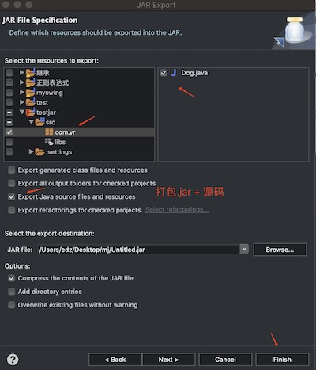
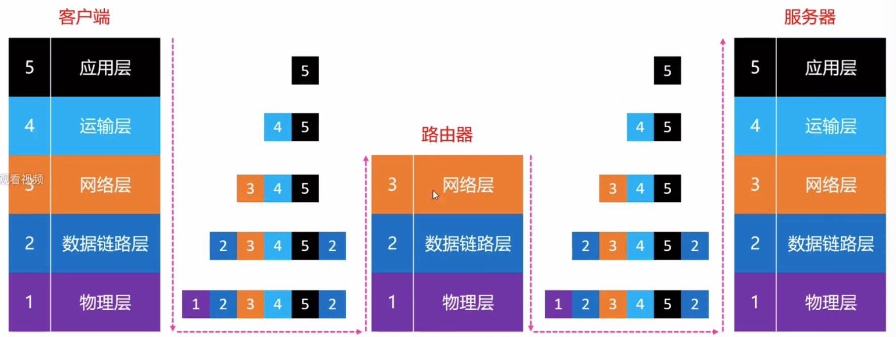

## 16、Collections


- `java.util.Collections` 是一个常用的集合工具类, 提供了很多实用的**静态方法.** 

  - Collections的常用方法如下:

    ```
    void sort(List<T> lsit);
    void sort(List<T> list, Comparator<? super T> c);
    T max(collection<? extends T> coll);
    T max(Collection<? extends T> coll, Comparator<? super T> com);
    T min(Collection<? extends T> coll);
    T min(Collection<? extends T> coll, Comparator<? super T> com);
    boolean addAll(Collection<? super T>c, T... elements);
    void reverse(List<?> list);
    Comparator<T> reverseOrder();
    void shuffle(List<?> list);		// 随机打乱list中的元素顺序
    void swap(List<?> list, int i, int j);
    void fill(List<? super T> list, T obj);		// 用 obj 填满 list
    void copy(List<? super T> dest, List<? extends T> src);
    boolean replaceAll(List<T> list, T oldVal, T newVal);
    
    ```

    

# 二五、并发编程

## 1、多线程介绍

- **什么是进程?**

  - 在操作系统中运行的一个应运用程序

  - 比如: 同时打开 微信, QQ, 操作系统就会分别启动2个进程

  - 每个进程之间是独立的, 每个进程均运行在其专用且受保护的内存空间内

     

  - 在Windows 中可以通过, "任务管理其" 查看正在运行的进程

- **什么是线程?**

  - 一个进程想要执行任务, 必须的有线程(每个进程至少要有1个线程)

  - 一个进程的所有任务都在线程中执行

- **线程的串行**

  - 1个线程中任务的执行是串行的
  - 如果要在1个线程中执行多个任务, 那么线程中的任务只能一个一个的顺序执行

- **什么是多线程**

  - 一个进程中可以开启多个线程, 所有线程可以并发(同时) 执行不同的任务
  - 进程--> 好比一个车间
  - 线程--> 好比生产线
  - 多线程技术, 可以提供程序的执行效率的

- **多线程的原理**

  -  同一时间, CPU的一个核心只能处理一个线程(同一时刻只有一个线程在工作)
  - 多线程并发(同时)执行, 其实是CPU 快速的在多个线程之间调度(快速的切换)
  - 如果CPU调度线程(切换线程) 的时间足够快, 就造成了多线程并发执行的假象. 

  - 如果是多核CPU, 才是真正的实现了多个线程同时执行
  - 思考: 如果线程非常多, 会发生什么情况呢?
    - CPU会在N个线程之间调度, 消耗大量的CPU资源你, CPU 会累死

- **多线程的优缺点**

  - 优点:
    - 能适当的提高程序的执行效率
    - 能适当的提高资源利用率 (CPU的使用率 和 内存的使用率)
  - 缺点:
    - 开启线程会占用一定的内存空间, 如果大量开启线程, 会占用大量的内存空间, 降低程序的性能
    - 线程越多, CPU在调度线程上的开销就越大
    - 线程越多, 程序的设计就更加的复杂
      - 比如: 线程之间的通信问题, 线程之间的数据共享问题

- **默认线程**

  - 每一个java程序启动后, 会默认开启一个线程, 称为主线程 ( main thread)

    - main 方法所在的线程就是主线程

      ```
      public static void main(String[] args) { 
      
        System.out.println(Thread.currentThread());
      }
      // 打印:
      Thread[main,5,main]   // Thread[线程名,线程优先级,线程组] 
      ```

      

## 2、java中的多线程

### 1、获取当前线程

- 在java程序中, main方法所在线程就是主线程

- 获取当前代码所在执行线程

  ```
  public static void main(String[] args) { 
    System.out.println(Thread.currentThread());
  }
  // 打印:
  Thread[main,5,main]   // Thread[线程名,线程优先级,线程组] 
  ```

### 2、创建线程

#### 1、方式1: 匿名类 或 lambda

- 匿名类创建子线程

  ```
  public static void main(String[] args) { 
  		
    // 创建一个线程, 把想要在这个新线程中执行的方法写在 run() 方法里面即可
    Thread thread = new Thread(new Runnable() {
      @Override
      public void run() { 
        System.out.println("子线程: " + Thread.currentThread());
      }
    });
  
    thread.setName("线程 666");
    thread.setPriority(10);
    // 启动线程
    thread.start();
  }
  // 打印:
  子线程: Thread[线程 666,10,main]
  ```

- 使用lambda 创建子线程

  ```
  public static void main(String[] args) { 
  		
    // 创建一个线程, 把想要在这个新线程中执行的方法写在 run() 方法里面即可
    Thread thread = new Thread(()->{
      System.out.println("子线程: " + Thread.currentThread());
    });
  
    thread.setName("线程 666");
    thread.setPriority(10);
    // 启动线程
    thread.start();
  }
  // 打印:
  子线程: Thread[线程 666,10,main]
  ```

#### 2、方式2  继承自Thread

- **继承自Thread类, 重写 `run()` 方法**

  > 其实, JDK 中提供的 Thread 方法已经实现了 `Runnable` 接口中的`run` 方法

  ```
  // 自定义线程
  class MusicThread extends Thread{
  	@Override
  	public void run() {
  		System.out.println("music thread run: " + Thread.currentThread());
  	}
  }
  
  // 测试:
  public static void main(String[] args) { 
    Thread thread = new MusicThread();
    thread.start();
  }
  // 打印:
  music thread run: Thread[Thread-0,5,main]
  ```

  > 当我们调用线程的 `start()` 方法, 本质就是调用线程内部的 `run()` 方法, 执行子线程操作

  **注意:**

  - **虽然我们发现, 在调用 thread 的start() 方法时, start()内部是调用的thread的run()方法, 但是 但是不要通过thread对象直接调用run() 方法**
  - **如果你直接通过 thread 对象调用run(), 那么run()方法会在当前线程(一般是主线程) 执行run() 方法, 并不会单独开线程**
  - **只有通过thread对象的start() 方法启动线程, 那么run() 方法才会在新开的子线程执行**


### 3、多线程的内存布局

- **PC寄存器**: 

  program counter register, 每一个线程都有自己的pc寄存器

- **java虚拟机栈**: 

  java virtual machine stack , 每一线程都有自己的java虚拟机栈

- **堆**:

  heap, 多个线程共享堆

- **方法区**: 

  method area, 多个线程共享方法区

- **本地方法栈**:

   Native method stack , 每个线程都有自己的本地方法栈


### 4、线程的状态

**NEW、RUNNABLE`(TIMED_WAITING、BLOCKED、WAITING)`、TERMINATED**


- 我们可以通过  **Thread.getState** 方法, 获得线程的状态(线程一共有6种状态)

  ```
  public static void main(String[] args) { 
  		
  		Thread mainThread = Thread.currentThread();
  		System.out.println(mainThread.getState());	// runnable
  		
  		Thread thread = new Thread();
  		System.out.println(thread.getState());		// new
  		
  	}
  ```

  - JDK 中线程的状态定义如下:

    ```
    // JDK 中线程的状态定义如下: 
    public enum State {
        NEW,				// 新创建的
        RUNNABLE,		// 可运行状态
        BLOCKED,
        WAITING, 
        TIMED_WAITING, 
        TERMINATED;
    }
    ```

    > - **NEW:** (新建), 尚未启动
    > - **RUNNABLE:** (可运行状态)正在JVM中运行
    >   - 或者正在等待操作系统的其它资源你(比如: 处理器)
    > - **BLOCK:**(阻塞状态)正在等待监视器(内部锁)
    > - **WAITING:**(等待状态) 在等待另一个线程
    >   - 调度以下方法会处于等待状态
    >     - 没有超时值的 `Object.wait`
    >     - 没有超时值的 `Thread.joinn`
    >     - LockSupport.partk
    > - **TIMED_WAITING:**(定时等待状态)
    >   - 调用以下方法会处于定时等待状态
    >     - `Tread.sleep`
    >     - 有超时值的`Object.wait`
    >     - 有超时值的`Thread.join`
    >     - LockSupport.parkNanos
    >     - LockSupport.parkUntil
    > - **TERMINATED:**(终止状态):已经执行完毕

- **线程的状态切换**
  
  - **NEW** 
  - **RUNNABLE**
    - TIMED_WAITING
    - BLOCKED
    - WAITING
  - **TERMINATED**


### 5、sleep、 interrupt

- 可以通过 **Thread.sleep** 方法暂停当前线程, 进入**WAITING** 状态

  - 在暂停期间, 若调用线程对象的 interrupt 方法中断线程, 会抛出`java.lang.interruptedException` 异常

  - 示例1: 正常睡觉

    ```
    public static void main(String[] args) {
    
      Thread myThread = new Thread(()->{
        System.out.println("myThread begin---");
        try {
          System.out.println("myThread sleep 3s");
          Thread.sleep(3000);
        } catch (InterruptedException e) { 
          System.out.println("myThread 睡觉时被干扰了, 扰断了");
          e.printStackTrace();
        } // 睡3秒
        System.out.println("myThread end===");
      }) ;
    
      myThread.start();
      try {
        System.out.println("main thread sleep 1s");
        Thread.sleep(1000);
      } catch (InterruptedException e) { 
        e.printStackTrace();
      }
      System.out.println("main thread end ===");\
    }
    // 打印:
    main thread sleep 1s
    myThread begin---
    myThread sleep 3s
    main thread end ===
    myThread end===
    ```

  - 示例2: 睡觉时被打断

    ```
    public static void main(String[] args) {
    
      Thread myThread = new Thread(()->{
        System.out.println("myThread begin---");
        try {
          System.out.println("myThread sleep 3s");
          Thread.sleep(3000);
        } catch (InterruptedException e) { 
          System.out.println("myThread 睡觉时被干扰了, 扰断了");
          e.printStackTrace();
        } // 睡3秒
        System.out.println("myThread end===");
      }) ;
    
      myThread.start();
      try {
        System.out.println("main thread sleep 1s");
        Thread.sleep(1000);
      } catch (InterruptedException e) { 
        e.printStackTrace();
      }
      System.out.println("main thread end ===");
      myThread.interrupt();
    
    }
    
    // 打印:
    main thread sleep 1s
    myThread begin---
    myThread sleep 3s
    main thread end ===
    java.lang.InterruptedException: sleep interrupted
    myThread 睡觉时被干扰了, 扰断了
    myThread end===
    	at java.lang.Thread.sleep(Native Method)
    	at com.yr.Main.lambda$0(Main.java:10)
    	at java.lang.Thread.run(Thread.java:748) 
    ```

    

### 6、join 、 isAlive

- **A.join 方法: 等线程A 执行完毕后, 当前线程再继续执行任务, 可以传参指定最长等待时间**

  > 比如: 我们调用A线程的 join 方法, 等A线程执行完了之后, 我们的当前线程(Join方法所在线程)才会执行后面的方法

  - 没有调用 join 方法时

    ```
    public static void main(String[] args) {
    
      Thread myThread = new Thread(()->{
        System.out.println("myThread begin---");
        try {
          System.out.println("myThread sleep 3s");
          Thread.sleep(3000);
        } catch (InterruptedException e) { 
          System.out.println("myThread 睡觉时被干扰了, 扰断了");
          e.printStackTrace();
        } // 睡3秒
        System.out.println("myThread end===");
      }) ;
    
      myThread.start(); 
      System.out.println("main thread end ===");
    }
    // 打印:
    main thread end ===
    myThread begin---
    myThread sleep 3s
    myThread end===
    
    从打印结果我们发现, 主线程的任务先执行完毕, 子线程后执行完
    ```

  - 调用 join方法

    ```
    public static void main(String[] args) {
    
      Thread myThread = new Thread(()->{
        System.out.println("myThread begin---");
        try {
          System.out.println("myThread sleep 3s");
          Thread.sleep(3000);
        } catch (InterruptedException e) { 
          System.out.println("myThread 睡觉时被干扰了, 扰断了");
          e.printStackTrace();
        } // 睡3秒
        System.out.println("myThread end===");
      }) ;
    
      myThread.start(); 
      try {
        System.out.println("main thread join myThread");
        myThread.join();
        System.out.println("main thread rest start");
      } catch (InterruptedException e) { 
        e.printStackTrace();
      }
      System.out.println("main thread end ===");
    }
    // 打印:
    
    main thread join myThread
    myThread begin---
    myThread sleep 3s
    myThread end===
    main thread rest start
    main thread end ===
    从打印结果我们发现, 调用join 方法后, 等待子线程的任务执行完毕后, 才执行的主线程剩余的代码
    主线程 拼在子线程后面执行了
    ```

    > 从打印结果我们发现一个结论:
    >
    > - 如果在当前线程(eg: main线程) 中调用的 A.join() 方法后, 当前线程(main线程)就会一直卡主不执行(即, A.join() 后面的代码卡主了不执行) , 直到子线程A中的任务执行完毕后, 当前线程(main线程) 中的代码才会继续执行
    >
    >   **即, 你可以理解为, 在当前线程如果调用了 A.join() 方法后当前线程的代码就卡主了不在执行, 直到A中的任务执行完毕后, 当前线程中的剩余代码(A.join()之后的代码) 才会继续执行**


- **我们在使用 A.join() 方法时, 还可以传递一个时间参数, 表示最多等待多长的时间, 示例如下:**

  **即: A.join(1000) 表示当前线程 最多等待1s**

  ```
  public static void main(String[] args) {
  
    Thread myThread = new Thread(()->{
      System.out.println("myThread begin---");
      System.out.println("myThread end===");
    }) ;
  
    myThread.start();  
    try {
      System.out.println("main thread join myThread");
      myThread.join(1000);
      System.out.println("main thread rest start");
    } catch (InterruptedException e) { 
      e.printStackTrace();
    }
    System.out.println("main thread end ===");
  }
  
  // 打印:
  main thread join myThread
  myThread begin---
  myThread end===		
  main thread rest start	// A 不到1s就执行完了, main接着A执行
  main thread end ===
  ```

  > 比如: `A.join(1000);` 
  >
  > - 表示当前线程最多等待A线程1s, 如果A线程在1s内提前执行完毕任务, 当前线程的剩余任务跟在A线程的后面继续执行
  > - 如果A线程内的任务在1s 内没有执行完毕, 当前线程在1s后会单独执行, 不会等待A线程执行完毕再执行

  ```
  public static void main(String[] args) {
  
    Thread myThread = new Thread(()->{
      System.out.println("myThread begin---");
      try {
        Thread.currentThread().sleep(3000);
      } catch (InterruptedException e) { 
        e.printStackTrace();
      }
      System.out.println("myThread end===");
    }) ;
  
  
    myThread.start();  
    try {
      System.out.println("main thread join myThread");
      myThread.join(1000);
      System.out.println("main thread rest start");
    } catch (InterruptedException e) { 
      e.printStackTrace();
    }
    System.out.println("main thread end ===");
  }
  // 打印:
  main thread join myThread
  myThread begin---
  main thread rest start	// 没等到A执行完, main等1s后就开始执行了
  main thread end ===
  myThread end===
  ```

  

- A.isAlive 方法, 查看线程 A 是否还活着

  - 已经死了

    ```
    public static void main(String[] args) {
    
      Thread myThread = new Thread(()->{
        System.out.println("myThread begin---");
        System.out.println("myThread end===");
      }) ;
    
    
      myThread.start();  
      try {
        System.out.println("main thread join myThread");
        myThread.join(1000);
        System.out.println("main thread rest start");
      } catch (InterruptedException e) { 
        e.printStackTrace();
      }
      System.out.println(myThread.isAlive());
      System.out.println(myThread.getState());
      System.out.println("main thread end ===");
    }
    // 打印:
    main thread join myThread
    myThread begin---
    myThread end===
    main thread rest start
    false		// A线程已经死了
    TERMINATED
    main thread end ===
    ```

    

  - 还活着

    ```
    public static void main(String[] args) {
    
      Thread myThread = new Thread(()->{
        System.out.println("myThread begin---");
        try {
          Thread.sleep(3000); // 当前线程 睡3秒
        } catch (InterruptedException e) { 
          e.printStackTrace();
        }
        System.out.println("myThread end===");
      }) ;
    
    
      myThread.start();  
      try {
        System.out.println("main thread join myThread");
        myThread.join(1000);
        System.out.println("main thread rest start");
      } catch (InterruptedException e) { 
        e.printStackTrace();
      }
      System.out.println(myThread.isAlive());		// A 线程还活着
      System.out.println(myThread.getState());
      System.out.println("main thread end ===");
    }
    
    // 打印:
    myThread begin---
    main thread join myThread
    main thread rest start
    true
    TIMED_WAITING
    main thread end ===
    myThread end===
    ```

    

## 3、线程安全问题

- **多个线程可能会共享(访问) 用一个资源**
  
  - 比如: 访问同一个对象, 同一个变量, 同一个文件
  
- **当多个线程访问同一块资源时, 很容易引发 `数据错乱和数据安全问题`, 称为线程安全问题**

- **什么情况下会出现线程安全问题?**
  - 多个线程共享同一个资源
  - 且至少有一个线程正在进行写的操作
  
- 示例代码, 下面的代码有线程安全问题

  ```
  package com.yr; 
  public class Main{
  	
  	public static void main(String[] args)  {
  		Station station = new Station();
  		for(int i = 0; i < 4; i++) {
  			Thread thread = new Thread(station);
  			thread.setName("线程(" + i + ")");
  			thread.start();
  		}
  	}
  	 
  }
  
   
  class Station implements Runnable{
  	// 一共有100 张票
  	private int tickets = 5;
  	
  	public boolean saleTicket() {
  		if(tickets < 1) return false;
  		tickets--;
  		String name = Thread.currentThread().getName();
  		System.out.println(name + "卖了一张票, 剩余: " + tickets  + "张票");
  		return tickets > 0;
  	}
  	
  	@Override
  	public void run() { 
  		// 只要还有票 就一直买
  		while(saleTicket()); 
  	}
  	
  }
  
  // 打印:
  线程(0)卖了一张票, 剩余: 1张票
  线程(3)卖了一张票, 剩余: 1张票
  线程(2)卖了一张票, 剩余: 1张票
  线程(1)卖了一张票, 剩余: 1张票
  线程(0)卖了一张票, 剩余: 0张票
  ```

  

## 4、线程同步


- **可以使用线程同步技术来解决线程安全问题**

  - **同步语句**(Synchronized Statement)
  - **同步方法**(Synchronized Method)

  > 换句话说, 在java中我们可以使用 **同步语句** 或者 **同步方法** 来解决多线程数据访问的安全问题

### 1、线程同步- 同步语句

- 示例代码如下:

  ```
  public class Main{
  	
  	public static void main(String[] args)  {
  		Station station = new Station();
  		for(int i = 0; i < 4; i++) {
  			Thread thread = new Thread(station);
  			thread.setName("线程(" + i + ")");
  			thread.start();
  		}
  	}
  	 
  }
  
   
  class Station implements Runnable{
  	// 一共有100 张票
  	private int tickets = 15;
  	
  	public boolean saleTicket() {
  		synchronized (this) {	// 这个就是同步语句块, 保证同一时间只有一条线程能访问{} 中的代码
  			if(tickets < 1) return false;
  			tickets--;
  			String name = Thread.currentThread().getName();
  			System.out.println(name + "卖了一张票, 剩余: " + tickets  + "张票");
  			return tickets > 0;
  		}
  	}
  	
  	@Override
  	public void run() { 
  		// 只要还有票 就一直买
  		while(saleTicket()); 
  	}
  	
  }
  ```


#### 1、synchronized(boj){} 同步语句加锁原理

- **synchronized (obj) {}** , 同步语句的原理  **重要!!!**

  - 每一个对象都有一个与它相关的内部锁(intrisic lock) 或者监视器锁(monitor lock)

  - 第一个执行到同步语句块的线程可以获取 **obj** 的内部锁, 在执行完同步语句中的代码后释放此锁

  - 只要一个线程持有了内部锁, 那么其他线程在同一时刻将无法获得此锁

    - 当它试图获取此锁时, 将会进入 **BLOCKED状态**

    > 一个对象的内部锁在同一时间只能被一个线程所持有(即, 一旦一个对象的内部锁被一条线程所有用, 那么其他线程将无法再拥有这个内部锁), 知道{} 范围内的代码执行完毕线程才会释放内部锁, 其他的线程才有机会再持有内部锁.

- 多个线程访问同一个**synchronized (obj) {}**(同步语句块) 时, 这个obj 对象必须是同一个对象才能起到同步的作用

  ```
  // 错误做法
  class Station implements Runnable{
  	// 一共有100 张票
  	private int tickets = 15;
  	
  	public boolean saleTicket() {
  		synchronized (new Object()) {	// 错误, 不能是new Object
  			if(tickets < 1) return false;
  			tickets--;
  			String name = Thread.currentThread().getName();
  			System.out.println(name + "卖了一张票, 剩余: " + tickets  + "张票");
  			return tickets > 0;
  		}
  	}
  	
  	@Override
  	public void run() { 
  		// 只要还有票 就一直买
  		while(saleTicket()); 
  	}
  	
  }
  
  // 正确做法1
  class Station implements Runnable{
  	// 一共有100 张票
  	private int tickets = 15;
  	
  	public boolean saleTicket() {
  		synchronized (this) {	// ok
  			if(tickets < 1) return false;
  			tickets--;
  			String name = Thread.currentThread().getName();
  			System.out.println(name + "卖了一张票, 剩余: " + tickets  + "张票");
  			return tickets > 0;
  		}
  	}
  	
  	@Override
  	public void run() { 
  		// 只要还有票 就一直买
  		while(saleTicket()); 
  	}
  	
  }
  
  // 正确做法2
  class Station implements Runnable{
  	// 一共有100 张票
  	private int tickets = 15;
  	
  	public boolean saleTicket() {
  		synchronized ("123") {	// ok
  			if(tickets < 1) return false;
  			tickets--;
  			String name = Thread.currentThread().getName();
  			System.out.println(name + "卖了一张票, 剩余: " + tickets  + "张票");
  			return tickets > 0;
  		}
  	}
  	
  	@Override
  	public void run() { 
  		// 只要还有票 就一直买
  		while(saleTicket()); 
  	}
  	
  }
  ```


### 2、线程同步- 同步方法

- 我们前面介绍了, 所谓线程同步语句就是使用 **`Synchronized(obj){}`** 包住的一个语句块, 那什么是线程同步方法呢?

- 所谓线程同步方法就是在定义方法时, 使用 **Synchronized关键字** 修饰的方法, 我们就称为线程同步方法.

  - 线程同步方法

    ```
    public boolean saleTicket() {
    	// 线程同步语句
      synchronized (this) {	// ok
        if(tickets < 1) return false;
        tickets--;
        String name = Thread.currentThread().getName();
        System.out.println(name + "卖了一张票, 剩余: " + tickets  + "张票");
        return tickets > 0;
      }
    }
    	
    // 线程同步方法
    public synchronized boolean saleTicket() {
        if(tickets < 1) return false;
        tickets--;
        String name = Thread.currentThread().getName();
        System.out.println(name + "卖了一张票, 剩余: " + tickets  + "张票");
        return tickets > 0;
    }
    ```

- 线程同步方法的注意点:

  - **Synchronized 关键字**不能用来修饰 构造方法

    > 换句话说, 你不能定义一个线程同步的构造方法, 不允许

- **线程同步方法的本质**

  - 如果是线程同步的**实例方法, 相当于 `Synchronized(this){}`, 即下面两种写法是等价的**

    ```
    // 线程同步实例方法
    public Synchronized void saleTicket(){
    	// 方法体具体实现
    }
    
    // 线程同步语句
    public  void saleTicket(){
      Synchronized(this){
      	// 方法体具体实现
      }
    }
    ```

  - 如果是线程同步的**静态方法, 相当于`Synchronized(类对象){}`, 即下面两种写法等价的**

    > 每个类在内存中都有一个类对象

    ```
    // 线程同步静态方法
    public  Synchronized static void saleTicket(){
    	// 方法体具体实现
    }
    
    // 线程同步语句
    public  void saleTicket(){
      Synchronized(Station.class){
      	// 方法体具体实现
      }
    }
    
    // 通过类名.class 或去类对象
    ```

    > - 我们在java中可以通过 `类名.class` 获取一个类对象
    >
    > - 也可以通过一个类名的字符串获取一个类对象, 不过这个字符串必须是全称包含包名, 且通过一个类名的字符串获取类对象可能会抛异常(比如你乱写类名)
    >
    > - 也可以通过 `实例对象.getClass()` 获取一个类对象, 下面操作等价, 都是获取Station的类对象:
    >
    > ```
    > System.out.println(Station.class); 						// 通过类名获取类对象
    > Class cls = Class.forName("com.yr.Station");	// 通过类名字符串你获取类对象
    > System.out.println(new Station().getClass());	// 通过实例对象获取类对象
    > // 打印: 
    > class com.yr.Station
    > class com.yr.Station
    > class com.yr.Station
    > ```

- 同步语句比同步方法更灵活
  - 同步方法其实是将整个方法都锁住了
  - 同步语句可以精确到需要加锁的具体语句范围(有些时候我们真的是不必锁住整个方法) 

- 使用了线程同步技术缺点
  
  - 虽然使用了线程同步技术可以解决线程的安全问题, 但是降低了程序的执行效率


### 3、单例模式(懒汉式)改进

- 旧版:

  ```
  // 这个代码如果在多线程下, 可能出现问题
  public class Rocket{
  	private static Rocket instance = nil;
  	private Rocket(){}
  	public static Rocket getInstance(){
  		if(instance == null){
  			instance = new Rocket();
  		}
  		return instance;
  	}
  }
  ```

- 改进版, 使用 同步方法

  ```
  // 这个代码如果在多线程下, 就不会出现线程安全问题了
  public class Rocket{
  	private static Rocket instance = nil;
  	private Rocket(){}
  	public static Synchronized Rocket getInstance(){
  		if(instance == null){
  			instance = new Rocket();
  		}
  		return instance;
  	}
  }
  ```


### 4、几个常用了类的细节


#### 1、动态数组线程安全问题

- **ArrayList:** 非线程安全
- **Vector:** 线程安全

>  ArrayList 中的方法是不安全的, 如果在多个线程中同时对ArrayList进行数据操作, 可能出现问题, 如下:
>
> ```
> List<Integer> arr = new ArrayList<>();
> arr.add(11);	// 线程1
> arr.add(12);	// 线程2
> ... ... 
> arr.add(13);	// 线程n
> 
> 如果上面的操作同时在多个线程中执行, 那么结果可能是混乱的多种多样
> ```


在真实的开发中我们应当如何来解决ArrayList的线程安全问题呢? 

- **方式1:** 对所有ArrayList 相关操作进行加锁处理**(同步语句 或者 同步方法)**

- **方式2:** **使用线程安全的动态数据Vector 替代 ArrayList** (推荐)

  - **Vector 的定义如下:**

    ```
    下面是Vector 与 ArrayList 的定义
    public class Vector<E> extends AbstractList<E>
                          implements List<E>, 
                                     RandomAccess,
                                     Cloneable, 
                                     java.io.Serializable
    {
    	// 实现 省略... ... 
    }
    ```

  - ArrayList 的定义如下:

    ```
    public class ArrayList<E> extends AbstractList<E> 
                              implements List<E>, 
                                         RandomAccess, 
                                         Cloneable, 
                                         java.io.Serializable
    {
      // 实现 省略... ... 
    }
    ```

    > 从上面的定义我们发现 ArrayList 和 Vector 的定义差不多
    >
    > 其实,ArrayList 和 Vector 的用法基本一样, 只是一个是线程安全的一个是线程不安全的, 直接把Vector 当做ArrayList来做即可

#### 2、动态字符串线程安全问题

- **StringBuilder:** 非线程安全的
- **StringBuffer:** 线程安全的

> 他们的用法基本一样

#### 3、映射 (map) 线程安全问题

- **HashMap:** 非线程安全
- **Hashtable:** 线程安全的


### 5、死锁(Dead Lock)

- 什么是死锁?

  - 两个或者多个线程永远阻塞, 相互等待.

  ```
  // 下面的代码就是 死锁
  public static void main(String[] args)  {
  
    new Thread(()->{
      synchronized ("1") {
        System.out.println("1-1");
        try {
          Thread.sleep(100);
        } catch (Exception e) {
          e.printStackTrace();
        }
        synchronized ("2") {
          System.out.println("1-2");
        }
      }
  
    }).start();
  
    new Thread(()->{
      synchronized ("2") {
        System.out.println("2-1");
        try {
          Thread.sleep(100);
        } catch (Exception e) {
          e.printStackTrace();
        }
        synchronized ("1") {
          System.out.println("2-2");
        }
      }
  
    }).start();
  
    System.out.println("----");
  
  }
  ```

- **下面的代码也会出现死锁**

  ```
  public class Person{
  	private String name;
  	public Person(String name) {
  		this.name = name;
  	}
  	
  	public synchronized void hello(Person p) {
  		System.out.format("[%s] hello to [%s] \n",name, p.name);
  		p.smile(this);
  	}
  	
  	public  synchronized void smile(Person p) {
  		System.out.format("[%s] smile to [%s]\n", name,p.name);
  	} 
    
    public static void main(String[] args) {
  		Person zhangsan = new Person("zhangsan");
  		Person lisi = new Person("lisi");
  		
  		new Thread(()->{
  			zhangsan.hello(lisi);
  			System.out.println("-------");
  		}).start();
  		new Thread(()->{
  			lisi.hello(zhangsan);
  			System.out.println("=======");
  		}).start();
  	}
  }
  ```

  > ```
  > public synchronized void hello(Person p) {
  >   System.out.format("[%s] hello to [%s] \n",name, p.name);
  >   p.smile(this);
  > }
  > // 等价于
  > public void hello(Person p) {
  >   synchronized(this){
  > 		System.out.format("[%s] hello to [%s] \n",name, p.name);
  > 		p.smile(this);
  >   }
  > }
  > ```
  >
  > ```
  > public  synchronized void smile(Person p) {
  >   System.out.format("[%s] smile to [%s]\n", name,p.name);
  > } 
  > // 等价于
  > public void smile(Person p) {
  >   synchronized(this){
  >     System.out.format("[%s] smile to [%s]\n", name,p.name);
  >   }
  > } 
  > ```

  


## 5、线程间通信

- 可以使用 **Object.wait、Object.notify、Object.notifyAll 方法**实现线程之间的通信

  > 因为这三个方式是Object中的, 因此任何java对象都有这三个方法

- **若想在线程A中成功调用 obj.wait、obj.notify、obj.notifyAll 方法**

  - 线程A必须持有 obj的内部锁

- **obj.wait:** 释放obj 的内部锁, **当前线程进入 WAITING 或 TIMED_WAITED 状态**

  > 注意:
  >
  > 当前线程拿到 `obj` 对象的内部锁后, `{}` 中的代码在执行完之前会被锁住, 但是如果在`{}` 中调动`obj.wait() 或 obj.wait(2000)` 后, 当前对象就会释放`obj` 的内部锁, 当前线程处于阻塞状态, 等待`obj.notify() 或 obj.notifyAll()` 通知后, 再继续执行`wait() 或 wait(2000)` 之后的代码

- **obj.nofityAll:** 唤醒所有**因为 obj.wait 进入 WAITING 或 TIMED_WAITED 状态的线程**

- **obj. notify:** 随机唤醒一个**因为 obj.wait 进入 WAITING 或 TIMED_WAITED 状态的线程**

  
  
  > **前面讲过同步语句的原理是这样的:**
  >
  > - 当个线程中的程序执行到 `Synchronized(obj){}` 这句代码时, 会尝试去获取 `obj` 对象的内部锁
  > - 如果此刻`obj` 对象的内部锁没有被任何线程所持有, 那么当前线程就会获取`obj` 对象的内部锁
  > - 一旦某条线程获取到了`obj` 对象的内部锁后, 其它线程就无法再获取`obj` 对象的内部锁, 直到持有`obj` 对象内部锁的线程释放`obj`的内部锁.
  >
  > 换句话说, `synchronized(obj){}` 同步语句的原理是这样的,  当线程A执行到`Synchronized(obj){` 时如果发现`obj` 对象的内部锁已近线程B持有了就等待B线程释放`obj` 对象的内部锁代码暂停执行. 当线程A发现`obj` 对象的内部锁没有被其它线程所持有, 线程A就立即持有`obj` 对象的内部锁, 然后执行`Synchronized(obj){}` 中的代码, `{}` 中的代码执行完毕后释放`obj` 的内部锁, 然后其它线程就可以去获取`obj` 的内部锁再执行代码.
>
  > 也就是说, 当线程X执行到`Synchronized(obj){` 时必须要拿到`obj` 的内部锁才能执行里面的代码, 否则就一直等待

  ```
  public String get(){
  	// 同步语句
  	synchronized("1"){ // 线程进入拿到 "1" 的内部锁后, 才能执行 {} 里面的代码, 否则在{} 外等待
  		// 线程拿到 "1" 的内部锁后, 就可以调用 "1" 的 wait() 或者 nofity()
  		"1".wait();
  		"1".nofify()
  		
  		// "2".wait();		error, 因为当前线程没有拿到 "2" 的内部锁
  		// "2".nofify()   error, 因为当前线程没有拿到 "2" 的内部锁
  	}
  }
  ```

**总结:**

- **调用 wait、notify 必须是同一个obj对象**
- **调用 wait、notify 的线程必须拥有 obj 的内部锁**


- 生产者消费者, 线程间通信, 示例代码如下: 

  ```
  package com.yr;
  
  public class Main{
  	public static void main(String[] args) {
  		Drop drop = new Drop();
  		new Thread(new Consummer(drop)).start();
  		new Thread(new Producer(drop)).start();
  	}
  }
  
  
  class Drop{
  	private String food;
  	// empty 为 true 代表: 消费者等待生产者生产 产品
  	// empty 为 false 代表: 生产者生产完毕, 等待消费者消费完毕
  	private boolean empty = true;
  	
  	/**
  	 * get 方法会在消费者线程中执行
  	 * @return
  	 */
  	public synchronized String get()  { 
  		// 此处使用while 是因为  wait过程中可能抛异常
  		// 当抛异常后 empty 为true时, 仍然继续等待
  		while(empty == true) {
  			try {
  				wait();
  			} catch (InterruptedException e) { }
  		}
  		empty = true;
  		this.notify(); 
  		return this.food;
  	}
  	
  	/**
  	 * add 方法会在生产者线程中执行
  	 * @param food
  	 */
  	public synchronized void add(String food) {
  		while (!empty) { 
  			try {
  				this.wait();
  			} catch (InterruptedException e) { }
  		}
  		empty = false;
  		this.notifyAll();
  		this.food = food;
  	}
  }
  
  
  /**
   * 生产者
   * @author edz
   *
   */
  class Producer implements Runnable{
  	
  	private Drop drop;
  	public Producer(Drop drop) {
  		this.drop = drop;
  	}
  
  	@Override
  	public void run() {
  		String[] foods = {"beef", "bread", "apple", "cookie" };
  		for(int i=0; i<foods.length; i++ ) {
  			try {
  				Thread.sleep(2000);
  			} catch (InterruptedException e) {}
  			System.out.println("生产者, 生产了产品: " + foods[i]);
  			drop.add(foods[i]);
  		}
  		drop.add(null);
  	}
  }
  
  
  /**
   * 消费者
   * @author edz
   *
   */
  class Consummer implements Runnable{
  
  	private Drop drop;
  	public Consummer(Drop drop) { 
  		this.drop = drop;
  	}
  	@Override
  	public void run() {
  		String food = null;
  		while((food = drop.get()) != null) {
  			System.out.format("消费者接收到产品: %s%n", food);
  			try {
  				Thread.sleep(2000);
  			} catch (InterruptedException e) { 
  				e.printStackTrace();
  			}
  		}
  	}	
  }
  
  // 打印:
  生产者, 生产了产品: beef
  消费者接收到产品: beef
  生产者, 生产了产品: bread
  消费者接收到产品: bread
  生产者, 生产了产品: apple
  消费者接收到产品: apple
  生产者, 生产了产品: cookie
  消费者接收到产品: cookie
  
  ```


## 6、可重入锁(ReentrantLock)

### 1、可重入锁的简单使用

- **ReentrantLock , 翻译为 `可重入锁`**

  - 类的全称: `java.util.concurrent.locks.ReentrantLock` 

  - **具有跟同步语句、同步方法一样的一些基本功能, 但是功能更加强大**

    > 同步语句、同步方法的作用就是对代码进行加锁的功能

- **什么是可重入?**

  - 同一个线程可以重复获取同一个锁
  - 其实`synchronized` 也是可重入的

- 使用ReentrantLock 前, 我们使用同步语句 或者 同步方法来保证多线程的数据安全问题, 示例如下:

  ```
  package com.yr;
  public class Main{
  	public static void main(String[] args) {
  		Station station = new Station(); 
  		for(int i=0; i < 4; i++) {
  			Thread thread  = new Thread(station);
  			thread.setName("线程(" + i + ")");
  			thread.start();
  		}
  	 
  	}
  }
  
  class Station implements Runnable{
  	private int tickets = 200;
  	// 同步方法保证线程安全
  	public synchronized boolean saleTicket() {
  		if(tickets < 1) return false;
  		tickets--;
  		String name = Thread.currentThread().getName();
  		System.out.println(name + " 卖了1张票, 剩余" + tickets + "张");
  		return tickets > 0;
  	}
  	@Override
  	public void run() {
  		while(saleTicket()) ;
  	}
  }
  ```

- 是用ReentrantLock 重用锁, 实现线程安全, 代码如下:

  ```
  package com.yr;
  
  import java.util.concurrent.locks.ReentrantLock;
  
  public class Main{
  	public static void main(String[] args) {
  		Station station = new Station(); 
  		for(int i=0; i < 4; i++) {
  			Thread thread  = new Thread(station);
  			thread.setName("线程(" + i + ")");
  			thread.start();
  		}
  	 
  	}
  }
  
  class Station implements Runnable{
  	private int tickets = 200;
  	private ReentrantLock lock = new ReentrantLock();
  	
  	public boolean saleTicket() {
  		try {
  			lock.lock();	// 执行代码前 使用重用锁 加锁
  			if(tickets < 1) return false;
  			tickets--;
  			String name = Thread.currentThread().getName();
  			System.out.println(name + " 卖了1张票, 剩余" + tickets + "张");
  			return tickets > 0;
  		} finally { // 因为 finally 中的代码必然会执行, 因此在finally 中解锁
  			lock.unlock();
  		} 
  	}
  	@Override
  	public void run() {
  		while(saleTicket()) ;
  	}
  }
  ```

  > **补充:**
  >
  > **因为写在 finally 中的代码必然会执行, 因此我们一般在finally 中对 重用锁进行解锁操作**


- wait() 与wait()
- 


### 2、ReentrantLock - lock 、tryLock

- **ReentrantLock.lock: 获取此锁**

  - 如果此锁没有被另一个线程持有, 则将锁的持有计数设为1, 并且此方法立即返回
  - 如果当前线程已经持有此锁, 则将锁的持有计数加1, 并且此方法立即返回 
  - 如果此锁被另一个线程持有, 并且在获得锁之前, 此线程将一直处于休眠状态, 此锁的持有状态被设为1

  > **其实这就是可重入锁的原理, 可以被当前线程锁多次**, 锁多次就要解锁多次

- **ReentrantLock.tryLock: 仅在调用时锁未被其它线程持有的情况下, 才获取此锁**
  - 如果此锁没有被另一个线程持有, 则将锁的持有计数设为1, 并且次方法立即返回true
  - 如果当前线程已经持有此锁, 则将锁的持有计数加1, 并且此方法立即返回true
  - 如果锁被另一个线程持有, 则次方法立即返回false

> 即:
>
> - 当使用`ReentrantLock.lock` 时.
>   - 如果发现锁已经被其它线程持有了, 当前线程就一直休眠等,直到其它线程释放锁,然后当前线程持有锁,唤醒代码继续执行
>   - 如果发现锁没有被其它线程持有, 当前线程就持有, 代码继续执行, 然后释放锁
>   - 即 `ReentrantLock.lock` 是必须要获取此锁, 代码才往后执行, 否则就休眠等待
> - 当使用`ReentrantLock.tryLock` 时, 
>   - 如果发现锁没有被其它线程持有, 这时当前线程就获取此锁, 将代码锁上, 然后代码继续执行
>   - 如果发现锁已经被其它线程持有, 那么当前线程就不获取此锁, 代码继续往后执行

- 使用 tryLock 时, 代码有点不一样, 要调整下, 如下:

  ```
  public boolean saleTicket() {
  	boolean flag = false;
  		try {
  			 flag = lock.tryLock();	 // 返回true 表示当前线程获取到锁, 返回false表示其他线程已经获取此锁当前线程没有获取到锁
  			if(tickets < 1) return false;
  			tickets--;
  			String name = Thread.currentThread().getName();
  			System.out.println(name + " 卖了1张票, 剩余" + tickets + "张");
  			return tickets > 0;
  		} finally { // 因为 finally 中的代码必然会执行, 因此在finally 中解锁
  			if(flag == true){ // 当前线程获取到锁, 才需要释放锁
  				lock.unlock();
  			} 
  		} 
  	}
  ```

  

### 3、ReentrantLock - unlock、isLocked

- **ReentrantLock.unlock: 尝试释放此锁**
  - 如果当前线程持有锁, 则将持有计数减少1
  - 如果持有计数现在为0, 则释放此锁
  - 如果当前线程没有持有此锁, 则抛`java.lang.IllegalMonitorStateException`
- **ReentrantLock.isLock: 查看此锁是否被任意线程持有**


### 4、什么是可重入锁

- 所谓可重入锁, 就是**同一个线程**可以**重复获取同一个锁**

- **其实, Synchronized 也是可重入锁**

  > 如果我没记错的话, 有些语言的synchronized 不是可重入锁

  ```
  public static void main(String[] args) {
    synchronized ("1") {
      synchronized ("1") {
        System.out.println("---1");
      } 
    }
  }
  // 打印:
  ---1
  	
  从打印结果,我们发现	synchronized 是可重入锁, 否则第二层 synchronized 是无法执行的
  ```

- ReentrantLock 是可重入锁, 示例如下:

  ```
  class Station implements Runnable{
  	private int tickets = 200;
  	private ReentrantLock lock = new ReentrantLock();
  	
  	public boolean saleTicket() {
  		try {
  			lock.lock();	// 可重入锁, 可以被当前线程锁多次
  			lock.lock();	
  			lock.lock();	
  			if(tickets < 1) return false;
  			tickets--;
  			String name = Thread.currentThread().getName();
  			System.out.println(name + " 卖了1张票, 剩余" + tickets + "张");
  			return tickets > 0;
  		} finally { // 因为 finally 中的代码必然会执行, 因此在finally 中解锁
  			lock.unlock();
  			lock.unlock();	// 可重入锁, 锁多次就要解锁多次
  			lock.unlock();
  		} 
  	}
  	@Override
  	public void run() {
  		while(saleTicket()) ;
  	}
  }
  ```

  

## 7、线程池(thread pool)

### 1、线程池介绍

- 线程对象占用大量的内存, 在大型应用程序中, 频繁的创建和销毁线程对象会产生大量内存管理开销

- 使用线程池可以最大程度地减少线程创建, 销毁所带来的开销

- 线程池由**工作线程(worker thread)** 组成

  - **普通线程: 执行完一个任务后, 声明周期就结束了**

    > 换句话说, 普通的线程在执行完成以后,线程的状态就变为了 **TERMINATED**, 就不能拿来用了
    >
    > ```
    > // 比如: 下面就是普通线程的示例:
    > public static void main(String[] args) {
    >   Thread thread = new Thread(()->{
    >     System.out.println(111);
    >   }) ;
    >   thread.start();
    >   // thread.start(); 错误, 普通线程只能启动一次, 再启动抛异常
    > }
    > ```

  - **工作线程(worker thread): 可以执行多个任务, 任务没来就一直等, 任务来了就干活**

    > 先将任务添加到队列(Queue) 中, 再从队列中取出任务提交到池子中执行

- **在java开发中, 常用的线程池类型是 固定线程池 (Fixed Thread Pool)**

  > 所谓固定线程池, 就是指有固定数量的正在运行的线程


### 2、线程池的简单使用

- 线程池, 简单示例:

  > 创建线程池(ExecutorService), 执行线程任务, 关闭线程池

  ```
  public class Main{
  	public static void main(String[] args) {
  		 
  		// 1. 创建 固定线程池
  		ExecutorService pool = Executors.newFixedThreadPool(3);
  		
  		pool.execute(()->{
  			System.out.println(Thread.currentThread());
  		});
  		pool.execute(()->{
  			System.out.println(Thread.currentThread());
  		});
  		pool.execute(()->{
  			System.out.println(Thread.currentThread());
  		});
  		// 任务执行完毕, 关闭线程池子, 如果还要用就不要关
  		pool.shutdown(); 
  	}
  }
  ```

  > 在java开发中, 线程池这种技术, 不用我们去实现, 在java中早就为我们实现好了


# 二六、 I/O

## 1、I/O 流 介绍  

- **I/O 流, 全称 Input/ Output Stream, 翻译为 输入/输出流**

- **输出流:**

  - `应用程序` -----010101010--> `文件、设备(比如:键盘、屏幕、鼠标等)`

    > 比如: 我们开发了一个程序要将数据写入到文件、屏幕上显示等, 这时就要用到输出流

- **输入流:**

  - `应用程序` <----010101010--`文件、设备(比如:键盘、屏幕、鼠标等)` 

    > 比如: 我们想要把文件里面的内容读取到程序中来, 就要用到输入流

> **总结:**
>
> - **所以, 输入/输出流 不是相对于文件或者设备来说的, 而是相对于我们写的程序来说的**
>
> - **也就是是说, 如果你以后不知道该使用输入流还是输出流, 你就想一下, 如果是从程序外送出就使用输出流, 如果是要读到程序里面就使用输入流**
>
> >  也即: 从程序往外流就是输出流, 从外往程序流输入流


- 其实, 输入/输出流除了用在文件的写入和读取上, 平时我们发送网络请求时也是要使用输入输出流的, 如下:

   


## 2、常用的I/O 流类型

- **I/O 流 的常用类型都在 java.io 包中**

| 类型                      | 输入流                                | 输出流                                 |
| ------------------------- | ------------------------------------- | -------------------------------------- |
| 字节流(Byte Streams)      | InputStream                           | OutputStream                           |
| 字符流(Character Streams) | Reader                                | Writer                                 |
| 缓冲流(Buffered Streams)  | BufferedInputStream<br>BufferedReader | BufferedOutputStream<br>BufferedWriter |
| 数据流(Data Streams)      | DataInputStream                       | DataOutputStream                       |
| 对象流(Object Streams)    | ObjectInputStream                     | ObjectPOutputStream                    |

- **字节流:** 一个字节一个字节的读写
- **字符流:** 一个字符一个字符的读写

> 其它的后面详解

## 3、File (文件&目录)

### 1、File 的操作常识介绍

- **一个File对象就代表一个文件或目录(文件夹)**

  ```
  // file1 file2 都能访问 test.txt 文件
  File file1 = new File("F:\\files\\texts\\test.txt"); 只有windows 可以
  File file2 = new File("F:/files/texts/test.txt");		unix,linux,mac, windows 都可以
  ```

- **名字分隔符(name separator):** `File.separator`

  - 在Unix、Linux、Mac系统中: 正斜杠(`/`)
  - 在windows系统中: 反斜杠(`\`)

  > 在java中 一个反斜杠`\` 代表的是转义符, 如果要表达`\` 字符需要使用两个`\\` 

  正因为在不同的操作系统中文件名的分隔符可能不同, 因此在实际开发中, 很多人是这样写的, 如下:

  ```
  File file2 = new File("F:/files/texts/test.txt");	
  		
  File file2 = new File("F:" + File.separator + "files" + File.separator + "texts" + File.separator + "test.txt");
  ```

  你直接打印`File.separator` 在不同的系统中结果是不同的, 可能是 `/` 或`\` 

- **路径分隔符(path separator):** `File.pathSeparator`

  - 在unix、Linux、Mac系统中: 冒号(`:`)

  - 在windows系统中: 分号(`;`) 

    ```
    是这样的, 有时我们可能需要传递多个 文件, 如下:
    // F:/files/1.txt
    // D:/2.txt
    String files = "F:/files/1.txt;D:/2.txt";	// windows 
    String files = "/files/1.txt:/2.txt";	// 非windows
    ```

    > 换句话说, 有时我们有这样的需求需要将多个文件路径拼写在一个字符串中, 传递出去
    >
    > 在unix,linux, mac 系统中使用 冒号`:` 来做为多个路径的拼接符号, 在接收端直接使用冒号`:` 对接收的的文件路径进行切割以便获取多个文件名路径
    >
    > 在是在windows 中因为文件路径有盘符的原因(盘符中有个冒号`:`) , 不能使用冒号`:` , 使用分号`;`代替
    >
    > 为了做跨平台兼容, 我们在实际开发中不能直接使用  冒号`:`  或者 分号`;` , 而是使用`File.pathSeparator` 代替, 这样就避免了兼容问题

    你直接打印`File.pathSeparator` 在不同的系统中结果是不同的, 可能是 `:` 或`;` 

  > 其实你在如果你够细心的话就会发现, 你在windows 中配置环境变量和在非windows 中配置环境变量时文件的分隔符就是`;` 和`:` 


- **在windows、Mac系统中**

  - **文件名, 目录名是不区分大小写的**

    > 其实如果你足够细心的话就会发现, 当你在 windows、Mac 中命名文件时会发现 `aaa` 和 `AAA` 冲突
    >
    > 文件名不区分大小写就是冲突的原因

- 在Unix、Linux 系统中
  
  - **文件名, 目录名是区分大小写的**


### 2、File 常用操作

```
String getName(); 				// 获取文件或目录的名称
String getParent();				//	获取父路径
String getParentFile();		// 获取父文件
String getPath();					// 获取路径
String getAbsolutePath();	// 获取绝对路径
File getAbsoluteFile();		// 获取绝对路径形式的文件
long lastModified();			// 最后一次修改的时间
long length();						// 文件的大小 (不支持目录)

boolean isExists();
boolean exists();
boolean isDirectory();
boolean isFile()
boolean isHidden();
boolean canRead();
boolean canWrite();

String[] list();												// 获取当前目录下的所有文件, 目录的名称
String[] list(FilenameFilter filter);		// 显示过滤后的清单(当前目录下的所有文件, 目录的名称)
File[] listFiles();											// 获取当前目录下所有文件 目录
File[] listFiles(FilenameFilter filter);
File[] listFiles(FileFilter filter);

boolean createNewFile(); 			// 创建文件 (不会覆盖旧文件)
boolean delete();							//	删除文件或者空目录 (直接删除, 不经过回收站)
boolean mkdir();							// 创建当前目录
boolean mkdirs();							// 创建当前目录 (包括不存在的父目录)
boolean renameTo(File dest);	// 剪切到新路径
```


### 3、File 练习

#### 1、遍历目录下的目录&文件

```
// 循环遍历指定目录下的所有文件和和目录
static void search(File dir, Consumer<File> operation) {
  if(dir == null || operation == null) return;
  if (!dir.exists() || dir.isFile()) return;
  
  File[] files = dir.listFiles();
  for (File file : files) {
    operation.accept(file);
    if (file.isFile()) continue;
    search(file, operation);
  }
}
```

#### 2、剪切文件

- 移动**目录或者文件** 到另外一个目录中

  ```
  static void move(File src, File dest) {
    if (src == null || dest == null) return;
    if (!src.exists() || dest.exists()) return;
    src.renameTo(dest);
  } 
  ```

  > JDK 自带的`public boolean renameTo(File dest) ` 剪切文件或者目录是有限制的
  >
  > - 如果 dest 中有父目录不存在, 文件是无法移动的
  >   - 换句话说, 你不能将`src 文件或目录` 移动到一个不存在的目录中

- **创建所有的父目录**

  ```
  static boolean mkParentDirs(File file) {
    if (file == null) return false;
    if(file.getParentFile() == null)  return false;	有时候 parentFile 可能不存在
    if(file.getParentFile().exists())  return true;
  
    System.out.println(00000);
    File parentFile = file.getParentFile();
    return parentFile.mkdirs();
  }
  ```

  > eg: file  "/a/b/c"    如果 a 和 b 都不存在则会创建 a 和 b

- **移动 目录或者文件 到任意位置**

  ```
  static void moveToAny(File src, File dest) {
  		if (src == null || dest == null) return;
  		if (!src.exists() || dest.exists()) return;
  		if(!dest.getParentFile().exists())  mkParentDirs(dest);
  		src.renameTo(dest);
  	}
  ```

#### 3、清空目录 & 删除文件


```
// 文件或目录
static void delete(File  file) {
  if(file == null) return;
  if(file.isFile()){
    file.delete();
    return;
  } 
  clean(file);
  file.delete();
}

// 清空目录
static void clean(File dir) {
  if(dir == null || !dir.exists() || dir.isFile()) return;
  File[] subFiles = dir.listFiles();
  for (File sf : subFiles) {
    delete(sf);
  }
}
```


## 4、字符

### 1、字符集(Character Set)

- **在计算机里面**

  - 一个中文汉字是一个字符
  - 一个英文字母是一个字符
  - 一个阿拉伯数字是一个字符
  - 一个标点符号是一个字符

  ... ... 

- **字符集(简称 CharSet) :** 

  - 所谓字符集, 就是由字符组成的集合

- **常见的字符集有:**

  - **ASCII:** 128个字符集(包括英文字母大小写, 阿拉伯数字等)

    > 因为最开是计算机是由美国人发明的, 所以最开是想到的就是他们的字母数字标点等, 因此ASCII是128个

  - **ISO-8859-1:** 在ASCII 基础上发展出来的, 支持欧洲部分语言文字的字符集, 在有些环境也叫Latin-1 (拉丁1)

  后面随着计算机的发展有出现了其它字符集... ... 

  - **GB2312:** 支持中文, 包含了6763个汉字
  - **BIG5:** 支持繁体中文, 包含了13053个汉字
  - **GBK:**是对GB2312 、BIG5 的扩充, 包含了21003个汉字, 支持中日韩
  - **GB18030:** 是对GBK的扩充,包含了27484个汉字
  - **Unicode:** 包括了世界上所有的字符

> `ISO-8859-1` 、`GB2312`、 `BIG5` 、`GBK`、 `GB18030`、 `Unicode` 中都已经不包括了`ASCII` 中的所有字符


### 2、字符编码 Character encode

- **每个字符集都有对应的字符编码, 它决定了每个字符如何转成二进制存储在计算机中**
  - **ASCII:** 单字节编码, 编码范围是 0x00~0x7f (0~127)
  - **ISO-8859-1:** 单字节编码, 编码范围 0x00~0xff
    - 0x00~0x7f 与ASCII一致, 0x80~0x9f 是控制字符, 0xA0 ~0zff 是文字符号
  - **GB2312、BIG5、GBK:** 采用双字节表示一个汉字
  - **GB18030:** 采用单字节, 双字节, 四字节表示一个字符
  - **Unicode:** 有Unicode、UTF-8、UTF-16、UTF-32等编码, 最常用的是 UTF-8编码
    - **UTF-8 采用单字节、双字节、三字节、四字节表示一个字符**, 非常灵活

> 换句话说:
>
> 同一个字符串, 我们采用不同的字符编码标准的话, 最后转换出来的二级制 0101010 是不一样的


- **获取字符串的二进制编码**

  ```
  public static void main(String[] args) throws UnsupportedEncodingException {
  		   
    String str = "CD成都";
    System.out.println("ASCII:      " + Arrays.toString(str.getBytes("ASCII")));
    System.out.println("ISO-8859-1: " + Arrays.toString(str.getBytes("ISO-8859-1")));
    System.out.println("GB2312:     " + Arrays.toString(str.getBytes("GB2312")));
    System.out.println("BIG5:       " + Arrays.toString(str.getBytes("BIG5")));
    System.out.println("GBK:        " + Arrays.toString(str.getBytes("GBK")));
    System.out.println("GB18030:    " + Arrays.toString(str.getBytes("GB18030")));
    System.out.println("UTF-8:      " + Arrays.toString(str.getBytes("UTF-8")));
    System.out.println("UTF-16:     " + Arrays.toString(str.getBytes("UTF-16")));
    System.out.println("UTF-32:     " + Arrays.toString(str.getBytes("UTF-32")));
    System.out.println("默认字符集:  " + Arrays.toString(str.getBytes()));
  
    // 获取当前的默认字符集 
    System.out.println("当前默认编码是: " +Charset.defaultCharset());;
  }
  
  // 打印:
  ISO-8859-1: [67, 68, 63, 63]
  GB2312:     [67, 68, -77, -55, -74, -68]
  BIG5:       [67, 68, -90, -88, -77, -93]
  GBK:        [67, 68, -77, -55, -74, -68]
  GB18030:    [67, 68, -77, -55, -74, -68]
  UTF-8:      [67, 68, -26, -120, -112, -23, -125, -67]
  
  UTF-16:     [-2, -1, 0, 67, 0, 68, 98, 16, -112, -3]
  UTF-32:     [0, 0, 0, 67, 0, 0, 0, 68, 0, 0, 98, 16, 0, 0, -112, -3]
  
  默认字符集:  [67, 68, -26, -120, -112, -23, -125, -67]
  当前默认编码是: UTF-8
  ```

  > 发现一个特点, 除了UTF-16 和 UTF-32编码, 其它的编码字母都是单字节

- **如果 `String.getBytes()`  方法没有指定的编码格式, 获取到的字符串的二进制编码采用的就是JVM默认的字符编码**

  - **一般JVM的默认编码是跟随 main方法所在的文件的编码字符编码**
  - **可以使用`Charset.defaultCharset()` 获取当前JVM 的默认编码**
    - CharSet 的类名全名: `java.nio.charset.Charset` 

  > 在使用eclipse工具开发java程序时, 你也可以 选择 main文件, 然后右键选择 `properties` 来查看当前main文件的字符编码格式, 或者设置编码格式


### 3、乱码

- 一般将 `字符串` 转换为`二进制` 的过程称为: 编码 encode
- 将一段`二进制` 转换为 `字符串` 的过程称为: 解码 decode

> 编码和解码必须要使用同样的编码格式, 否则会出现解码错误(即乱码)

```
public static void main(String[] args) throws UnsupportedEncodingException {
		   
		String str = "CD成都"; 
		System.out.println("默认字符集:  " + Arrays.toString(str.getBytes("UTF-8")));
		
		byte[] bytes = {67, 68, -26, -120, -112, -23, -125, -67};

		// 二进制解码
		String s1 = new String(bytes);
		String s2 = new String(bytes, "UTF-8");			
		System.out.println("s1: " + s1);		// CD成都
		System.out.println("s2: " + s2);     // CD成都   
}
// 打印:
默认字符集:  [67, 68, -26, -120, -112, -23, -125, -67]
s1: CD成都
s2: CD成都
```

 

## 5、字节流(Byte Streams)

### 1、字节流介绍

 

- **字节流的特点:**

  - 一次只读写一个字节
  - 最终都继承自` InputStream` 、 `OutputStream`

  > 即, 如果你发现一个类是**直接继承自 InputStream 或者 OutputStream**的, 那么这个类就是字节流的类(一次读写一个字节长度的二进制数据)
  >
  > 比如: FileInputStream 和 FileOutputStream 都是字节流

- **常用的字节流有:** 

  `FileInputStream`、`FileOutputStream`

  > 换句话说, FileInputStream  和 FileOutputStream 都是一个字节一个字节的读写的 

- FileInputStream 和 FileOutputStream的继承关系定义如下:

  ```
  public class FileInputStream extends InputStream{ // InputStream 是抽象类
  	// 省略... 
  }
  
  public class FileOutputStream extends OutputStream{ // OutputStream 是抽象类
  	// 省略... 
  }
  ```

  


### 2、FileOutputStream (文件 字节 输出流)

- 示例1:  以覆盖的形式往文件中写入 二进制字节流

  ```
  public static void main(String[] args) throws Exception
    OutputStream os = new FileOutputStream("/Users/edz/Desktop/s1/a.txt");
    os.write('A');
    os.write('B');
    byte[] bs =  {'w', 'C'};
    os.write(bs);  
    os.close();  
  }
  ```

  > - 字节流一次读写一个字节长度的二进制
  > - `new FileOutputStream("/Users/edz/Desktop/s1/a.txt");` 采用的是覆盖源文件的写操作

- 示例2: 以追加的形式往文件中写入 二进制字节流

  ```
  public static void main(String[] args) throws Exception{
    OutputStream os = new FileOutputStream("/Users/edz/Desktop/s1/bbbb.txt\"", true);
    os.write('A');
    os.write('B');
    byte[] bs =  {'w', 'C'};
    os.write(bs); 
    os.write("CD成都".getBytes());  
    
    os.close();  	// 文件写完后记得关闭
  }
  ```

### 3、FileInputStream (文件 字节 输入流)

- 一次读取一个字节

  ```
  public static void main(String[] args) throws Exception{
  		
    InputStream is = new FileInputStream("/Users/edz/Desktop/s1/a.txt");
    int b1 = is.read();	// 读取第一个字节
    int b2 = is.read(); // 读取第一个字节
    System.out.println((char)b1);
    System.out.println((char)b2);
    is.close();
  }
  // 打印:
  A
  B
  ```

  

- 一次读取多个字节

  ```
  InputStream is = new FileInputStream("/Users/edz/Desktop/s1/a.txt");
  byte[] bs = new byte[20];
  int len = is.read(bs);  // len 就是读取到的真正长度
  System.out.println(Arrays.toString(bs));
  System.out.println(new String(bs));	// 这中方式, 解析的长度不准确, 实际解析长度为20
  System.out.println(new String(bs, 0, len)); // 这种解析正解
  is.close();
  // 打印:
  [65, 66, 119, 67, 0, 0, 0, 0, 0, 0, 0, 0, 0, 0, 0, 0, 0, 0, 0, 0]
  ABwC
  ABwC
  ```

  


### 4、练习

- **保存数据到文件**

  ```
  static void write(byte[] bs, File toFile) {
    if (bs == null || toFile == null || toFile.exists()) return;
    File parentFile = toFile.getParentFile();
    if(parentFile == null) return; 	// 有些时候 parentFile 可能不存在
    if (!parentFile.exists()) parentFile.mkdir();
    
    OutputStream fos = null;
    try {
      fos = new FileOutputStream(toFile);
      fos.write(bs);
    } catch (FileNotFoundException e) {
      e.printStackTrace();
    }catch (IOException e) { 
      e.printStackTrace();
    }finally {
      try { 
        if(fos != null)fos.close();
      } catch (IOException e) { 
        e.printStackTrace();
      }
    }
  }
  ```

  > 当我们使用FileOutputStream 写文件时, 如果文件不存在会自动的帮我们创建文件
  > 但是文件的父目录不存在的话, 会跑文件路径找不到异常
  > 因此在使用FileOutputStream 写文件前我们要确保包文件的父目录是存在的

- **读取文件内容**

  ```
  static byte[] read(File file) {
    if(file == null || !file.exists() || file.isDirectory()) return null;
    InputStream is = null;
    byte[]  bs = null;
    try {
      is = new FileInputStream(file);
      bs = new byte[(int)file.length()]; 
      is.read(bs); // 在这里读取的时候不需要考虑编码问题
      return bs;
    } catch (FileNotFoundException e) { 
      e.printStackTrace();
    }catch (IOException e) { 
      e.printStackTrace();
    }finally {
      try {
        if(is != null)is.close(); 
      } catch (IOException e) { 
        e.printStackTrace();
      }
    } 
  }
  // 打印:
  [65, 66, 119, 67]
  ```

  

> 注意:
>
> 我们在使用 FileInputStream 和 FileOutputString 进行文件的读取和写的操作时, 不需要考虑编码问题


- **复制文件**

  ```
  static  void copy(File src, File dest) {
    if (src == null || dest == null) return;
    if (src.isDirectory() || dest.exists()) return;
    
    // 创建不存在的父目录
    File parentFile = dest.getParentFile();
    if (parentFile == null) return;
    if (! parentFile.exists()) parentFile.mkdirs();
  
    FileInputStream fis = null;
    FileOutputStream fos = null;
    try {
      fis = new FileInputStream(src);
      fos = new FileOutputStream(dest);
      byte[] bytes = new byte[8192];	// 一次最多读取8kbb
      int len = 0;
      while((len = fis.read(bytes)) != -1) {
        fos.write(bytes, 0, len); // 每次将 缓存 bytes 中的真实数据写入文件
      }
    } catch (FileNotFoundException e) { 
      e.printStackTrace();
    } catch (IOException e) { 
      e.printStackTrace();
    }finally {
      try {
        if (fis != null) fis.close();
        if (fos != null) fos.close();
      } catch (IOException e) { 
        e.printStackTrace();
      }
    } 
  }
  ```

  

## 6、try-with-resources 语句

- **下面就是 java7 开始推出的 `try-with-resources` 语句(可以没有 `catch` 、`finaly`)**

  ```
  try (资源1; 资源2; 资源3; ... ){
  
  }catch(Exception e){
  
  }finally{
  
  }
  
  // 也可以写成这样
  try (资源1; 资源2; 资源3; ... ){
  
  }
  ```

  > 其实就是比普通的 try-catch-finally 多了一个 小括号`()` 

- **它可以在 `try` 后面的小括号中声明一个或多个资源 `resouce`** 

  - **只要是实现了 java.lang.AutoCloseable 接口的实例, 都可以称之为资源**

  > **java中的`InputStream` 和 `OutputStream` 都是实现了 `Closeable` 接口的(`Closeable` 继承自`AutoCloseable`)** 

- **不管 `try` 中的语句是正常还是意外的结束**

  - **最终都会自动按顺序调用每一个资源的`close` 方法**

    - **`close` 方法的调用顺序与资源的声明顺序相反**

  - **如果 `try-with-resources` 语句中有finally, 会先执行完所有资源的 `close` 方法后, 再执行`finally`**

    


- **改造前的代码如下:**

  ```
  static  void copy(File src, File dest) {
    if (src == null || dest == null) return;
    if (src.isDirectory() || dest.exists()) return;
    // 创建不存在的父目录
    File parentFile = dest.getParentFile();
    if (parentFile == null) return;
    if (! parentFile.exists()) parentFile.mkdirs();
  
    FileInputStream fis = null;
    FileOutputStream fos = null;
    try {
      fis = new FileInputStream(src);
      fos = new FileOutputStream(dest);
      byte[] bytes = new byte[8192];	// 一次最多读取8kbb
      int len = 0;
      while((len = fis.read(bytes)) != -1) {
        fos.write(bytes, 0, len); // 每次将 缓存 bytes 中的真实数据写入文件
      }
    } catch (FileNotFoundException e) { 
      e.printStackTrace();
    } catch (IOException e) { 
      e.printStackTrace();
    }
    finally {
      try {
        if (fis != null) fis.close();
        if (fos != null) fos.close();
      } catch (IOException e) { 
        e.printStackTrace();
      }
    } 
  }
  ```

- 改造后的代码

  ```
  static  void copy2(File src, File dest) {
    if (src == null || dest == null) return;
    if (src.isDirectory() || dest.exists()) return;
    
    // 创建不存在的父目录
    File parentFile = dest.getParentFile();
    if (parentFile == null) return;
    if (! parentFile.exists()) parentFile.mkdirs();
  
    try (FileInputStream fis = new FileInputStream(src);
      FileOutputStream fos = new FileOutputStream(dest);){
      byte[] bytes = new byte[8192];	// 一次最多读取8kbb
      int len = 0;
      while((len = fis.read(bytes)) != -1) {
        fos.write(bytes, 0, len); // 每次将 缓存 bytes 中的真实数据写入文件
      }
    } catch (FileNotFoundException e) { 
      e.printStackTrace();
    } catch (IOException e) { 
      e.printStackTrace();
    } 
  }
  ```


## 7、字符流

### 1 、字符流介绍

**前面我们介绍了字节流`FileInputStream 和 FileOutputStream` 都是继承自`InputStream 和 OutputStream`, 字节流的特点是一次读写一个字节**


**下面我们来介绍一下, 字符流:**

- **首先, 我们前面介绍了字符, 知道字符下面特点:** 

  - 不同的字符在内存中占有的二进制数的长度是不同的
  - 一个字节,两个字节,三个字节, 四个字节 不确定

- **在介绍字符流前, 我们就要先介绍下字符流的特点:** 

  - 字节流一次读写一个字节, 字符流一次读写一个字符
    - **即, 字节流一次读写一个byte, 而字符流, 一次读写一个 char**
  - 字节流是继承自`InputStream 和 OutPutStream` 的, 而字符流是继承自`Reader 和 Writer` (Reader 和 Writer 是抽象类)
  - 因为字符流每次是一个字符一个字符的读写的, 所以每次读写的字节长度是不确定的, 一般是1~4, 但是具体一次读取的长度是多少和是和字符流读取时采用的字符编码格式有关系的( 比如: UTF-8、UTF-16等)

- **常用的字符流有:**

  - FileReader 和 FileWriter

  - 注意: 这两个类只适合用来写文件, 比如: `.txt` 、`.java` 等

    > 如果你使用FileReader 和 FileWriter 来读写 `.MP3` 文件, 那么一点意义也没有

  - FileReader 和 FileWriter 的定义如下:

    ```
    public class InputStreamReader extends Reader { // Reader是抽象类
    	// 省略...
    }
    public class FileReader extends InputStreamReader{
    	// 省略...
    }
    
    public class OutputStreamWriter extends Writer { // Writer是抽象类
    	// 省略...
    }
    public class FileWriter extends OutputStreamWriter {
    	// 省略...
    }
    ```

    

### 2、FileWriter 

- 示例1:

  ```
  static void testFileWriter(File file) {
    Writer writer = null;
    try {
      writer = new FileWriter(file);
      writer.write('C');
      writer.write('D');
      writer.write('真');
      writer.write('美');
      writer.write('丽');
      writer.write("成都".toCharArray());
      writer.write("漂亮");
      writer.close();
    } catch (IOException e) { 
      e.printStackTrace();
    }finally {
      try {
        if(writer != null) writer.close();
      } catch (IOException e) {
        e.printStackTrace();
      }
    }
  }
  
  // 使用 try-with-resources 简化
  static void testFileWriter(File file) {
    try(FileWriter writer = new FileWriter(file);) {
      writer.write('C');
      writer.write('D');
      writer.write('真');
      writer.write('美');
      writer.write('丽');
      writer.close();
    } catch (IOException e) { 
      e.printStackTrace();
    }
  }
  ```

  

### 3、FileReader

- 示例代码:

  ```
  static void testFileReader(File file) {
    try (FileReader reader = new FileReader(file)){
      int c1 = reader.read();
  
      char[] chars = new char[3]; 
      int len = reader.read(chars);
  
      System.out.println((char)c1);
      System.out.println("len: " + len + ", " +  Arrays.toString(chars)); 
    } catch (IOException e1) { 
      e1.printStackTrace();
    }
  }
  
  // 打印:
  C
  len: 3, [D, 真, 美]
  ```

### 4、练习

- 将文件中的字符逐个打印出来

  ```
  static void readPerChar(File file) {
    if (file == null || !file.isFile()) return;
    try(FileReader reader = new FileReader(file)){
      int c = 0;
      while((c = reader.read()) != -1) {
        System.out.print((char)c);
        Thread.sleep(50);
      }
    }catch (Exception e) {
      e.printStackTrace();
    }
  }
  ```


## 8、缓冲流 (Buffered Streams) 

### 1、缓冲流介绍

- **前面我们介绍的 字节流、字符流, 都是无缓冲的 I/O 流, 每个读写操作均由底层操作系统直接处理**
  - 每个读写操作通常都会触发磁盘访问, 因此大量的读写操作, 可能会使程序的效率大大降低

- **为了减少读写操作带来的开销, java 实现了缓冲的 I/O 流**
  - **缓冲输入流:**
    - 从缓冲区读取数据, 并且只有当缓冲区为空时才调用本地的输入API(Native Input API)
  - **缓冲输出流:**
    - 将数据写入缓冲区, 并且只有当缓冲区已满时才调用本地的输入API(Native Output API)


|                 | 缓冲输入流          | 缓冲输出流           |
| --------------- | ------------------- | -------------------- |
| 缓冲 **字节流** | BufferedInputStream | BufferedOutputStream |
| 缓冲 **字符流** | BufferedReader      | BufferedWriter       |

> 上述表格中的4个缓冲流的默认缓冲区大小是 8192 字节(8kb), 可以通过构造方法传参设置缓冲区大小


 

- **缓冲字节流的原理读写原理 ** ???
  - 当我们使用**缓冲字节输出流**往磁盘上写数据时, 缓冲字节流 首先会将我们待写的数据一个字节一个字节的往缓冲区写入, 当缓冲区写满后, 就会调用本地的API将缓冲区的数据一次性写到指定的磁盘, 缓冲区被清空后缓冲写字节流又循环往复的一个字节一个字节的往缓冲区写数据, 这样一直执行下去, 直到所有的数据写完毕为止. 这就是缓冲字节流写数据的大致原理
  - 当我们使用**缓冲字节输入流**读取数据时, 当我们调用read方法是发现缓冲区是空的, 这时底层的API会从磁盘读取一包数据将缓冲区充满, 然后缓冲字节流会从缓冲区一个字节一个字节的读取数据, 整个缓冲区读取完毕后, 清空缓冲区, 底层API 再从磁盘读取下一包数据充满缓冲区, 缓冲字节流再冲缓冲去一个个字节的读取, 依次往复操作, 知道磁盘数据读取完毕, 这就是缓冲字节流读取数据的大致原理
- **缓冲字符流读写原理**
  - 与缓冲字节流的原理一样的, 只是缓冲字符流一次读取的是一个字符


### 2、缓冲流- 使用

- 缓冲流常见的使用方式:
  - 将**无缓冲流**传递给**缓冲流**的构造方法(将无缓冲流包装成缓冲流)
  - 如果将无缓冲流比作是一个无装备的士兵, 那么缓冲流就是一个有强力装备的士兵

- 示例1:

  ```
  static void testBufferedInputStream(File file) {
    if(file == null || !file.exists() || file.isDirectory()) return;
    InputStream is = null;
    BufferedInputStream bis =  null;
    try {
      is = new FileInputStream(file);
      bis = new BufferedInputStream(is, 8192);
      bis.read();
    } catch (IOException e) { 
      e.printStackTrace();
    }finally { 
      try {
        // 这里只需要关闭缓冲流即可, 缓冲流内部会关闭 无缓冲流
        if (bis != null) bis.close();
      } catch (IOException e) { 
        e.printStackTrace();
      }
    } 
  }
  ```

- 示例2:

  ```
  static void testBufferedWriter(File file) {
    if(file == null || !file.exists() || file.isDirectory()) return;
    FileWriter writer = null;
    BufferedWriter bufferedWriter = null;
    try {
      writer = new FileWriter(file);
      bufferedWriter = new BufferedWriter(writer); 
      bufferedWriter.write("11111");
      bufferedWriter.newLine();
      bufferedWriter.write("222222");
    } catch (IOException e) { 
      e.printStackTrace();
    }finally {
      try {
        if (bufferedWriter != null)  bufferedWriter.close();
      } catch (IOException e) { 
        e.printStackTrace();
      }
    }
  }
  ```

  


### 3、缓冲流- close 、 flush

- 只需执行缓冲流的 `close` 方法, 不需要执行缓冲流内部包装的无缓冲弄流的`close` 方法

  > 当调用缓冲流的`close` 方法时, 缓冲流内部会调用内部包装的无缓冲流的`close` 方法

- 调用缓冲输出流的`flush` 方法, 会强制调用本地的输出API, 将缓冲区的数据真正写入到文件中

  ```
  File file = new File("/Users/edz/Desktop/s1/qaz.txt")
  writer = new FileWriter(file);
  bufferedWriter = new BufferedWriter(writer);
  bufferedWriter.write("11111");
  // 如果没有调用 flush, 数据是不会写入磁盘的
  bufferedWriter.flush();
  ```

  > 换句话说,
  >
  > 当我们调用 `BufferedWriter.write("11111");`时, 数据并没有写入磁盘, 仅仅是写入了缓冲区
  >
  > 当我们调用`BufferedWriter.flush();` 时, 就会将缓冲区的数据写入磁盘

  ```
  File file = new File("/Users/edz/Desktop/s1/qaz.txt")
  writer = new FileWriter(file);
  bufferedWriter = new BufferedWriter(writer);
  bufferedWriter.write("11111");
   
  bufferedWriter.close(); // 当我们调用 close() 方法时, 其内部会调用一次flush 将数据写入磁盘
  ```


### 4、使用缓冲字符流一行一行的读

```
static void readLine() throws Exception{
	try(BufferedReader reader = new BufferedReader(new FileReader(new File("")))){
		String line = null;
		// 当读取一行时, 读出的字符串是不包含换行的
		while((line = reader.readLine()) != null){
			System.out.println(line);
			Thread.sleep(100);
		}
	}
}
```


### 5、转换文本编码

将文本全部读出来, 再将文本转换为二进制, 再将二进制写入


### 6、文件的编码转换

```
{
	try(
		// 读取一个GBK 格式的文件
		BufferedReader reader = new BufferedReader(
																new InputStreamReader(
																		new FileInputStream(
																				new File("/desktop/abc_gbk.txt"), 
																				"GBK"
                                     )
																)
														);
		// 写入一个UTF-8 的格式文件
		BufferedWriter writer = new BufferedWriter(
																new OutputStreamWriter(
																	new FileOutputStream("/desktop/abc_utf8.txt"),
																	"UTF-8"
																)
														)
	){
	String line = null;
	while((line = reader.readLine()) != null){
		writer.write(line);
		writer.newLine();	// 因为我们读取一行时, 读出来的字符串末尾的换行会被去掉, 因此写的时候要补上换行
	}
	
	}
}
```


### 6、总结

- 缓冲字节输入流  与 字节输入流的使用方法是一样的, 只是带缓冲
- 缓冲字节输出流 与 字节输出流的使用方法也是一样的, 只是带缓冲
- 缓冲字符输入流 与 字符输入流的使用方法是一样的, 只是带缓冲
- 缓冲字符输出流 与 字符输出流的使用方法是一样的, 只是带缓冲

> 一句话, 你会使用不带换成的流后, 自动就会使用带缓冲的流了


## 9、读取控制台输入

- 其实我们在java开发中, 读取控制台的数据, 相当于读取键盘的输入.

  即, 标准输入 与 标准输出

- 在java开发中:

   标准输入对应: `System.in`

  标准输出对应: `System.out`

```
public static void main(String[] args) throws IOException {

  // 1. 将输入字节流, 转换为输入字符流
  // 2. 在将输入字符流转换为 缓冲输入字符流
  BufferedReader reader = new BufferedReader(new InputStreamReader(System.in));
  String line = null;
  while((line = reader.readLine()) != null) { // reader.read方法时阻塞式的
  System.out.println("\t" + line);
  }
}
```


## 10、Scanner 类

### 1、Scanner 的简单使用

- `java.util.Scanner` 是一个可以使用正则表达式来解析基本类型和字符串的简单文本扫描器

  - 它默认利用空白(空格\制表符\终止符)作为分隔符将输入分割成多个 toekn(部分)

    > 换句话说, 如果你直接使用一个Scanner来扫描一个字符串的话, Scanner对象默认会使用空白(空格\制表符\终止符) 将输入的字符串分隔成多个token(你可以将一个token理解为一部分)

    ```
    // 可以通过以下几种方式来创建一个 Scaner
    public Scanner(Readable source);
    public Scanner(InputStream source); 
    public Scanner(File source);
    public Scanner(String source);
    
    从上面我们发现, 我们可以通过 一个流, 一个文件, 一个字符串等来创建一个Scanner
    有了Scanner后, 我们就可以通过正则表达式来扫描一个文件或者一个字符串
    ```

  - Scanner默认扫描示例:

    ```
    public static void main(String[] args)  {
    
      Scanner scanner = new Scanner("ja\rck ro\te hel\nokit 美丽成都 huanle骚年");
      while(scanner.hasNext()){
      System.out.println(scanner.next());
      }
      scanner.close();
    }
    // 打印:
    ja
    ck
    ro
    e
    hel
    okit
    美丽成都
    huanle骚年
    ```

  - 上面的示例, 是扫描一个字符串, 同理你扫描一个文件也是没有问题的,如下:

    ```
    Scanner scanner = new Scanner(new File("/desktop/abc.txt");
    while(scanner.hasNext()){
    	System.out.println(scanner.next());
    }
    scanner.close();
    ```

  - 示例

    ```
    public static void main(String[] args)  {
    
      Scanner scanner = new Scanner("jack 666 888 ak47");
      System.out.println(scanner.next());
      System.out.println(scanner.nextInt());
      System.out.println(scanner.nextDouble());
      System.out.println(scanner.hasNext("[a-z]{2}\\d{2}"));
    
      scanner.close();
    }
    // 打印:
    jack
    666
    888.0
    true
    ```

    

### 2、Scanner- useDelimiter

- Scanner.useDelimiter 方法可以自定义分隔符

  ```
  Scanner scanner = new Scanner("aa 1 bb 22 cc33dd");
  scanner.useDelimiter("\\s*\\d+\\s*");// \\s* 0各个或多个空白, \\d+ 至少一个数字, \\s* 0个或多个空白
  while(scanner.hasNext()){
  	System.out.println(scanner.next());
  }
  scanner.close();
  //打印:
  aa
  bb
  cc
  dd
  
  public static void main(String[] args)  {
  
    Scanner scanner = new Scanner("aabbcc33");
    scanner.useDelimiter("");
    while(scanner.hasNext()){
      System.out.println(scanner.next());
    }
    scanner.close();
  }
  // 打印:
  a
  a
  b
  b
  c
  c
  3
  3
  ```

  

### 3、Scanner 标准输入流

```
public static void main(String[] args)  {

  // 前面介绍过了, 可以通过输入流, 创建一个Scanner, 下面们来看下
  Scanner scanner = new Scanner(System.in);
  System.out.println("请输入第一个整数: ");
  int num1 = scanner.nextInt();
  System.out.println(num1);

  System.out.println("请输入第二个整数: ");
  int num2 = scanner.nextInt();
  System.out.println(num2);

  System.out.println("结果: " + (num1 + num2));
	scaner.close();
}
```

> 其实使用Scanner 来获取标准输入的的原理主要是利用了这几点:
>
> - Scanner 除了可以扫描一段字符串, 也可以扫描一个文件, 一个输入流
> - 输入流的read 方法是 等待睡眠的, 没有输入代码就卡主等待
> - Scanner 默认的扫描分隔符就是空白(空格\ 回车\ 换行等)


因此以后在java日常开发中, 就可以利用Scanner的这一特性来监听键盘的输入


## 11、格式化输出

- 有2个类可以实现格式化输出
  - PrintStream、PrintWriter
- 他们有3种常用方法: `print` 、`println`、`format` 


### 1、PrintStream 格式化输出, 输出到屏幕

- System.out、System.err 是 PrintStream 类型的实例
  - 属于标准输出流(Standard Output Stream)
  - 比如输出到屏幕、控制台(Console)
- PrintStream 是字节流, 但他内部利用字符流对象来模拟字符流的许多功能

> 注意:
>
> `System.out.printlin` 与 `System.err.println` 的打印顺序不一定是先写先输出, 执行顺序不一定

PrintStream 是格式化输出, 输出到控制台


### 2、PrintWriter 格式化输出, 输出到文件

PrintWriter 是格式化输入, 可以输入到文件

- 平时若要创建格式的输出流, 一定要使用 `PrintWriter` , 他是字符流

  ```
  public static void main(String[] args) throws FileNotFoundException  {
  
    String name = "jack";
    int age = 20;
    PrintWriter writer = new PrintWriter("/Users/edz/Desktop/未命名文件夹/1.txt");
    writer.format("my name is %s, age is %d", name, age);
    writer.close(); 
  }
  ```

- 可以通过构造方法设置 PrintWriter.autoflush 为true

  - 那么println、format 方法内部就会自动调用flush 方法

    ```
    new PrintWriter(new FileOutputStream(new File("/Users/edz/Desktop/未命名文件夹/1.txt")), true );
    ```

  > 即默认情况下, PrintWriter 的 println、printf、format 方法模式是不会flush 的, 只是会把数据写入缓冲区

**总结:**

**虽然PrintStream 和 PrintWriter 都是输出流, 但是一般不要乱用, PrintStream 的应用场景就是用来向控制台输出内容的, PrintWriter的应用场景就是将文本内容输入到文件的**


## 12、数据流

- 有2个数据流:

  - DataInputStream、DataOutputSteam, 支持基本类型, 字符串类型的I/O操作

- 使用DataInputStream 将各种基本类型数据与字符串写入文件, 示例如下:

  ```
  public static void main(String[] args) throws FileNotFoundException ,IOException {
  
    int age = 20;
    int money = 3000;
    double height = 1.75;
    String name = "jack";
    DataOutputStream dos = new DataOutputStream(new FileOutputStream(new File("/Users/edz/Desktop/未命名文件夹/1.txt")));
    dos.writeInt(age);
    dos.writeInt(money);
    dos.writeDouble(height);
    dos.writeUTF(name);
  
    dos.close(); 
  }
  // 写入后, 文件内容如下:
  0000 0014 0000 0bb8 3ffc 0000 0000 0000
  0004 6a61 636b 
  ```

  > 打开文件后, 我们发现使用DataOutputStream 写入文件的基本类型非常的乱, 基本看不懂, 那么我们为什么还要用DataOutputStream 呢?  这个其实是因为DataOutputStream 是有它自己的优势的, 下面我们先来看先PrintWriter

- 使用PrintWriter 写入基本类型数据

  ```
  PrintWriter writer = new PrintWriter(new File("/Users/edz/Desktop/未命名文件夹/2.txt"));
  writer.print(age);;
  writer.print(money);
  writer.print(height);
  writer.print(name);
  writer.close();
  
  // 写入后, 文件内容如下:
  2030001.75jack
  ```

  > 从文件内容来看, 很漂亮


**综上所述:**

1. 我们通过DataOutputStream 和 PrintWriter 都可以将 基本数据(整数, 小数, 字符串等)

2. 通过DataOutputStream 写到文件中的内容很乱, 肉眼基本很难识别

3. 通过PrintWriter 写到文件中的内容很漂亮, 轻松识别

4. 那么我们在实际应用中应当如何选择呢,是不是就都是用PrintWriter呢? 

   答案是否定的. 

   DataOutputSteam 和 PrintWriter 虽然都可将基本数据写入文件保存, 但是二者的使用场景是有相当的差异的.

   其实, 他们的应用场景是这样的:

   - 如果想要将基本数据按照一定的格式写到文件中保存,并且保存后的文件内容是拿给人看的你就使用PrintWriter, 因为PrintWriter写到文件的数据很漂亮, 但是想让机器再从文件中恢复出文件将很难困难
   - 如果你想将基本数据写到文件中保存, 方便以后再从文件中恢复出原来的数据的话, 就使用DataOutputStream, 因为DataInputStream 将很容易恢复出DataoutputStream写入文件中的数据

```
// DataOutputStream 写入文件数据
public static void main(String[] args) throws FileNotFoundException ,IOException {

  int age = 20;
  int money = 3000;
  double height = 1.75;
  String name = "jack";
  DataOutputStream dos = new DataOutputStream(new FileOutputStream(new File("/Users/edz/Desktop/未命名文件夹/1.txt")));
  dos.writeInt(age);
  dos.writeInt(money);
  dos.writeDouble(height);
  dos.writeUTF(name);

  dos.close(); 
}
// 文件内容
0000 0014 0000 0bb8 3ffc 0000 0000 0000
0004 6a61 636b 


// DataInputStream 恢复文件数据
public static void main(String[] args) throws FileNotFoundException ,IOException {
  DataInputStream dis = new DataInputStream(new FileInputStream(new File("/Users/edz/Desktop/未命名文件夹/1.txt")));
  System.out.println(dis.readInt());
  System.out.println(dis.readInt());
  System.out.println(dis.readDouble());
  System.out.println(dis.readUTF());
  dis.close();
}
// 打印:
20
3000
1.75
jack
```


**总结:**

DataInputStream 和 DataOutputStream 就是用来记录我们开发中用到的数据和恢复数据的

即, 基本数据归档与解档 


## 13、对象流

### 1、对象流的简单使用

我们前面有介绍过, DataOutputStream 和 DataInputStream 是用来对基本类型数据 归档与解档的, 我们在java中用到的对象怎么归档, 怎么解档呢?这就要用到我们下面介绍的对象流了.

- **有2个对象流: 是支持引用类型的I/O**
  
- ObjectIputStream、ObjectOutputStream
  
- **只有实现了`java.io.Serializable` 接口的类才能使用对象流进行I/O 操作**

  - 否则会抛出`java.io.NotSerializableException` 异常

- **`Seriallizable` 是一个标记接口(maker Interface), 不要求实现任何方法**

  - 什么是标记接口呢?

  - 所谓标记接口就是要求我们在写代码实现类时, 在类名后面写上 `implements Serializable` , 告诉外部使用这个类的人, 这个类是可序列化的, 但是不需要实现 `Serializable`接口里面的方法(其实标记接口仅仅定义了接口的名字, 里面并没有定义任何方法)

    ```
    // JDK Serializable 的定义如下:
    public interface Serializable {
    }
    ```

- **通过ObjectOutputStream , 我们可以将一个实现了`Serializable` 标记接口的对象写入文件中, 将对象保存起来, 如下:**

  - **定义Person 类**

    ```
    class Person implements Serializable{
    	private int age;
    	private double height;
    	private String name;
    	
    	public Person(int age, double height, String name) {
    		this.age = age;
    		this.height = height;
    		this.name = name;
    	}
    	
    	public int getAge() {
    		return age;
    	}
    	public void setAge(int age) {
    		this.age = age;
    	}
    	public double getHeight() {
    		return height;
    	}
    	public void setHeight(double height) {
    		this.height = height;
    	}
    	public String getName() {
    		return name;
    	}
    	public void setName(String name) {
    		this.name = name;
    	}
    	@Override
    	public String toString() {
    		return "Person [age=" + age + ", height=" + height + ", name=" + name + "]";
    	}
    	
    }
    ```

  - **将person对象, 通过ObjectOutputStream保存到文件中 (对象序列化)**

    ```
    public static void main(String[] args) 
    throws FileNotFoundException, IOException, ClassNotFoundException  {
    		
      Person person = new Person(18, 1.8, "zhagnsan");
      ObjectOutputStream oos =  new ObjectOutputStream(new FileOutputStream("/Users/edz/Desktop/未命名文件夹/2.txt"));
      oos.writeObject(person);
      oos.close();
    }
    ```

- **我们可以通过ObjectInputStream 类, 将使用ObjectOutputStream 写入文件的对象恢复出来, 如下:**

  - **使用ObjectInputStream 反序列化对象**

    ```
    public static void main(String[] args) 
    throws FileNotFoundException, IOException, ClassNotFoundException  {
    		 
      ObjectInputStream ois = new ObjectInputStream(new FileInputStream("/Users/edz/Desktop/未命名文件夹/2.txt"));
      Person person2 = (Person) ois.readObject();
      ois.close();
      System.out.println(person2);
    }
    // 打印: 
    Person [age=18, height=1.8, name=zhagnsan]
    ```

    

### 2、对象序列化 与 反序列化

前面我们介绍的通过 ObjectOutputStream 将实现了标记接口Serializable 的对象写入文件的过程, 我们称之为对象序列化, 即将对象写入文件的过程就是序列化过程

通过ObjectInputStream, 将文件里保存的实现了Serializable接口的对象恢复出来的过程, 我们就成为反序列化

> 即:
>
> 序列话: 对象 -> 二进制 的过程
>
> 反序列化: 二进制 -> 还原对象 的过程

java中是怎么来实现序列化和反序列化的呢?  要求对象实现Serializable 接口


- 序列化: Serialization
  - 将对象转换成可以存储 或者 传输的 数据
  - 利用ObjectOutputStream 就可以实现对象的序列话
- 反序列化(Deserialization)
  - 从序列化后的数据恢复出对象
  - 利用ObjectInputStream可以实现对象的反序列化

> 若将对象比作是一座冰雕
>
> ​	序列化: 将冰雕化成水
>
> ​	反序列化: 将融化后的水恢复成冰雕


- 序列化的前提是实现Serializable 且, 对象内的所有字段都必须是可序列化的

  > 换句话说, 一个对象要序列化它就必须是先Serializable 接口
  >
  > 且, 如果对象内有引用类型的字段, 那么引用类型的字段也是必须要实现Serializable 接口的

  ```
  class Person implements Serializable{
  	int age;
  	double height;
  	String name;
  	Dog pet;	// Dog 类必须实现Serializable接口, 否则 Person 不能序列化
  }
  ```

  

  


### 3、transient

- **transient:**  英 [ˈtrænziənt] 

  - **被transient 修饰的实例变量不会被序列化**

    ```
    class Dog implements Serializable{
    	private transient int age;
    	private String name;
    	public Dog(int age, String name) {
    		this.age = age;
    		this.name = name;
    	}
    	@Override
    	public String toString() {
    		return "Dog [age=" + age + ", name=" + name + "]";
    	}
    }
    
    void xuLieHua(){
    		Dog dog = new Dog(19, "zhangli");
    		ObjectOutputStream oos =  new ObjectOutputStream(new FileOutputStream("/Users/edz/Desktop/未命名文件夹/3.txt"));
    		oos.writeObject(dog);
    		oos.close();
    }
    
    void fXuLieHua(){
    	ObjectInputStream ois = new ObjectInputStream(new FileInputStream("/Users/edz/Desktop/未命名文件夹/3.txt"));
      Dog dg = (Dog) ois.readObject();
      ois.close();
      System.out.println(dg);
    }
    // 打印:
    Dog [age=0, name=zhangli]
    ```

    

### 4、serialVersionUID

- **每一个可序列化类都有一个 `serialVersionUID` , 相当于类的版本号**

  - 默认情况下会根据类的详细信息计算出 `serialVersionUID` 的值, 根据编译器的不同可能千差万别
  - 一旦类的信息发生修改, `serialVersionUID` 的值就会发生变化

- **如果序列化、反序列化时的 `serialVersionUID` 不一致**

  - 会认为序列化、反序列时的类不兼容, 会抛出`java.io.InvalidClassException` 异常

- **强烈建议每一个可序列化类都自定义`serialVersionUID`, 不要使用它的默认值**

  - 必须是 `static final long`

  - 建议声明为: `private`

  - 如果没有自定义 `serialVersionUID` , 编译器会发出"serial" 警告

    > `The serializable class Person does not declare a static final serialVersionUID field of type  long`

> 换句话说:
>
> 如果我们使用默认的  `serialVersionUID` 来对某个类进行序列化和反序列化, 很容易因为序列化前后又对元拿来的类进行了编辑操作, 只要我们对类进行了编辑那么默认的 `serialVersionUID` 就会发生变化, 那么在进行反序列化时就会因为版本问题报错, 解析不错来
>
> 如果我们使用自定一个 `serialVersionUID` , 那么就能解析错来, 最多是某个字段可能使用默认值而已


```
// 1. 序列化前代码定义如下:
class Person implements Serializable{
	 
	private static final long serialVersionUID = 1L;	// 自定义版本号
	int age;
	double height;
	String name; 
	
	public Person(int age, double height, String name) {
		this.age = age;
		this.height = height;
		this.name = name;
	}

	@Override
	public String toString() {
		return "Person [age=" + age + ", height=" + height + ", name=" + name + ", info=" + info + "]";
	}
}

// 2. 序列化
static void xuliehua(){
  Person person = new Person(188, 1.8, "zhagnsan");
  ObjectOutputStream oos =  new ObjectOutputStream(new FileOutputStream("/Users/edz/Desktop/s1/2.txt"));
		oos.writeObject(person);
		oos.close();
}

// 3. 修改类文件
class Person implements Serializable{
	 
	private static final long serialVersionUID = 1L;
	int age;
	double height;
	String name;
	String info;
	
	public Person(int age, double height, String name) {
		this.age = age;
		this.height = height;
		this.name = name;
	}

	@Override
	public String toString() {
		return "Person [age=" + age + ", height=" + height + ", name=" + name + ", info=" + info + "]";
	}
	
}

// 4. 修改了再反序列化
static void fanxuliehua(){
  ObjectInputStream ois = new ObjectInputStream(new FileInputStream("/Users/edz/Desktop/s1/2.txt"));
  Person person2 = (Person) ois.readObject();
  ois.close();
  System.out.println(person2);
}
// 打印:
Person [age=188, height=1.8, name=zhagnsan, info=null]
```


# 二七、GUI

## 1、GUI 介绍

- GUI(Graphical User Interface): 图形用户界面
  - 指在计算机中采用图形方式显示的用户界面
- 1970年代, 美国施乐公司的研究人员开发出了第一个图形用户界面
  - 这一设计使得计算机实现了字符界面向图形界面的转变
  - 后来, 微软,苹果等公司的操作系统陆续出现, 界面设计不断完善. 
  - 现在我们日常生活中用的的操作系统都是GUI的
- java 也是可以开发GUI 程序的, 常见的GUI编程方案有4种
  - AWT(Abstract Windows toolKit)
    - java最早官方推出的GUI编程开发包, 界面风格是跟随操作系统的
  - SWT (standard widget Toolkit)
    - 由IBM推出的,著名的开发工具 `Eclipse` 就是用 SWT 开发的
  - **Swing:**
    - 在AWT 的基础上扩充了功能, 灵活且强大, 在不同的操作系统中可以保持一样的风格
  - JavaFX
    - java官方推出的最新的一代GUI编程开发包, 参考资料比Swing少一点


## 2、Swing 常用组件

- Swing 提供了一套丰富多彩的组件, 下图仅列出了几个常用组件
  - 紫色的在 `java.awt` 包中, 绿色的在`javax.swing` 包中

   

  > 一般用: `JFrame`、`JDialog`、`JLabel`、`JTextField`、`JButton` 


- Swing 组件预览

   

- 简单的窗口

  ```
  public static void main(String[] args) {
    // javax.swing 这个包中的类有个特点, 类名前面通常有个 J
  
    // 1. 创建一个窗口
    JFrame frame = new JFrame("第一个java程序");
    // 2. 设置窗口的大小
    frame.setBounds(100, 100, 200, 150);
    // 3. 设置点击窗口的X时关闭程序(默认点击X是不能关闭程序的)
    frame.setDefaultCloseOperation(JFrame.EXIT_ON_CLOSE);
    // 2. 显示窗口
    frame.setVisible(true);
  }
  ```

   


## 3、简单的图形案例

- 实例代码

  ```
  import java.awt.FlowLayout;
  import java.awt.Font;
  import java.awt.event.ActionEvent;
  
  import javax.swing.JButton;
  import javax.swing.JDialog;
  import javax.swing.JFrame;
  import javax.swing.JLabel;
  import javax.swing.JTextField;
  
  public static void main(String[] args) {
  		// javax.swing 这个包中的类有个特点, 类名前面通常有个 J
  		
  		// 1. 创建一个窗口
  		JFrame frame = new JFrame("第一个java程序");
  		// 2. 设置窗口的大小
  		frame.setBounds(100, 100, 600, 400);
  		// 3. 设置点击窗口的X时关闭程序(默认点击X是不能关闭程序的)
  		frame.setDefaultCloseOperation(JFrame.EXIT_ON_CLOSE);
  		// 4. 设置窗口的不觉模式(流水布局)
  		FlowLayout layout = new FlowLayout(FlowLayout.LEFT, // 流水布局, 从左往右排布
  											10, //水平 间距
  											20);//垂直 间距
  		frame.setLayout(layout);
  		Font font = new Font("微软雅黑",Font.PLAIN, 18);
  		
  		// 5. 添加文本输入组件
  		JTextField txtField1 = new JTextField(6); // 6列文本的宽度
  		txtField1.setFont(font);
  		frame.add(txtField1);
  		
  		JLabel addLb = new JLabel("+");
  		addLb.setFont(font);
  		frame.add(addLb);
  		
  		JTextField txtField2 = new JTextField(6);  
  		txtField2.setFont(font);
  		frame.add(txtField2);
  		
  		JLabel equalLb = new JLabel("=");
  		equalLb.setFont(font);
  		frame.add(equalLb);
  		
  		JLabel rstLb = new JLabel("?");
  		rstLb.setFont(font);
  		frame.add(rstLb);
  		
  		JButton btn = new JButton("计算");
  		btn.setFont(font);
  		btn.addActionListener((ActionEvent event)->{
  			if (txtField1.getText().length() > 0 && txtField2.getText().length() > 0) {
  				try {
  					int num1 = Integer.parseInt(txtField1.getText());
  					int num2 = Integer.parseInt(txtField2.getText());
  					rstLb.setText("" + (num1 + num2)); 
  				} catch (NumberFormatException e) {
  					
  //				 JDialog dialog = new JDialog();
  					// 模态弹框
  				 JDialog dialog = new JDialog(frame,  true);
  				 dialog.setTitle("警告");
  				 int dialogW = 200;
  				 int dialogH = 150;
  				 int dialogX = (int) (frame.getX() + (frame.getWidth() -  dialogW) * 0.5);
  				 int dialogY = (int) (frame.getY() + (frame.getHeight() -  dialogH) * 0.5);
  				 dialog.setBounds(dialogX, dialogY, dialogW, dialogH);
  				 dialog.setResizable(false); // 不允许缩放
  				 
  				 
  				 JLabel lb = new JLabel("   只能输入数字");
  				 lb.setFont(font);
  				 dialog.add(lb);
  				  
				 dialog.setVisible(true);
  				}
  			}
  			System.out.println(event);
  		});
  		frame.add(btn);
  		// 2. 显示窗口
  		frame.setVisible(true);
  	}
  ```
  
   


# 二八、java程序的运行过程

## 1、如何运行java程序

- 思考:

  - Elipse 是如何将我们开发的java程序运行起来的呢?

     

    当我们点击Eclipse的运行按钮时, Eclipse会将我们编写的java代码(即 `.java` 文件) 编译为字节码文件, 然后加载到JVM中, 最后解析运行程序. 

- JDK 的bin 目录中已经包含了运行java程序所必备的工具

  > 其实, Eclipse 底层就是调用了这些必备的工具将我们的java程序运行起来的
  >
  > 其中最主要的两个工具就是`java 和 javac` 工具

- 我们如何通过 这些命令来手动运行我们的java程序呢?

  - 在终端执行命令: `javac  test.java` 将我们编写的java程序编译为字节码文件 `test.class`
  - 在终端执行命令: `java test` 运行 字节码文件, 启动程序


## 2、 .class文件

- 每个类(也包括枚举) , 接口编译完毕都会生成一个对应的字节码文件

  > eg: 执行命令 `javac abc.java` , 就就会将`abc.java` 编译成字节码文件

  | 类型               | .class 文件名                |
  | ------------------ | ---------------------------- |
  | 顶级类型(类、接口) | 类型                         |
  | 嵌套类型(类、接口) | 外部类型 + $ + 嵌套类型      |
  | 局部类             | 外部类型 + $ + 数字 + 局部类 |
  | 匿名类             | 外部类型 + $ + 数字          |

  

## 3、main 方法的参数

```
public class Mian{
	public static void main(String[] args){
		try{
			int n1 = Integer.parseInt(args[0]);
			int n2 = Integer.parseInt(args[1]);
			System.out.format("%d, %d", n1, n2);
		}catch(Exception e){
			System.out.println("please 输入两个 数字")
		}
	}
}
```

> 执行终端命令:
>
> java Main
>
> // 打印: please 输入两个 数字
>
> java Main 11 22
>
> // 打印: 11, 22

- main方法的限制:
  - 必须是公共, 静态(public static)
  - 不能有返回值(void)
  - 有且只有一个参数, 参数类型是String[] 或者 String...

## 4、JAR

在介绍`JAR` 前, 我们先来介绍一个为什么要使用呢`JAR`的背景:

是这样的, 我们在做java项目的时候会将自己编写好的`java` 代码与他人分享, 或者使用他人分享的`java` 代码, 这样做的好处就是代码可以重复使用, 不用重复造轮子.

那在实际的开发中, 我们共享`java` 代码通常有两种方式:`源码方式共享` 、`.jar文件` 共享

- **源码方式共享 java代码:**
  - 直接提供字节写的`.java` 源码给他人使用, 这种方式容易应为`包` 的问题造成编译报错, 不推荐直接分享`.java` 源码
  - 直接将java源文件同包一起分享给他人使用, 使用者直接将`包` 拷贝到项目中使用, 这种方式的好处是使用者可以看见源码, 且不容易出现因包引起的编译问题

- `.jar` 的方式分享代码:

  - 以`.jar` 的方式分享java代码给他人使用, 可以保证源码的安全(避免使用者随意修改) 

  - 使用者在使用`.jar` 的时候也不会出现因为`包` 的问题引起的编译问题

  - 使用`.jar` 分享代码需要分享这将`.java` 打包成`.jar` 文件

  - 且使用`.jar` 形式分享java代码时, 通常有两种方式:

    - 方式一: 只分享`.class` 形式的jar包, 使用者不能看源码
    - 方式二: 分享`.class`形式的jar包 + java源码jar包形式分享, 这种方式 使用者可以看见源码实现, 但是不能修改源码

    

- 将`.java`文件打包成一个`.jar`文件分享出去(不开源源代码)**

  - JAR, 全称 java Acrhive, 使用zip文件格式打包

  - Eclipse自带了导出JAR包的功能: `右击项目 --> Export --> java --> JAR File`
    
  - 本质上调用了`JDK bin` 目录中的 `jar.exe` 
    
     
    
    

- 将 `.java` 文件打包成 `.jar` 的源码, 提供给使用者看源码的能力, 但是不能修改

    

  

- 使用别人提供的`.jar` 文件  (不能查看源码, 只能查看方法或者属性)

  1. 在项目中创建一个文件夹, eg: `libs` 

  2. 将分享的`xxx.jar` 文件直接拷贝到`libs` 文件夹中

  3. 选中`xxx.jar 文件 --> BuildPath --> add to Build Path` , 这样在项目中就可以了

     >  一旦引用成功, 在项目中会多一个`Referenced Libraris` 的类似目录的文件夹

      

  4. 如果你想要移除已经引用的`xxx.jar`, `选中Referenced Libraries 下已经引用的xxx.jar --> 邮件选择Build Path --> Remove from Build Path`

     ​    

- 如果在使用别人提供的`.jar` 文件时, 想看源文件的实现, 这时可以让提供者打包一个 `java source file and resource` 的jar包, 然后在给之前打的不能看源码的jar文件关联源文件

  `选中待关联的xxx.jar --> 右键 --> properties --> java source attachment --> 选择对应关联的 source.jar文件即可`

  

## 5、jar 文件签名

我们为甚么要给 `.jar` 文件签名呢? 

- 是这样的, 我们在java开发中, 可以通过`.jar` 文件的形式分享我们编写的java代码给别人使用, 其实`.jar` 文件的本质就是一堆`.class` 文件的压缩包, 为了保证第三方人员使用到真正的`.jar` 文件而不是被别人串改改的`.jar` 文件

- 也或者随着项目的开发时间推移, 我们1.0的`xxx.jar` 文件和2.0的`xxx.jar` 文件功能不能, 保证在上架程序发布时, `.jar` 文件不弄混, 我们也要用到 jar文件签名

可以通过一些命令来对 `.jar` 文件进行签名, 签名可以用来检测文件是否有被串改


## 6、Runnable JAR

- 可运行 JAR(Runnable JAR) :
  - 包含了程序入口 main 方法的 JAR

比如你开发完一个java程序, 比如: 我们前面开发的GUI程序, 开发完毕了, 你是不是想让你的朋友用一下, 但是给别人用不可能让别人在下载安装一个Eclipse 吧, 这显然不好, 这时就可以使用 Runnable JAR了. 


`右击项目 --> Export --> java --> Runnable JAR file--> Launch configuration (选择main方法的类) --> 选择导出目录`


导出来的`xxx.jar` 就是可以直接运行的java程序了, 通常有2种方式可以运行:

- 直接双击运行
- 使用命令: `java -jar xxx.jar` 运行

你也可以利用一些工具将 `JAR` 转为`exe` 文件, 双击 `exe` 文件启动程序. 

> 此方法使用于windows, 只是依然需要JVM的支持


## 7、生成java文档


# 二九、网络编程

## 1、网络分成

- 为了更好的促进互联网络的研究和发展, 国际标准化组织ISO在1985年指定了网络互连模型

  - OSI 参考模型(Open System Interconnect Reference Mode) 具有7层结构

   

## 2、HTTP 请求过程

 

- 应用层: 报文,用户数据
- 运输层(传输层): 运输层头部 + 报文,用户数据
- 网络层: 网络层头部 + 运输层头部 + 报文,用户数据
- 数据链路层: 数据链路层头部+ 网络层头部 + 运输层头部 + 报文,用户数据+ 数据链路校验码
- 物理层:  *将 "数据链路层头部+ 网络层头部 + 运输层头部 + 报文,用户数据+ 数据链路校验码"* 转化为 0101001 二进制

> 运输层头部: 主要包含端口号& TCP 或 UDP 相关信息 ( 主要用于描述用怎样的方式(协议)传输到那个端口)
>
> 网络层头部: 主要指IP地址(主要用于描述发送到网络上的那台主机上)
>
> 数据链路层头部和校验码: 主要用于描述使用哪个网卡传递数据, 如何验证数据一致性
>
> 物理层: 主要将上层的数据转化为二进制数据发送出去


## 3、网络分成描述

  


## 4、TCP/IP协议

- **TCP/IP 协议, 简称 TCP/IP**
  - 是一个网络通信模型, 以及一整个网络传输协议家族, 为网际网络的基础通信架构
- **TCP/IP 不仅仅指的是 TCP 和 IP 两个协议**
  - 是指一个由 FTP、SMTP、TCP、UDP、IP等协议构成的协议家族
  - TCP、IP协议是该协议家族中最早通过的标准, 所以称为TCP/IP
- **TCP:** Transmission Control Protocol, 传输控制协议
- **IP:**Internet Protocal, 网际协议

## 5、TCP vs UDP

- **在传输层, 有2种常用协议:**

  - TCP

  - UDP

    |              | TCP                        | UDP                                  |
    | ------------ | -------------------------- | ------------------------------------ |
    | 连接性       | 面向连接                   | 无连接                               |
    | 通信数量     | 每一个连接只能是一对一通信 | 支持,一对一, 一对多,多对一, 多对多   |
    | 可靠性       | 可靠传输, 不丢包           | 不可靠传出, 尽最大能力交付, 可能丢包 |
    | 首部占用空间 | 大                         | 小                                   |
    | 传输速率     | 慢                         | 块                                   |
    | 资源消耗     | 大                         | 小                                   |
    | 常见协议     | FTP、HTTTP、HTTPS、DNS     | DNS、DHCP                            |
    | 应用场景     | 浏览器、文件传输、邮件发送 | 音视频通话, 直播                     |

- **TCP 数据**

   

  - 32位序列号指的就是 `seq`, 表示发送数据的编号
  - 32位确认号指的就是`ack`, 表示的是对接收到的确认, 发送的ack=接收到的seq+1

  > 在java中, 是使用 `java.net.Socket` 和 `java.net.ServerSocket` 可以实现TCP 

  

- **UDP 数据**

  

  

  > 在java中, 使用`java.net.DatagramSocket` 可以实现UDP请求

  

## 6、TCP- 三次握手-建立连接

 

**在建立TCP三次握手前,服务端需要启动服务器, 开启 Listen监听服务**, 下面是三次握手的详细分析:

1. **客户端(第一次握手): 发起TCP 连接请求** (SYN=1, seq=x)

   > SYN 是同步信号标志位, =1表示想要建立连接, 表示我想和你同步
   >
   >  seq 是32位序列号, 标记自己发出的数据标号

2. **服务端(第二次握手): 连接请求确认**(SYN=1,ACK=1,seq=y,ack=x+1)

   > SYN 是同步信号标志位, =1表示想要建立连接, 表示我想和你同步
   >
   > ACK是确认信号标志位, =1 表示对接收到的数据的确认.
   >
   > seq是32位序列号.标记自己发出的数据标号
   >
   > ack是确认码,表示的是对接收到的数据的确认 ack = seq+1  表示的是对接收到的编号为seq数据的确认

   一旦客户端收到服务端的TCP连接请求确认数据, 客户端就知道TCP数据建立起来了

3. **客户端(第三次握手): 对服务TCP连接请求确认的确认**(ACK=1, seq=x+1, ack=y+1)

   > ACK是确认信号标志位, =1 表示对接收到的数据的确认.
   >
   > seq是32位序列号.标记自己发出的数据标号
   >
   > ack是确认码,表示的是对接收到的数据的确认 ack = seq+1  表示的是对接收到的编号为seq数据的确认

*三次握手TCP连接建立客户端和服务端的socket状态就会标记为连接已建立状态,之后后就可以进行数据的正常传输了*

**三次握手的感觉有点像打电话:** 

`客户端:服务端在吗? --> 服务端:我在我在 --> 客户端: 那我要开始说话了`


**三次握手报文特点:**

1. 客户端和服务端在发送数据给对端时,都会有个自己的seq, 且每发送一次数据 seq 在上次的基础上+1
2. 客户端和服务端在响应对方数据时都有个ack, 且ack的值为收到的对端的seq值+1
3. 客户端和服务端在回复对方数据时都有个ACK标志位,且ACK=1, 表示对接收到的数据的回复

**三次握手过程中服务端与客户端的Socket各会经历下面几个状态:**

- **服务端Socket:**
  1. 服务监听状态: **Listen**
  2. 同步接收状态: **SYN-RCVD**
  3. 连接建立状态: **ESTABLISHED**
- **客户端Socket:**
  1. 同步发送状态: **SYN-SENT**
  2. 连接建立状态: **ESTABLISHED**


## 7、TCP- 四次挥手-释放连接

 

**客户端与服务端TCP通信一般分为三个阶段:**`三次握手建立连接`、`数据发送与接收`、`四次握手释放连接`

**下面来详细介绍下TCP的四次握手释放连接:**

- **客户端(第一次握手): 发送连接释放**(FIN=1, ACK=1,seq=u,ack=v)

  **客户端进入终止等待1状态(FIN-WAIT-1)**

  > FIN=1 表示终止信号

- **服务端(第二次握手): 确认客户端链接释放**(ACK=1,seq=v,ack=u+1)

  **服务端进入关闭等待(CLOSE-WAIT)**

  **客户端进入终止等待2状态(	FIN-WAIT-2)** 

- **服务端(第三次握手): 发送链接释放** (FIN=1,ACK=1,seq=w, ack=u+1)

  **客户端进入时间等待状态(TIME-WAIT)**

  **服务端进入最后等待状态(LAST-ACK)**

- **客户端(第四次握手): 确认服务端链接释放**(ACK=1,seq=u+1, ack=w+1)

  **客户端服务端关闭**

## 8、DNS 服务器

DNS 服务器是域名解析服务器, 全世界有很多

比如: 你要向`www.baidu.com` 发送http 请求时, 其实它底层大致是这样的:

- 先将`www.baidu.com` 发送给`DNS` 服务器, 获取对应你的IP地址
- 拿到IP地址后, 直接通过IP向指定的主机发送网络请求