#    aeclipse 快捷键

- eclipse 中 导 包 的快捷键`ctrl + shift + o` , 也可以用`ctrl + 1` 来修复

  即, 当java文件中因为没有导入文件报错时, 直接`ctrl + shift + o`  来修复

- eclipse 中自动生成`get` 、`set` 、`constructor`、`toString` 常用代码的快捷键: `shift + Alt + s`

  Mac 中为 `option + command + s`

- 抽取方法的快捷键: 先框选需要抽取的代码, 然后`alt+shift+m`, mac  的话是 `option+command+m`

  


# 一、初识java+搭建开发环境

## 1、java介绍

java是全世界最流行的开发语言之一, 长期霸占TIOBE编程热门语言排行榜前3名

java最初由就职用于SUN公司的James Gosling 等人发明. SUN公司全称: Sun Microsystems, 其中SUN 是Stanford University Network的缩写(斯坦福大学网络)

SUN 公司在2009年被Oracle (甲骨文) 公司以74亿美金收购

java有3大版本: java SE, java ME , java EE(以前也分别叫做: j2SE, j2ME, j2EE)

- java SE (java platform, Standard Edition, java 平台标准版)
  - 是javaME, JavaEE的编程基础, 可以用来开发一些桌面应用, 游戏
- javaME(java platform, micro Edition, java平台微信版)
  - 主要应用在移动设备和嵌入式设备(比如: 手机,pad, 电视机顶盒等) , 以前一些智能手机(诺基亚等)上的应用, 游戏就是基于javvaME 开发的. 
- javaEE(java platform, Enterprise Edition, java 平台企业版) 
  - 主要用于企业级应用(后台管理系统等) 
  - java3大版本中,市场需求最大的就是javaEE, 很多人学习java, 最终从事的就是javaEE开发

## 2、java的版本演进

一般我们说的java的版本, 指的就是javaSE 的版本, JDK版本

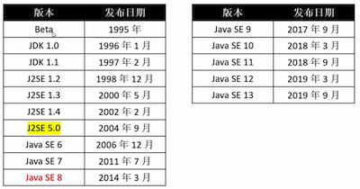 


## 3、java开发必备

想要顺利开发java程序, 有2个必须要安装的软件: JDK、JRE

- JDK (java Development kit), java开发工具包
  - 提供了开发中要用到的各种常用工具
- JRE( java Runtime Environment), java 运行环境
  - 将开发完的java程序运行到JVM上

> 一般我们是这样一个流程
>
> **使用JDK开发一套java程序, 利用JRE将程序运行到JVM上** 

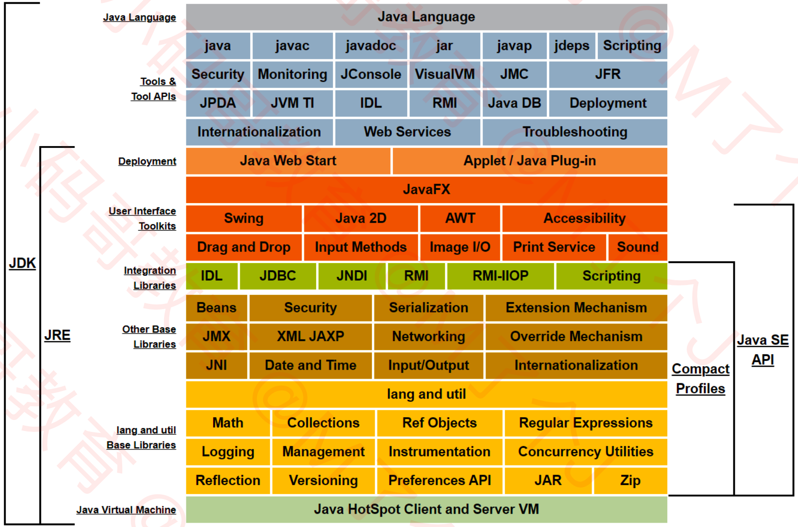 

**从上图可以看出, JDK中已经包含了 JRE, JRE中已经包含了JVM, 所以我们开发中只需要安装JDK就可以了. ** 


## 4、JDK 的下载

JDK中已经包含了JRE, 所以不需要单独下载JRE, 只下载JDK即可

下载地址: https://www.oracle.com/technetwork/java/javase/downloads/index.html


# 二、java的数据类型

## 1、Java数据类型介绍

java的数据类型就两大类:

- **基本数据类型(primitive type)** 
  - **byte**: 8-bit的整数, 取值范围 [128, 127]
  - **short**: 16-bit的整数, 取值范围[-32768, 32767]
  - **int**: 32-bit的整数
  - **long**: 64-bit的整数
  - **float**: 单精度32bit 浮点数
  - **double**: 双精度64bit浮点数
  - **boolean**: 布尔类型, 只有true 和 false
  - **char**: 单个 16-bit的unicode字符, (即一个char相当于是16bit的整数)
- **引用数据类型(reference type)**


## 2、字面量 (Literal)

- 整数

  ```
  // 十进制
  byte v1 = 123;
  
  // 二进制 (或0B11001)
  short v2 = 0b11001;
  
  //十六进制(或者 0xF78A, 0xf78a)
  int v3 = 0XF78A;
  
  // 以L或者l 结尾表示long类型(或者 199l)
  long v4 = 199L;
  ```

- 浮点数

  ```
  // 以F或者f结尾表示浮点数 float类F(或者 123.4f)
  float v1 = 123.4F;
  
  // 以D或者d结尾表示 double 类型(或者 123.4d)
  double v2 = 123.4D;
  
  // 默认是double 数据类型
  double v3 = 123.4;
  
  // 可以使用科学计数(E 或者 e)
  float v4 = 1.234E2f;
  double v5 = 1.234e2
  ```

  > 注意:
  >
  > 在java中, 浮点数默认就是 double 类型, 如下:
  >
  > double d1 = 1.34;  等价于 double d2 = 1.34d;
  >
  > 如果想用字面量表示一个float, 那么必须写成 `1.34f`   数字后面要有 `f` , 或者 (float)1.34;

- 字符和字符串

  ```
  // 使用单引号表示字符
  char c1 = 'A';
  
  // 使用双引号表示字符串
  String s1 = "abc";		// String 在java中属于引用数据类型
  ```

- 布尔

  ```
  boolean v1 = true;
  boolean v2 = false;
  ```

- 空值

  ```
  String v1 = null;
  
  注意: 在java中, 空值不等于空字符串, 空值null 表示不指向任何对象
  ```


## 3、在数字中使用下划线

从java7开始, 可以给数字添加下划线增强可读性

```
int v1 = 1_0000_0000;
int v2 = 0xFF_EC_DE_5E;
int v3 = 0b1100_0011;
double v4 = 12.23_23_23;
long v5 = 1__0000_000;		// 多个下划线也可以连在一起写

```

下面的写法是错误的

```
//  不能在浮点数的小数点前后写下划线 _
double d1 = 1._23;
double d2 = 1_.23;

// 不能在数字的前后写下划线 _
int  v1 = _123;
int v2 = 223_;

// 不能在X B F D L E 等特殊字母的前后使用下划线
byte v3 = 0x_12;
byte v4 = 0_b1002;
float v5 = 1.12_f;
long v6 = 189_L;
```


## 4、变量的初始化

任何变量在使用前都必须初始化(赋值)

- **局部变量, 需要程序员手动初始化** 

  ```
  void test(){
  	// int age;
  	// System.out.println(age); // 错误,变量在使用前必须初始化
  	
  	// 下面是正确做法
  	int age = 18;
  	System.out.println(age);
  	
  	// 也可以这样
  	double height;
  	height = 1.88;
  	System.out.println(height);
  }
  ```

  

- **非局部变量(实例变量, 类变量)** 

  **编译期会自动给未初始化的变量设置一个初始值** , 程序员可以不用管, 自动有初始值

  ```
  public class Main{
  	// 像这种, 成员变量, 实例变量编译器会自动帮我们初始化
  	private int age;
  	private static double height; // 类变量, 编译器也会帮助我们初始化
  	
  	public static void main(String[] args){
  		int count; // 局部变量, 在使用前必须初始化
  		System.out.println(count); // 错误, count在使用前必须初始化
  	}
  	
  }
  ```

- **编译器默认的初始值** 

  | 数据类型       | 默认初始值 |
  | -------------- | ---------- |
  | byte           | 0          |
  | short          | 0          |
  | int            | 0          |
  | long           | 0          |
  | float          | 0.0f       |
  | double         | 0.0d       |
  | char           | '\u0000'   |
  | boolean        | false      |
  | 对象(引用类型) | null       |

  


## 5、运算符(注意点)

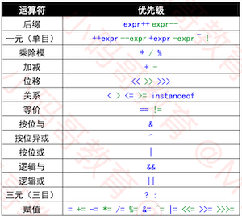 


### 1、表达式 (注意点) 容易犯错

**java中的算术表达式的结果 必须被使用, 否则报错** 

> 但是在其它语言里没有这个特点, 这一点需要注意一下, 否则在开发中容易犯错误

```
// 错误写法: 
void test() {
  /// 下面的表达式结果必须被用起来, 否则报错
  10 + 20;
}
	
// 正确做法1 
void test() {
  int sum = 10 + 20;
}

// 正确做法1 
void test() {
  int sum = 10 + 20;
}
// 正确做法2
void test() {
  System.out.println(10 + 20);
}

void test(){
	int[] arr = {1,2,3,4};
	// arr[2]; 错误写法, 表达式必须用起来
	int rst = arr[2];
}
```

> 即, java 中的算术表达式必须被使用


### 2、字符串拼接

java中字符串 使用 `+` 拼接

```
int age = 18;
String name = "zhangsan";
double height = 1.88;
System.out.println(
	"my name is" + name
	+ ", my age is" + age
	+ ", my height is" + height
);
```


### 3、位运算符

- `>>` 与 `>>>` 

  - `>>` 有符号右移动, 左边用符号位补齐

  - `>>>` 无符号右移, 左边用0补齐

    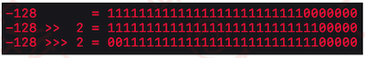 

补充:

```
int a = 10; 
/// 将一个整数, 转换成二进制的字符串
System.out.println(Integer.toBinaryString(a));	// 1010
System.out.println(Integer.toHexString(a));		// a		 
```


- `&` , `|` , `^`  按位与, 按位或, 按位异或

  > & 按位与, 相同取1, 不同取0
  > | 按位或, 有1取1, 全0取0
  > ^ 按位异或, 不同取1, 相同取0

  ```
  int age1 = 0b10010;
  int age2 = 0b11111;
  System.out.println(Integer.toBinaryString(age1 & age2)); // 10010
  System.out.println(Integer.toBinaryString(age1 | age2)); // 11111
  System.out.println(Integer.toBinaryString(age1 ^ age2)); // 01101
  ```

  > 在java中, & | ^ 按位与, 按位或, 按位异或除了可以用在整数上, 也可以用在 布尔类型 boolean 类型上

  ```
  System.out.println(false & true);		// false
  System.out.println(false | true);   // true
  System.out.println(false ^ true);		// true
  ```

**说明**

虽然, `&` , `|`, `^` 能用在 boolean 类型的数据上, 且 `&` 与 `&&`  `|` 与`||` 表面上看效果差不多, 

但是, 在实际开发中 `&&` 与 `&`  以及 `||` 与 `|` 还是有区别的, 具体区别如下:

- `&&` 称为短路与, `||` 称为短路或, 而`&` 与`|` 是没有短路功能的, 这一点需要注意一下.


## 6、(重点)类型转换(type conversion)

### 1、拓宽基本类型转换(Widening Primitive Conversion)

所谓拓宽基本数据类型就是将 **数据范围小的转换为数据范围大的** (19种), 可以自动转换**(隐士转换)** 

- byte 转 short, int, long, float, double

- short 转 int, long, float, double

- int 转 long, float, double

- long 转 float, double

- float 转 double

- char 转 int, long, float, double

  ```
  byte b = 12;
  short s = b;
  int i1= s;
  
  char c = 'A';
  int i2 = c;
  
  long L1 =i1;
  float f = L1;
  double d = f;
  ```

### 2、窄化基本类型转换(Narrowing Primitive Conversion)

所谓窄化基本数据类型转换, 就是将数据范围大的转化为数据范围小的(22种), 可能会丢失精度和范围, **需要强制转换** 

- short 转 byte, char
- char 转 byte, short
- int 转 byte, short, char
- long 转 byte, short, char, int
- float 转 byte, short, chart, int, long
- double 转 byte, short, char, int, long, float

```
short s = 512;
char c = (char)s;
byte b = (byte)c;

double d = 12.3;
float f = (float)d;
int i = (int)d;
```

> 注意:
>
> 布尔类型和整型浮点型之间是不能互相转换的, 这个在java开发


### 3、一元数字提升(Unary Numeric Promotion)

**一元数字提升:
将`byte`, `short`, `char` 类型的一元数字自动提升为`int`类型(拓宽基本数据类型转换)**  

> 所谓的一元运算符就是操作一个数字的运算符,常见的一元数字提升运算符有:
>
> 数组的方括号运算符[], 正号 + , 负号 -, 按位取反 ~  , 位移运算符 >> << >>> 
>
> 注意: ++ 和 -- 不是一元运算提升符号

说白了, 所谓的一元数字提升就是说当我们使用一元运算符操作一个数字(byte, short, char) 时, 编译器会自动的将这个数字(byte, short, char) 提升为 int 的数据类型, 换句话说一元数字提升就相当于是编译器自动帮助我们执行了 (int)byte, int(short), (int)char 的操作, 示例如下: 

- 示例说明1

  ```
  byte index = 1;
  int[] arr = [1,2,3,4];
  
  int rst = int[index]; // 此处 index 经过 [] 一元运算符处理后, 结果自动转换为 int 类型的了
  
  换句话说, 与下面这两句等价
  int a = 1;
  int rst = int[a]; // 相当于int rst = int[(int)a];的感觉
  ```

- 示例说明2

  ```
  byte b1 = 10;
  byte b2 = -b1; // 这句报错, -b1 的结果是int类型, 不能直接赋值给 byte 需要手动强制转换
  byte b3 = +b1; // 这句报错, +b1 的结果是int类型, 不能直接赋值给 byte 需要手动强制转换
  
  // 此处的+是正数的意思, - 是负数的意思
  ```

- 示例说明3

  ```
  char c = 'A';		// 字符在内存中存储的是ASCII值
  System.out.println(c);	// 是char 类型, 打印为 A
  
  System.out.println(+c); // 此处是 int 类型, 打印为 65
  System.out.println(-c); // 此处是 int 类型, 打印为 -65
  ```

  > 这也是我们如何将一个字符转换为数字, 或者如何获取一个字符的ASCII 码值常用的方法(使用一元数字提升即可)
  >
  > 相当于System.out.println((int)c); 的感觉

- 示例说明4

  ```
  char c1 = 'A';
  char c2 = +c1; // 错误, 编译不通过
  char c3 = 65;  // 这一句为什么能编译通过呢? 因为字面量 65 的数据类型是不确定了, 可以是byte, short, char, 所以能通过
  
  float height = 1.88; // 错误, 编译不通过, 因为 1.88 默认是double 类型, 不能直接将一个double 类型的数据直接赋值给float类型的数据
  ```

  > 结论: 
  >
  > - 整数字面量比如: 123 的具体类型是不确定的可以是直接赋值给 byte, short, char, 也可以赋值给long编译器会自动将整数字面量123拓宽为long, 等价于 123L
  > - 浮点数 12.3 默认是双精度的类型, 即字面量 12.3 与 12.3L 是一个意思, 因此不能直接将 12.3 赋值给float


### 4 二元数字提升(Binary Numeric Primitive)

二元数字提升这个注意事项如果没掌握的话, 也是让初学java的人员有时对计算结果一头雾水的原因, 为什么报错, 一脸懵逼~~~

我们在学java的时候, 必须要对二元数字提升要有认识, 否则程序报错了就很尴尬


**二元数字提升:**

**提升一个或两个数字(拓宽基本数据类型转换)** 

- 如果任意一个数字是`double` 类型, 那么另外一个就会被转换为`double` 类型,
- 否则, 如果一个数字是`float` 类型, 那么另外一个就会被转换为`float` 类型
- 否则, 如果一个数字是`long` 类型, 那么另外一个就会被转换为`long` 类型
- 否则, 两个数字都被转换为 `int` 类型. 

> 说白了, 就是两个数字在进行运算时, 会先检查有没有double, 如果有就将另外一个不是double的自动转换为double, 这样就相当于 double 与 double 运算, 结果为double, 如果没有double就看有没有是float类型的, 有就将另外一个不是float的转换为float, 再运算
>
> 以此类推,直至int类型
>
> 如果两个数字在运行时, 都不是 double, float, long, int, 那么在运算前全部转换为int类型再运算, 结果为int.

**即, 两个数字在运行时, 结果至少是int 级别的** 

- 常见的二元运算符有:

  > 乘 *, 除 /, 取余 %, 加法 + , 减法 -
  >
  > 比较 < , <=, >, >=
  >
  > 判等 ==, !=
  >
  > 位运算 &, |, ^
  >
  > 三目 ? :

- 示例: (此处我们举一个常见错误例子)

  ```
  byte b3 = b1 + b2;  
  // 错误, 二元数字提升, 最低的数据类型都是 int, 
  // 此处 b1 + b2 相当于 (int)b1 + (int)b2 结果是一个int, int 的结果不能直接赋值给 byte
  		
  // 这样做仍然是错误的做法	
  byte b3 = (byte)b1 + (byte)b2;  
  
  // 正确的做法: 将计算结果强转为 byte 才可以
  byte b3 = (byte)(b1 + b2);  
  
  有个特例
  byte b = 1 + 2; 编译通过, 正确的
  byte b4 = 6;
  b4 += 3; 编译通过, 所以在java开发中你会经常看见+=, -+ , *= 这种操作
  
  ```

  

## 7、标识符

- 标识符: 变量名, 方法名, 类名等, 命名规则如下:

  - 不限长度的 `java字母` , `java数字` 序列, 但必须以`java字母` 开头, 区分大小写

  - 不能使用关键字
  - 不能使用字面量 true, false, null


# 三、数组


## 1、数组的创建

> Java的数组属于引用类型
>
> - 数组元素存储在对空间(heap) 

```
int[] arr1;
int[] arr2 = {}; // 空数组 (推荐这种语法)
int arr3[] = {}; // 空数组 (不推荐这种语法)

// 定义的时候指定数组元素
int[] arr4 = new int[]{1,2,3,4};
int[] arr5 = {1,2,3,4}; // 这个是语法糖

// 定义的时候指定数组长度
int[] arr6 = new int[4];
arr6[0] = 1;
arr6[1] = 1;
arr6[2] = 1;
arr6[3] = 1;

// 多维数组
int[][][] arr7;
int[] arr8[][];
```

> 注意:
>
> 在java中, 字符数组 != 字符串 (C 语言中是等价的)
>
> 字符数组: char[]
>
> 字符串: String


## 2、数组遍历

- 遍历

  ```
  int[] arr = {1,2,3};
  
  for(int i=0; i<arr.length; i++){
  	System.out.println(arr[i]);
  }
  
  // 相当于iOS中的for in
  for(int ele : arr){
  	System.out.println(ele);
  }
  ```

- java数组元素存储在堆空间(heap)

- java的堆内存申请会自动进行初始化

  ```
  int[] arr = new int[4];
  for(int ele : arr) {
  	System.out.println(ele); // 打印 4个 0
  }
  
  String[] arr = new String[4];
  for(String ele : arr) {
  	System.out.println(ele);	// 打印4个null
  }
  ```

## 3、数组的打印

```
String[] arr = new String[4]; 
System.out.println(arr);
```

> 数组的打印如下:
>
> [Ljava.lang.String;@6d06d69c
>
> `Ljava.lang.String; ` 部分 代表的是数组的类型, String 类型
>
> `@6d06d69c`  代表的是数组的 哈希code, 只不过使用十六进制显示的


## 4、可变参数 & 可变参数特点

- 可变参数的简单使用

  ```
  public static int sum(int... nums){
  	int rst = 0;
  	for(int i=0; i<nums.length; i++){
  		rst += nums[i];
  	}
  	return rst;
  }
  ```

- 可变参数必须是方法的最后一个参数, 否则有歧义会将报错. 

  > java JDK中自带的 `System.out.printf()` 方法就是使用了可变参数
  >
  > 格式字符串参考API文档的 `java.util.Formatter` 类

- 可变参数的本质

  其实可变参数的本质就是一个普通的数组, eg: `int[]`、`double[]`、`string[]`

- **可变参数的特点**

  可变参数是一个非`null` 的数组, 这个特点很重要

  ```
  void test(){
  	printNames(); // 调用可变参数
  }
  
  // 定义可变参数方法
  void printNames(String≥ ... names){
  	System.out.println(names == null);  // false
  }
  ```

  

## 5、参数传递

java中的数据类型2种:

- 基本数据类型:  byte  char short int long float double boolean

  > 值传递

- 引用数据类型: 数组, 对象


## 6、对象数组的注意点

- 强制类型转换

  ```
  // 下面的操作是完全可以的
  Object obj1 = 11;
  Integer obj2 = (Integer)obj1;
  System.out.println(obj2);
  // 打印:
  11 
  ```

- **Object[] objs1 = {11,22,33};  ** 的本质

  ```
  Object[] objs1 = {11,22,33};  
  Object[] objs2 = new Object[] {11,22,33};   
  // 上面两句代码本质是一样的, 表示的是一个 Object[] 类型的数组, 只是这个数组里面存储的是 Integer 而已
  		
  ```

- 误区

  ```
  Object[] objs1 = {11,22,33};  
  // Integer[] array = (Integer[])objs1; 错误 java.lang.ClassCastException
  ```

  > `Object[] objs1 = {11,22,33};` 表示的是一个 Object[]  数组
  >
  > `Integer[]` 类型的数组与 `Object[]` 类型的数组是不同类型的数组, 因此是不能进行强制转换的
  >
  > 因此,结论:
  >
  > `objs1` 是不能赋值给 `array` 的, 因为 `Object[]` 类型与 `Integer[]` 是不同的类型, 且没有继承关系, 类型不对


# 四、方法


## 1、方法定义

java中的方法就是其他语言中的函数

- 方法的书写格式

  ```
  修饰符 返回值类型 方法名(参数列表){
  	方法体
  }
  ```

- 可变参数

  > 可变参数至少都是一个{}, 不会为null

  ```
  public static int sum(int... nums){
  	int rst = 0;
  	for(int i=0; i<nums.length; i++){
  		rst += nums[i];
  	}
  	return rst;
  }
  
  
  // 外面使用
  sum();// 可以
  sum(1,2,3,4,5); // 也可以, 这就是可变参数
  ```

  > 注意:
  >
  > 方法中的可变参数, 必须是方法的最后一个参数


## 2、方法签名(Method Signature)


- 方法签名由两部分组成: `方法名` 和 `参数类型` 

  > 注意: 方法签名不包含返回值

- 下面的方法签名是: `sum(int, long, double)`

  ```
  public static double sum(int i, long l, double d){
  	return i + l + d;
  }
  ```

- 同一个类里面不能存在两个或多个方法签名一样的方法

## 3、方法重载(overload) 

- java的方法支持重载: **方法名相同, 方法签名不同**

  >  即: 方法名相同, 参数个数不同, 参数类型不同

- 方法重载与返回值类型, 以及方法的参数名无关


## 4 、递归

```
int sum(int n){
	if(n <= 1) return n;
	return n + sum(n - 1);
}
```


# 五、面向对象

## 1、java程序的内存划分

- `堆` 存储GC所管理的各种对象 (就是我们平时new出来的对象)
- `方法区`  Method Area, 存储每一个类的结构信息(比如字段和方法信息, 构造方法和普通方法) 
- `PC寄存器` Program Counter Register, 存储java虚拟机正在执行的字节码指令地址
- `Java虚拟机栈` Java Virtual Machine Stack, 存储栈帧(java的方法栈) 
- `本地方法栈` Native Method Stack, 用来支持native方法调用(比如C语言编写的方法) 

## 2、构造方法

**构造方法, 也叫构造器, 能够更方便的创建一个对象**

- **方法名必须与类名一样**
- **没有返回值类型**
- **可以重载** 

```
public class Dog{
	public int age;
	public double height;
	
	public Dog(){
	}
	
	public Dog(int age){
		this.age = age;
	}
	
	public Dog(int age, double height){
		this.age = age;
		this.height = height;
	}
}


// 外面使用
Dog d1 = new Dog();
Dog d2 = new Dog(18);
Dog d3 = new Dog(18, 1.88);
```

- **默认构造方法**

  如果一个类没有自定义构造方法, 编译器会自动为他提供无参的默认构造方法

  但是, 如果你自定义了构造方法, 默认的构造方法就不再存在了

## 3、 this

`this` 是一个指向当前对象的引用, 常见用途.

- 访问当前类中定义的成员变量
- 调用当前类中定义的方法**(包括构造方法) ** 

```
public class Dog{
	public int age;
	public double height;
	
	public Dog(int age, double height){
		this.age = age;
		this.height = height;
	}
	
	public Dog(int age){
		//  自己调用自己的构造方法
		this(age, 1.88); // 使用this 调用当前类中的构造方法
	}
}
```

>  this的本质就是一个隐藏的, 位置最靠前的参数


## 4、包 (package)

java中的包就是编程语言中的命名空间, 包的本质是文件夹, 常见的作用是:

- 将不同类进行组织管理, 访问控制
- 解决命名冲突

- 类的第一句代码必须使用`package` 声明自己属于哪个包


java 中, 包名的建议:

- 为了保证报名的唯一性, 一般包名都以公司的域名倒写开头: eg: `com.baidu` 

- 一般包名都是用小写

包名的细节:

- 如果你公司的域名有非法字符(一般是数字, 中划线, 关键字), 建议使用`_` 来使包名合法化

  ```
  520it.com // 域名
  com._520it // 包名
  
  my-name.org // 域名
  org.my_name // 包名
  
  int.com // 域名
  com._int // 包名
  ```

类的第一句代码必须使用`package` 声明自己属于哪个包

```
package com;	// 此处说明当前类 Test 是属于 com 这个包的, 这句不能省

public class Test {

	public static void main(String[] args) {
		System.out.println("======");
	}
}
```


## 5、如何使用一个类

在java中, 要正常的使用一个类, 必须得知道这个类的具体位置(在那个包), 有3种常见的方式来使用一个类:

1. 使用类的全名(包名+类名)
2. 导入包中的具体某个类
3. 导入包中的所有类


- 方式一, 使用类的全名(包名+类名)

  ```
  com.yr.Dog dog = new com.yr.Dog();
  ```

  > 这种使用全名的方式使用类, 肯定是不推荐的, 但是有时也必须要用
  >
  > 当系统内的类(第三方的类)和自己的类名称冲突时, 一般我们会采用这种方式来解决类的冲突
  >
  > 在java开中, 是不存在给类取别名的哈. 

- 方式二, 使用`import` 导入指定的类名

  ```
  import com.yr.Dog; // 导入指定的类名, 后面使用就可以不使用全名了
  
  void test(){
  	Dog dog = new Dog();
  	System.out.println(dog);
  }
  ```

- 使用`import` 导入整个包的所有类

  ```
  import com.yr.Dog;
  import com.yr.Cat;
  // 上面的可以简化为下面的, 直接导入整个包的类, 这样后面包里面的类就不用使用全名了
  import com.yr.*;
  
  void test(){
  	Dog dog = new Dog();
  	Cat cat = new Cat();
  	
  	System.out.println("dog: " + dog + ",cat: " + cat);
  }
  ```

  > 注意:
  >
  > `import com.yr.*;` 只表示导入的com.yr 包中的类, 不包含包中的包, 指的是直接包
  >
  > 即: 
  >
  > import com.yr.*; 仅仅是 import 了直接存放在com.yr 包中的类
  >
  > 并不包含 import com.yr.xx.*; 中的类


## 6、导入的细节

为了方便, java的编译器会为每个源文件,自动导入2个包:

- 第一个, `java.lang.*` 这个包
- 第二个, 当前文件所在的包(即 `文件件所在包.*` 


## 7、继承

### 1、子类 父类同名成员变量

在java中, 子类可以定义跟父类同名的成员变量( 但是, 不推荐这样做) 

```
public class Person{
	public int age = 2;
}

public class Student extends Person{
	public int age = 1;
	public void show(){
		System.out.println(age); 				// 1
		System.out.println(this.age); 	// 1
		System.out.println(super.age);  // 2
		
	}
}
```

> 在其它语言中好像是不允许子类父类有同名的成员变量的


### 2、方法的重写(Override) 

在java中, 子类的方法签名与父类的**方法签名一样** 称为方法重写, 也叫覆盖, 覆写

```
package com;

public class Animal {
	public void speak() {
		System.out.println("Animal speak");
	}
}


package com;
public class Person extends Animal {

	@Override
	public void speak() {
		// TODO Auto-generated method stub
		super.speak(); 
		System.out.println("person speak");
	}
}
```


**java 中方法重写注意点:** 

- 子类`override` 的方法权限, 必须要大于等于`>=` 父类的方法权限

  比如: 父类的方法是`protected`  权限, 子类的就不能比`protected` 小, 只能是`protected或public`

  > public > protected > 无修饰符(package-private) > private

- 子类`override` 的返回值类型必须要小于等于`<=` 父类的方法返回类型

  比如: 父类方法方法是返回`Dog` 子类的就至少是`Dog` 或是`Dog` 的子类


### 3、super

`super` 的常见用途

- 访问父类中定义的成员变量

  ```
  比如: 父类 Animal 和 子类 Person中都有个 `age` 成员变量, 在子类中想要访问父类中的`age` 成员变量就必须使用 super.age 来访问
  this.age; // 访问自己的age
  super.age; // 访问父类的age
  ```

- 访问父类中定义的成员方法

  ```
  public void test(){
  	super.test();
  	System.out.println("child test");
  }
  ```

- 访问父类的构造方法

  > 只能在子类的构造方法中使用super 访问父类的构造方法
  >
  > 且, 使用super调用父类的构造方法时, super只能写在构造方法的第一句

  ```
  Dog(int age, double height){
    super(age);
    this.height = height;
  }
  ```

  

### 4、构造方法的细节

- 子类的构造方法必须先调用父类的构造方法, 再执行后面的代码

- 如果子类的构造方法没有显示调用父类构造方法, 编译器会自动调用父类无参的构造方法

  如果 此时父类没有无参的构造方法编译器将报错.

  > 即, 父类没有无参的构造方法时, 子类的构造方法里面必须显示的调用父类的有参构造方法.


## 8、注解(Annotation)

2个常见的注解:

- `@Override`: 告诉编译器这是一个重写的方法

- `@SuppressWarning("警告类别")` 让编译器不生成警告信息

  ```
  @SuppressWarnings("unused")  // 抑制 未使用警告
  @SuppressWarnings({"unused", "rawtypes})  // 抑制 多个警告
  ```

  > 注意: 
  >
  > 如果你的代码中没有对应的需要压制的警告信息, 但是你使用了对应的抑制 注解, 编译器也会报错

```
// 抑制代码中的单行未使用警告
void test(){
	@SuppressWarnings("unused") 
	int age = 10;
}


// 抑制整个方法中的未使用警告
@SuppressWarnings("unused") 
void test(){
	int age = 10;
	double height = 1.88;
}

// 抑制整个类中的未使用警告
@SuppressWarnings("unused") 
public class Person{
	void test(){ 
    double height = 1.88;
	}
	
	void test2(){
		int age = 10; 
	}
}
```


## 9 、访问控制(Access control)

java中有4个级别的访问控制, 从高到低如下所示:

- `public`: 在任何地方都可见(可访问)
- `protected`: 仅在自己的包中, 自己以及自己的子类中可见(可访问)
- `无修饰符(package-private)` : 仅在自己的包中可见
- `private`: 仅在自己的类中可见

> 在包中可见, 表示的是只要在同一个包里面文件里都是可以访问的, 与子类父类无关
>
> 只要不是被`private` 修饰的, 就是包中可见

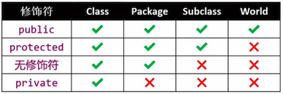 


**使用注意**

- 上述4种访问权限都可以用来修饰类的成员, 比如:

`成员变量` 、`方法` 、`嵌套类` 等

>  所谓的类成员就是写在 java类的 {} 里面的一切

- 只有`public` 、`无修饰符(package-private` 可以修饰顶级类

  > 所谓顶级类, 就是一个源文件中能最外面的类 (因为在 java 中, 可以在类里面定义类)

  ```
  public class Dog{ // 顶级类, 顶级类要么使用public 修饰, 要么不写
  	class Pet{	// 非顶级类
  	}
  }
  ```

- 在java的一个源文件中, 可以写多个顶级类, 但是最多只有一个顶级类可以使用public 修饰,

  且使用 public 修饰的顶级类名必须与源文件名相同

  ```
  // Person.java 源文件
  public class Person{ // 顶级类
  
  }
  
  class Dog{ // 顶级类
  
  }
  
  class Cat{ // 顶级类
  
  }
  
  在java源文件中, 最多只有一个顶级类可以使用 public 修饰
  ```

- 上述4个访问权限不可以修饰 `局部类, 局部变量`


## 10、封装

java中的所谓封装, 一般来说就是将成员变量的访问控制权限全部设置为私有的`private` 然后提供 `get` 和 `set` 方法. 

```
public class Person{
	private int age;
	private double height;
	
	public void setAge:(int age){
		this.age = age;
	}
	public int getAge(){
		return this.age;
	}
	
	public void setHeight(double height){
		this.height = height;
	}
	public double getHeight(){
		return this.height;
	}
}
```

> 顺便说一下,  在java 中尽量为每个类都提供无参的构造方法. 


## 11、toString 方法

- 在java中, 当打印一个对象时, 会自动调用对象的`toString` 方法, 并将返回的字符串打印出来

- `toString` 方法是源于基类`java.lang.Object` , 默认的实现如下所示:

  ```
  // java.lang.Object 类中的toString方法的实现
  
  public String toString() {
  	return getClass().getName() + "@" + Integer.toHexString(hashCode());
  }
  ```

  > 即, 默认情况下我们打印一个对象时,打印结果@的左边表示的是当前对象的类名, @右边表示的是对象的哈希值的十六进制


# 六、static

## 1、static 介绍

- `static` 常用来修饰类的成员: `成员变量`、`成员方法` 、`嵌套类`, 如下: 

  ```
  package com.yr;
  
  public class Person{
  	private static int age;	// static 修饰成员变量
  	
  	public static void run(){	// static 修饰成员方法
  		System.out.println("Person 在 run");
  	}
  	
  	public class Test{	// static 修饰嵌套类
  	
  	}
  }
  ```

  

## 2、static 修饰成员变量、修饰方法

静态变量

- 被`static` 修饰的成员变量, 我们一般称为类变量, 静态变量, 静态字段

  在程序运行的过程中只占用一份固定的内存(存储在方法区)

  - **静态成员变量, 可以通过实例 和 类名 访问** 

- 没有被`static` 修饰的成员变量, 我们称之为实例变量

  在每个实例对象中都有一份实例变量的内存

  - **实例变量, 只能通过实例对象来访问** 


静态方法

- 被`static` 修饰的方法, 称为类方法, 静态方法
  - **静态方法可以通过实例 和 类名访问**
  - **静态方法内部不能使用`this` **
  - **在静态方法里面可以直接访问静态变量 和 静态方法** 
  - **静态方法里面不能直接访问实例变量 和 实例方法** 
- 没有被`static` 修饰的方法, 称为 实例方法
  - **实例方法只能通过实例对象访问** 


不推荐

- 不推荐使用实例方位类变量, 类方法
- 在同一个类中, 不能有同名的实例变量和静态变量
- 在同一个类中, 不能有同名的实例方法和静态方法


## 3、静态导入

### 1、静态导入介绍

使用静态导入后, 就可以省略类名来访问静态成员(静态变量, 静态方法, 嵌套类)

```
// 定义静态 成员的Dog 类
package com.yr;
public class Dog{
	public static int age = 10;
	public static double height = 1.88;
	public static void test(){
		System.out.println("dog static test");
	}
}
```

- 在没有使用静态导入前, 我们是这样用的

  ```
  import com.yr.Dog; // 导入Dog类
  
  public class Person{
  	
  	public static void doTest(){
  		// 访问Dog 中的静态成员我们需要使用实例对象或类名
  		Dog dog = new Dog();
  		System.out.println(dog.age);
  		System.out.println(dog.height);
  		dog.test();
  		
  		// 或者
  		System.out.println(Dog.age);
  		System.out.println(Dog.height);
  		Dog.test();
  	}
  }
  ```

- 使用静态导入后, 我们可以简化静态成员的使用了

  ```
  import com.yr.Dog; // 导入Dog类
  import static com.yr.Dog.age; // 导入Dog类中的age 静态成员
  import static com.yr.Dog.height; // 导入Dog类中的height 静态成员
  import static com.yr.Dog.test; // 导入Dog类中的height 静态成员
  public class Person{
  	
  	public static void doTest(){
  		  
  		System.out.println(age);	// 直接访问静态成员变量
  		System.out.println(height);  
  		test();	// 直接访问静态成员方法
  	}
  }
  ```

  > 其实, 我们也可以使用 `import static com.yr.Dog.*`  静态导入Dog类中的所有静态成员
  >
  > 这样就不用再一个个的导入了


**注意:**

虽然使用静态导入后, 我们在导入类中使用外部的静态成员变得简单了, 但是不要滥用静态导入

引入静态导入使用多了可能也会让我们的代码的可读性降低, 引起不必要的麻烦, 使用时要慎用!!!


### 2、静态导入使用 情景1

没有使用静态导入前

```
package com.yr;
 
class Dog {

	public static int age = 20;
	
	public static void test() {
		System.out.println("dog static test");
	}
	
	
	public static class Leg {
	}
}

// 外部使用
import com.Dog.Leg;

public class Person  {

	public static void main(String[] args) {
		// 需要使用Dog.Leg 来访问
		Dog.Leg leg = new Dog.Leg();
		System.out.println(leg);
	}
}

```

使用静态导入后

```
import com.Dog.Leg;
import static com.Dog.*; // 静态导入


public class Person  {

	public static void main(String[] args) {
		
		Leg leg = new Leg();  // 此处Leg相当于Dog.Leg
		System.out.println(leg);
	}
}
```


### 3、静态导入经典应用场景

```
import static java.lang.Math.PI; // 静态导入 PI

public static void main(String[] args){
	System.out.println(2*PI*3.14);
}
```


## 4、成员变量的初始化

- 编译器会自动为未初始化的成员变量设置初始值

  ```
  public class Person{
  	public static int age;
  	public double height;
  }
  
  // 上面的类中是没有显式的为 age 和 height 成员变量做初始化的
  // 编译器会自动的为我们做初始化
  ```

- 如何手动给实例变量提供初始值?三种方式

  - 在声明的时候就赋初值

  - 在构造方法中

  - 在`初始化块` 中

    编译器会将初始化块复制到每个构造方法的头部`(每创建一个实例对象, 就会执行一次初始化块)`

  ```
  // 声明时候赋初值
  public class Person{ 
  	public double height = 10;
  }
  
  // 构造方法赋初值
  public class Person{ 
  	public double height;
  	public Person(){
  		this.height = 10.0;
  	}
  }
  
  // 初始化块赋初值
  public class Person{ 
  	public double height;
  	
  	// 实例方法, 初始化块
  	{
  		this.height = 10.0;
  	}
  }
  ```

  

- 如何手动给类变量提供初始值? 

  - 在声明中

  - 在 静态初始化代码块 中

    - 当一个类被初始化的时候执行`静态初始化代码块` 

    - 当一个类第一次被主动使用时, JVM 会对类进行初始化

      > 即, 当一个类在第一次被使用的时候就会执行 静态初始化代码块, 也即使静态初始化代码块在程序运行过程中只会执行一次

  ```
  public class Person{
  	public static int age;
  	public Person(){
  	
  	}
  	
  	// 静态初始化代码块
  	static {
  		age = 10;
  	}
  }
  ```


**说明:**

在一个类中, 可以有多个(静态) 初始化代码块, 按照在源码中书写的先后顺序执行


## 5、单例模式

如果一个类设计成单例模式, 那么在程序运行过程中, 这个类只能创建一个实例. 

单例实现的3个 步骤:

1. 构造函数私有化, 禁止外部直接使用构造方法创建实例
2. 提供一个私有的静态的成员变量来保存实例变量
3. 提供一个公共的静态的方法, 供外部来访问单例的实例对象

- 饿汉式单例实现

  ```
  public class Rocket{
  	private static Rocket instance = new Rocket();
  	private Rocket(){}
  	public static Rocket getInstance(){
  		return instance;
  	}
  }
  ```

- 懒汉式单例实现 (有线程安全问题)

  ```
  public class Rocket{
  	private static Rocket instance;
  	private Rocket(){}
  	public static Rocket getInstance(){
  		if(instance == null){
  			instance = new Rocket();
  		}
  		return instance;
  	}
  }
  ```

  


# 七、final


- 被 `final` 修饰的类, 不能被继承

  > 如果你设计出来一个类, 但是不想这个类被别人继承你就可以使用final 修饰这个类

  ```
  public final class Animal { 
  }
  
  // The type Dog cannot subclass the final class Animal
  // 被final 修饰的类不能被继承
  class Dog extends Animal{
  }
  ```

- 被`final` 修饰的方法, 不能被重写

  ```
  public  class Animal {
  	 public final void test() {
  		 System.out.println("animal test");
  	 }
  }
   
  class Dog extends Animal{
  	
  	// 子类不能重写 父类的final 方法
  	@Override
  	public void test() {
  		System.out.println("Dog test");
  	}
  }
  ```

  

- 被`final` 修饰的变量, 只能进行1次赋值操作

  > 其实, java中的fianl 修饰的变量, 和其它语言中`const` 修饰的常量有想同的感觉, 但是又有点不同

  ```
  public void test(){
  	final int age = 10; 
  	age = 20; // 错误, final 修饰的变量只能赋值一次
  }
  
  public void test(){
  	final int age ; 
  	age = 10; // final 修饰的变量只能赋值一次, 可以先定义在赋值, 反正只能赋值一次
  }
  ```

  - 如果`final` 修饰的是类的成员变量时, 除了 这个成员变量只能赋值一次外, 还要求对象创建出来后final修饰的成员变量就要有值

    ```
    // 错误写法
    public class Dog{
    	private final int age;
    }
    
    // 正确写法1
    public class Dog{
    	private final int age = 10;
    }
    
    // 正确写法2
    public class Dog{
    	private final int age;
    	
    	{
    		age = 10;
    	}
    }
    
    // 正确写法3
    public class Dog{
    	private final int age;
    	
    	public Dog(){
    		age = 10;
    	}
    }
    
    即, final修饰成员变量时, 在实例对象创建出来时必须有值
    要么定义成员变量是赋值, 要么在构造方法里赋值, 要么在初始化代码块中赋值
    ```

    > 当然, final修饰的成员变量, 也可以是静态成员变量(静态方法), 用法类似


**补充**:

想java中这种final 修饰的变量, 一旦赋值了就不能再赋值了, 在其它语言中称为**常量** , 但是在java开发中我们一般所说的常量不是这个final 修饰的变量,如: `final int age = 10;` 

在java中我们所说的常量一般更多指的是下面这种, 这种我们一般才称为常量:

```
// 下面这种才是我们一般称为的java常量
public static final double PI = 3.141592653589;

// 即在java中我们所说的常量一般指的是被 static final 修饰的 静态成员变量
// 且, java中的常量一般全部使用 大写命名, 多个单词使用 _ 分隔
```


**java 常量常识:**

- 如果将基本数据类型或者字符串定义为常量( static final) , 并且在编译时就能确定值

  编译器会使用常量值替代各处的常量名(类似于C语言中的宏替换)

  ```
  public  class Animal {
  	
  	private  final static int AGE = 10; // 这种一般我们成为编译时常量 
  	 
  	 public static void test() {
  		 System.out.println(AGE); // 编译器会自动替换为   System.out.println(10);
  	 }
  }
  
  // 但是想下面这种是不会替换的
  
  public  class Animal {
  	
  	private  final static int AGE = getAge();
  	static int getAge(){
  		// 计算操作 ...
  		reture 10;
  	}
  	 
  	 public static void test() {
  		 System.out.println(AGE); // 此处编译器不会自动替换为   System.out.println(10);
  	 }
  }
  ```


# 八、嵌套类(Nested Class)


## 1、嵌套类介绍

- 嵌套类: 定义在另一个类中的类

  ```
  public class OuterClass{
  	// 静态嵌套类
  	static class StaticNestedClass{
  	
  	}
  	
  	// 非静态嵌套类(内部类)
  	class InnerClass{
  	
  	}
  }
  ```

  > 只要是定义在一个类内部的类, 不论有没有被static修饰, 我们都称为嵌套类
  >
  > 使用 static 修饰的嵌套类, 称为静态嵌套类
  >
  > 没有被static修饰的嵌套类, 称为非静态嵌套类(或者 内部类)

- 定义在嵌套类外面的类 , 我们称为: 外部类(outer class) , 像上面的 `OuterClass` 就是外部类

- 最外层的外部类, 称为: 顶级类(top-level class)

  ```
  public class Person{	// 顶级类
  	class A{	// 外部类
  		class B{	// 外部类
  			class C{
  			}
  		}
  	}
  }
  ```

  


## 2、内部类(inner class)

- 内部类, 没有被`static` 修饰的嵌套类(非 静态嵌套类)

- **跟 实例变量, 实例方法一样, 内部类与外部类的实例对象相关联** 

  > 说白了, 内部类(非 静态嵌套类) 和实例变量, 实例方法一样, 只能通过实例对象的方式访问, 如果没有创建外部内的实例变量是不能访问内部类
  >
  > 注意: 我们此处说的内部类, 都是指的 非静态嵌套类, 静态嵌套类后面再说.

  ```
  package com.yr;
  
  public class Person{
  	private int age;
  	public int getAge(){
  	
  	}
  	class InnerClass{
  	
  	}
  }
  
  说白了, 要访问 `age`, `getAge()`, `InnerClass`  这三个成员都必须先创建 Person 类的实例对象, 这也就是我们说的与实例对象挂钩
  其实很好理解, Person类的实例不存在时, `age` 不存在, 没有人调用`getAge()` 方法, `InnerClass` 没有意义
  ```

- ​	**必须先创建外部类实例, 然后再用外部类实例创建内部类实例** 

  ```
  package com.yr;
  
  public class Person{
  	private int age;
  	public int getAge(){
  		return age;
  	}
  	
  	public class Hand{
  		public void test(){
  			System.out.println("person innerclass hand");
  		}
  	}
  }
  
  Public class Test{
  	public static void main(String[] args){
  		// 1. 创建Person实例对象
  		Person person = new Person();
  		
  		// 2. 通过Person 的实例对象创建内部类 Hand 的实例对象
  		Hand hand = person.new hand();	// 注意, 只能通过这种方式创建Hand 的实例
  		hand.test(); // 通过Hand 的实例访问里面的实例方法
  	}
  }
  ```

  > 其实, 在内部类里面是有一个指向外部类的引用的(相当于你可以理解为在内部类里面有个外部类的成员变量), 上面示例的内部类的内存布局如下: 

  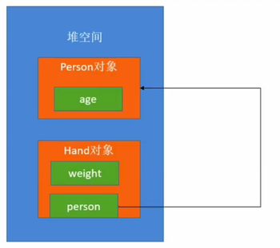 

  从上面内部类的内存结构, 我们也可以理解为什么, 必须要先创建外部类对象后才能创建内部类对象. 

  

- 内部类不能定义 除 **编译时常量** 以外的任何 **static 成员** 

  ```
  public class Person{
  	public class Hand{
  		private static  final int weight = 188; // 编译时常量  
  		// 错误写法, 在内部类中 定义的静态变量 必须是final 修饰的常量
  		// private static int count = 10;
  	}
  }
  ```

  

- 内部类可以直接访问外部类中的所有成员(即使被声明为 private)

  ```
  public class Person  {
  	private int age = 18;
  
  	class Hand{
  		 void test() {
  		 // 内部类, 访问外部类 的私有成员变量也是可以的
  			System.out.println(age); // 此处相当于是 访问 person.age
  			
  		}
  	}
  	
  	public static void main(String[] args) {
  		Person person = new Person();
  		Hand hand = person.new Hand();
  		hand.test();	
  	}
  }
  ```

  

- 外部类可以直接访问内部类实例的成员变量, 方法(即使声明为 private)

  ```
  public class Company{
  	private String name;
  	public Company(String name){
  		this.name = name;
  	}
  	
  	public void fire(Employee e){
  		// 外部类访问内部类的私有成员
  		System.out.println(name + "fire " + e.no );
  	}
  	
  	public class Employee{
  		private int no;
  		public Employee(int no){
  			this.no = no;
  		}
  	}
  	
  	public void show(){
  		// 内部类访问外部类的私有成员变量
  		System.out.println(name + ": " +no);
  	}
  }
  ```

  > 即内部类和外部类可以相互访问对方的成员.

## 3、内部类细节

当外部类与内部类有相同的成员变量时, 需要按照下面的方式访问

```
public class OuterClass{
	private int x = 1;
	
	public class InnerClass{
		private int x = 2;
		public void show(){
			System.out.println(x); // 2
			System.out.println(this.x); // 2
			System.out.println(OuterClass.this.x); // 1
			
		}
	}
}
```


## 4、静态嵌套类 (static Nested Class)

- 静态嵌套类: `被 static 修饰的嵌套类`

- 静态嵌套类在行为上就是一个顶级类, 只是定义静态嵌套类的代码写在了另一个类中了而已.

  ```
  public class Person{
  	private int age = 10; 
  	// 在Person这个类中定义了一个 static的静态嵌套类
  	public static class Car{
  	}
  }
  
  // 外部使用静态嵌套类
  public static void main(String[] args){
  
  	Person tom = new Person();
  
  	// 静态嵌套类需要这样使用, 直接使用类名 . 即可, 不用向内部类一样需要创建外部类的实例
  	Person.Car myCar = new Person.Car();
  	// 可以从上面的代码看出, 静态嵌套类的行为就是一个顶级类. 
    // Car 对象和 Person 对象没有任何联系
  }
  ```

- 对比一般的顶级类, 静态嵌套类多了一些特殊权限

  **可以直接访问外部类中的成员(即使被声明为 private) **

  ```
  public class Person{
  	private static int age = 10;
  	private int count = 2;
  	private static void run(){
  		System.out.println("person run");
  	}
  	public static class Car{
  		public void test(){
  			Person person = new Person();
  			System.out.println(person.count);	// 访问person实例的私有成员
  			System.out.println(Person.age); 	// 可以直接访问外部类的静态成员变量, 即使是私有的
  			Person.run(); 	// 可以访问外部类的静态方法, 即使是私有的
  		}
  	}
  }
  
  // 外部使用静态嵌套类
  public static void main(String[] args){
   
  	Person.Car myCar = new Person.Car();
  	myCar.test();
  }
  ```

  

## 5、什么情况下使用嵌套类呢? 

首先要回答这个问题, 我们必须先搞懂下面的问题: 

1. 嵌套类分为静态嵌套类和非 静态嵌套类(内部类)

2. 静态嵌套类相当于普通的顶级了, 可以独立于外部类, 单独创建自己的实例对象, 只是静态嵌套类相比普通的定义类多了一些方位外部类成员的权限

3. 非 静态嵌套类, 我们也称为内部类, 在内部类的内部其实是有一个隐藏的指向外部类的引用, 因此必须要先创建外部类的实例, 再通过外部类的实例才能创建内部类的对象

   


**使用嵌套类的经验总结:**

- 如果 `类A` 只用在 `类C` 的内部, 可以考虑将 `类A` 嵌套在 `类C` 中

  - 封装性更好, 对于类A外部是永远不可见的
  - 程序的包更加的简化(程序对外看起来类更少, 更简单) 
  - 这样处理, 有时增强可读性和可维护性

- 如果 `类A` 需要经常访问 `类C` 的非公共成员, 可以考虑将 `类A` 嵌套到 `类C` 中. 

  > 因为调用方法会经常的分配栈帧, 回收栈帧, 频繁的调用方法也会消耗性能, 如果直接访问成员的话性能会更好 

- 另外, 如果是想将`类A` 隐藏起来, 也是可以考虑将 `类A` 作为 `类C` 的嵌套类, 不对外暴露

- 如果需要经常访问非公共的实例成员,  设计成内部类(非静态嵌套类), 否则设计成静态嵌套类. 

  > 即, 我们在设计静态嵌套类时, 尽量设计成 静态嵌套类
  >
  > 即, 能静态就静态 


# 九、局部类(local Class)

- 局部类: 定义在代码块中的类(可定义在`方法中`、`for循环中` 、`if语句中等`) 

  ```
  public class Person{
  	public void test(){
  		class A{
  		
  		}
  	
  		if(ture){
  			class B{
  			
  			}
  		}
  		
  		for(int i=0; i<10; i++){
  			class C {
  			
  			}
  		}
  	}
  }
  ```

- 局部类的特点:

  - 局部类的作用域, 只在当前定义局部类的代码块中有效

    ```
    if(true){ // class A 只能在这个{} 内可以使用
    	class A{
    	
    	}
    }
    ```

  - 局部类不能定义除编译时常量以外的任何 static 成员

    ```
    void test() {
    		class A{
    			static final int Type = 1;
    			int aa = 10; 
    			// static int a = 10; 错误, 只能定义编译时常量, 即 static final 修饰的成员
    		}
    	}
    ```

  - 局部类只能访问 `final` 或者 有效 `final` 的局部变量

    ```
    void test() {
    
    		int aa = 10; // 此处的 aa 相是 有效 final 的局部变量
    		// 在java8以前, 这里是必须写成 final int aa = 10; 的, 否则报错
    
    		// 编译器, 判断局部变量只赋值过一次时, 就认为局部变量是 有效final局部变量
    		// 即, 此处 int aa = 10; 相当于 final int aa = 10;
    		class Test{
    			 void testA() {
    				 System.out.println(aa);
    			 }
    		} 
    		
    		Test t = new Test();
    		t.testA(); // 此处调用testA时, 可能外部的局部变量 aa 已经回收了, 所以 testA 内部的aa 需要是有效final的类型 加持
    }
    ```

    > 其实, 你可以将局部类内部访问的有效 final局部变量理解为在局部类里面有对外面的有效final
    >
    > 有值捕获的意思, 防止外部修改
    >
    > 因为他要考虑到函数调用时堆栈内存回收的问题等等, 所以从这样来理解的话是合理的

  - 局部类可以访问外部类里面的成员, 即使被定义为私有

    - 局部类只有定义在实例相关的代码块中, 才能直接访问外部类中的实例成员(实例变量, 实例方法)

    ```
    package com;
    public class Person{
    	private int age = 10;
    	public static void main(String[] args) {}
    	
    	void test() {
    		if (true) {
    			// 局部类
    			class Test{
    				void test() {
    					// 局部类方位外部类的 私有成员呢
    					System.out.println(age);
    				}
    			}
    		}
    	}
    ```

    - 注意: 

      ```
      public class Person{
      	private int age;
      	
      	// 实例代码块, 这样是可以的
      	{
      		class Dog {
      			void speak(){
      				System.out.println(age);
      			}
      		}
      	}
      	
      	// 静态代码块, 这样是不可以, 不和示例挂钩
      	{
      		class Dog {
      			void speak(){
      				System.out.println(age);  // 报错, 静态代码块不与实例挂钩
      			}
      		}
      	}
      }
      ```

- 局部类举例

  ```
  public class TestLocalClass{
  	private int a = 1;
  	private static int b = 2;
  	private static void test1(){}
  	private void test2(){}
  	
  	// 局部类
  	public void test3(){
  		int c = 3;
  		class LocalClass{
  			static final int d = 4;
  			void test4(){
  			 System.out.println(a+b+c+d);
  			 test1();
  			 test2();
  			}
  		}
  		
  		new LocalClass().test4();
  	}
  	
  }
  ```

  


# 十、抽象类 & 接口


## 1、抽象方法 (Abstract Method)

在学习抽象类之前, 我们先来看一下抽象方法

- 被 `Abstract` 修饰的方法, 称为抽象方法

  - 且, 抽象方法只有方法声明, 没有方法实现(即, 参数列表后面没有 `{}` , 只有分号)
  - 且, 抽象方法不能是 `private` 权限, 因为定义抽象方法的目的就是让子类去实现的, 如果使用`private` 修饰的话, 那么子类是不能访问的, 这样就矛盾了
  - 且, 抽象方法, 只能是实例方法, 不能是静态方法(类方法)
  - 且, 抽象方法只能定义在抽象类, 或者是接口中(因为抽象类是提供给子类继承实现, 接口时用给其它类实现的, 实现时重写对应 抽象方法) 

  ```
  package com;
  // 抽象类
  public abstract class Animal {
  	// 抽象方法
  	public abstract void run();
  }
  ```


## 2、抽象类

- 抽象类: 被`abstract` 修饰的类, 称为抽象类

  - 抽象类不被 被 `final` 修饰( 因为定义抽象类的目的就是给子类继承的, 而被`final` 修饰的类是不能被继承的, 因此抽象类不能`final` 修饰)
  - 抽象类中, 可以定义抽象方法 (被 `abstract` 修饰的方法)
  - 抽象类不能实例化, **但是抽象类可以自定义构造方法** 
    - 抽象类定义构造方法的意义, 就是让子类调用父类的构造方法的意义
  - 子类必须实现抽象类中的抽象方法(即, 子类必须重写抽象类中的抽象方法), 除非子类也是抽象类
  - 可以像非抽象类一样定义成员变量、常量、嵌套类型、初始化块, 非抽象方法等
    - 也就是说, 抽象类完全可以不定义抽象方法

  >  简单的记, 抽象类就是在普通的类的基础上增加了可以定义抽象方法的功能
  >
  >  也减少了一个功能, 就是实例化的功能

  ```
  package com;
  
  public abstract class Animal {
  	
  	public abstract void run();
  }
  
  // 抽象子类可以不实现父类的抽象方法
  abstract class Bird extends Animal{
  	public abstract void fly();
  }
  
  // 普通子类必须实现父类的抽象方法
  class Dog extends Animal{
  	@Override
  	public void run() {
  		// TODO Auto-generated method stub	
  	}
  }
  ```


## 3、接口 (interface)

### 1、接口的介绍

- java 中的接口: 

  一系列方法声明的集合, 是用来定义规范和标准的

  ```
  package com;
  public interface TestInterface {
  	public abstract void test();
  }
  ```

  > 一句话, java中的接口就是用来定义方法声明的
  >
  > 如果, 按照这么说的话,那么java中的接口和抽象类是很像的, 但是java中的接口和抽象类还是有区别的, 具体区别我们后面说

- java 接口可以定义的内容

  - 可以定义`抽象方法`、`常量`、 `嵌套类`, 从java8开始可以定义`默认方法`、`静态方法(类方法)`

    > **注意**: 
    >
    > 1. 在接口中定义的 `抽象方法`、`常量`、`嵌套类` 都是隐士的 **public** 的, 因此在接口内定义`抽象方法, 常量, 嵌套类` 是都时可以省略 **public** 关键字
    >
    > 2. 但是, 从java9开始, 接口中可以定义 `private` 的方法, 因为现在很多人都是使用的java8. 所以在接口中定义`private` 方法这种是不太常见的做法, 且容易出现兼容性问题
    >
    > 3. 在接口中定义的常量可以省略 `static final` , 换句话说, 在接口中定义常量可以写成`static final int AGE = 10, 与 int AGE = 10` 等价
    >
    >    *因为在接口中定义的常量是可以省略 `static final` 的, 换句话说在接口中只能定义常量, 不能定义变量*
    >
    > 4. 接口中定义的抽象方法也可以省略`abstract` 关键字, 换句话说在接口中定义的方法默认就被加上你了 `public abstract` 修饰符
    >
    >    *换句话说, 在抽象类中定义的抽象方法必须写`abstract` 关键字, 在接口中定义的抽象方法可以省略 `public` 和 `abstract` 关键字
    >
    > 5. 接口中是不能定义构造方法, 不能定义(静态) 初始化块, 不能实例化

    

  ```
  public interface JiaJiaoable{
  	// 1. 接口中定义常量
  	static final int AGE = 10; // 相当于是 public final int AGE = 10;
  	// 2. 定义抽象方法
  	abstract void jiaoBianChenng(Kid kid);	
  	// 相当于是 public abstract void jiaoBianChenng(Kid kid);
  	// 3. 定义嵌套类
  	class A{}  // 相当于是 public class A{}
  	
  }
  ```

- 示例代码

  - 接口代码

    ```
    package com;
    
    public interface JiaJiaoable {
    	// 在接口中可以定义 常量 (static final)
    	static final int AGE = 10;
    	// 因为在接口中定义常量可以省略 static final, 因此上面这句可以简写为 int AGE = 10;
    
    	public abstract void jiaoBianCheng(Child child);
    	// 因为在接口中定义的方法默认就是 public abstract 的, 因此上面方法的定义可以简写为
      // void jiaoBianCheng(Child child);
    }
    ```

  - 实现接口的类

    ```
    package com;
    
    public class Student implements JiaJiaoable {
    
    	@Override
    	public void jiaoBianCheng(Child child) {
    		
    		System.out.println("Student jiao " + child.getName() + "biancheng");
    	}
    }
    ```

  - 外部代码

    ```
    package com;
    
    public class Child {
    	private String name;
    	private JiaJiaoable jiaJiao;
    	public Child(String name) {
    		this.name = name;
    	}
    	
    	public String getName() {
    		return name;
    	}
    	
    	public void setJiaJiao(JiaJiaoable jiaJiao) {
    		this.jiaJiao = jiaJiao;
    	}
    	
    	
    	public void study() {
    		// 通过 接口的实例对象, 访问接口内定义的常量
    		System.out.println(jiaJiao.AGE);
    		// 通过接口名访问, 接口中的常量
    		System.out.println(JiaJiaoable.AGE);
    		this.jiaJiao.jiaoBianCheng(this);
    	}
    	
    	
    	 public static void main(String[] args) {
    		 Child child = new Child("zhangsan");
    		 child.setJiaJiao(new Student());
    		 child.study();
    		 
    	 }
    }
    ```


**接口总结:**

```
public interface JiaJiaoable{
	public static finale int AGE = 10;
	public abstract void jiaoBianCheng();
	public class A{}
}

// 与下面的代码完全等价
public interface JiaJiaoable{
	int AGE = 10;
	void jiaoBianCheng();
	class A{}
}
```


### 2、接口的细节

- 接口的名称可以在任何使用类型的地方使用 (表示具备某种能力的对象)

- 一个类可以通过`implements` 关键字实现一个或者多个接口(多个接口之间使用`,` 分隔)

  - 实现接口的类必须实现接口中所有的抽象方法, 除非这个类是抽象类
  - 如果一个类实现的多个接口中有相同的抽象方法, 只需要实现一次

- `extends` 和 `implements`  可以一起使用, 且`implements` 关键字必须写在 `extends` 的后面

  - 当父类, 接口中的方法签名一样时, 那么返回值类型也必须一样

- 一个接口可以通过`extends` 关键字继承一个或多个接口

  - 当多个父接口中的方法签名一样时, 那么返回值类型也必须一样

  ```
  // 在java中接口也是可以继承的
  public interface Happiable extends Eatable, Runnable{
  	
  }
  ```


### 3、抽象类和接口的对比

- 首先抽象类很容易理解, 抽象类就是在普通的类的基础上增加了定义抽象方法的能力
- 抽象类是对一类事物的概括描述, 继承自抽象类的子类都有一些共性
- 接口是对某些事物具备某种能力的描述, 实现抽象类的类都具备某种能力

- 抽象类是用来继承的 (extends)
- 接口是用来实现的(implements)

**何时选择抽象类呢?**

1. 在紧密相关的类之间共享代码时, 选择抽象类
2. 需要使用除`public` 之外的权限时使用抽象类. (因为接口中的都是public)
3. 如果需要定义实例变量, 非final的静态变量使用抽象类 (因为接口中定以的成员变量默认就是常量 static final)

**何时选择接口**?

1. 不相关的类实现相同的方法, 选择接口
2. 只定义行为, 不关心具体谁实现, 选择接口
3. 如果要实现类型的多继承(能力的多继承), 选择接口 (类只能是单继承) 


### 4、接口的升级问题

前面, 我们已经介绍过了, 接口表示的是能力清单, 功能清单, 一个类实现了某个接口就代表具备了某类能力. 接口是用来给外部的类实现的, 如果我们在项目的开发后期想要为某一个接口增加抽象方法怎么办呢? 这时其实挺麻烦的, 因为我们可能并不知道那些类实现了对应的接口, 我们不可能将项目中所有的类挨个找一遍吧, 这个似乎不太现实, 而且也容易出错.  这就是我们要解决的一个接口升级问题.

如果我们想要在不改动以前的实现类的前提下进行接口的升级, 从java8开始, 有2种方案:

- 方案一: 为接口新增 **默认方法 default method**
- 方案二: 为接口新增 **静态方法 static method** 


#### 1、接口默认方法( default method)

- 用`default` 修饰的方法是 `默认方法`

  - 默认方法只能是 `实例方法`

    ```
    public interface Eatable{
    	// 为接口增加默认方法
    	default void eat(String name){
    		System.out.println("Eatable 吃 " + name);
    	}
    }
    
    // 子类实现接口并重写接口的默认方法
    public class Person implements Eatable{
    	@Override
    	default void eat(String name){
    		// 实现类通过 接口名.super调用接口的默认实现
    		Eatable.super.eat(name);
    		System.out.println("Person 吃 " + name);
    		
    	}
    }
    ```

- 当一个类实现了的接口中有默认的方法实现时

  - 这个类可以啥也不干, 沿用接口的默认实现 (这也是我们使用默认方法升级接口的原理)
  - 当然, 实现类也可以重写接口中的默认实现方法
  - **当然, 子类也可以将接口中的默认方法声明为抽象方法(此类必须是抽象类)**

- 当一个接口继承自另外一个接口时

  - 子接口可以将父接口中的抽象方法, 重新定义实现为默认方法
  - 子接口也可以将父接口中的抽象方法, 重新定义为默认方法


#### 2、接口默认方法的细节

- 如果父类定义的非抽象方法 与 接口的默认方法相同时, 最终调用父类的方法

  > 及优先调用类中的方法, 在查找接口中的默认方法
  >
  > 即, 如果一个类实现了一个接口的话, 如果实例对象 调用接口中声明的方法时, java 会优先查找类中的实现会调用类中实现的方法(从子类往父类查找), 如果类中没有实现才查找接口中有无默认实现并调用, 否则报错

  ```
  // 接口中定义了一个 默认方法 run
  package com;
  public interface Runable {
  	default void run() {
  		System.out.println("runable interface default run");
  	}
  }
  
  // 父类中定义了一个 run 方法
  public class Animal {
  	public void run() {
  		System.out.println("Animal run");
  	}
  }
  
  // 子类继承父类, 并实现了接口
  public class Person extends Animal implements Runable {}
  
  // 执行代码
  public class Child {
  	
  	 public static void main(String[] args) {
  		 Person person = new  Person();
  		 person.run(); // 最终执行的是 父类中的 非抽象方法 "Animal run"
  	 }
  }
  ```

- 如果父类中定义的抽象方法与接口中定义的默认方法相同, 要求子类必须实现此抽象方法

  > 子类在实现父类的抽象方法时可以使用 接口名.super 关键字, 调用接口中的默认方法

  ```
  // 接口定义默认方法
  public interface Runable {
  	default void run() {
  		System.out.println("runable interface default run");
  	}
  }
  
  // 父类定义 抽象方法与 接口中定义的默认方法相同
  public abstract class Animal {
  	public abstract void run() ;
  }
  
  // 子类必须实现父类的抽象方法, 即便实现的接口中有定义相同的默认方法
  // 当然, 子类在实现父类的抽象方法时, 如果不想自己实现, 可以使用 接口名.super 调用接口中的默认实现
  public class Person extends Animal implements Runable {
  	public void run() {
  		Runable.super.run();
  	}
  }
  
  // 应用
  public static void main(String[] args) {
  		 Person person = new  Person();
  		 person.run(); // 此处最终调用的是接口中的默认实现
  	 }
  ```

- 如果一个子接口继承自多个父接口, 且多个父接口都有共同的默认方法, 那么要求子接口必须对同名的默认接口进行重写(重新实现一个同名的默认方法, 或是将同名的默认方法重写为一个抽象方法)

  > 其实很好理解, 因为多个父接口中都有一个相同的默认实现, 子接口在调用这个名字的方法时根本不知道该调用哪一个, 在子接口层级处理好这个分歧即可

  ```
  // 1. Runnable 接口定义了一个默认方法 run
  public interface Runnable{
  	default void run(){
  		System.out.println("Runnable run");
  	}	
  }
  
  // 2. Walkable 接口中也定义了一个默认方法 run
  public interface Walkable{
  	default void run(){
  		System.out.println("Walkable run");
  	}	
  }
  
  // 3. Testable 继承自 Runnable 和 Walkable
  // 那么子接口必须重写 父接口的 默认方法
  public interface Testable extends Runnable, Walkable {
  	@Override
  	default void run() { 
  		Runnable.super.run();
  		Walkable.super.run();
  	}
  }
  ```

- 同理, 如果是一个类实现多个接口时, 如果多个接口都有同名的默认实现也是要求类重写这个默认的方法

  > 同理, 因为多个接口都有同名的默认实现, 实例在调用时有歧义, 不知道调用哪个, 子类实现即可

  ```
  // 1. Runnable 接口定义了一个默认方法 run
  public interface Runnable{
  	default void run(){
  		System.out.println("Runnable run");
  	}	
  }
  
  // 2. Walkable 接口中也定义了一个默认方法 run
  public interface Walkable{
  	default void run(){
  		System.out.println("Walkable run");
  	}	
  }
  
  // 3. Testable 继承自 Runnable 和 Walkable
  // 那么子接口必须重写 父接口的 默认方法
  public class Test implements Runnable, Walkable {
  	@Override
  	public void run() { 
  		Runnable.super.run();
  		Walkable.super.run();
  	}
  }
  ```

- 像下面这种接口继承方式, 又都有默认方法时, 是不要求重写的

  ```
  // 1. Animal 接口中定义了默认方法
  public interface Animal{
  	default String mySelf(){
  		return "animal mySelf";
  	}
  }
  
  // 2. Fire继承自Animal 但是 自己里面未设置 默认方法
  public interface Fire extends Animal{
  }
  
  // 3. Fly 继承自Animal, 并且有自己的默认方法
  public interface Fly extends Animal{
  	default String mySelf(){
  		return "Fly mySelf";
  	}
  }
  
  // 这种, Fly 和 Fire 中没有直接的默认方法, 实现类就可以不用再重写了
  public class Dragon implements Fly, Fire{
  	
  }
  Dragon dragon = new Dragon();
  System.out.println(dragon.mySelf());  // 打印的是 "Fly mySelf"
  
  ```

- 在接口中定义的抽象方法, 类是必须要全部实现的, 没有像Objective-c中的协议中有可选的这种语法

  除非是接口中定义的默认方法类可以不实现

#### 3、静态方法 (static method)

前面说过了, 我们为已有的接口实现升级操作主要有两种方式: `增加默认方法 和静态方法` , 下面我们就来看一下如何通过给接口添加静态方法来升级接口


- **接口中定义的静态方法与类中定义的静态方法有点不同, 在接口中定义的静态方法只能通过接口名字调用, 且接口中定义的 静态方法不能被继承**

  在类中定义的静态方法, 既可以通过类名调用, 也可以通过实例调用(不推荐)

- 类中定义的静态方法是可以被继承的, 但是接口中定义的静态方法是不能被继承的

  > 换句话说, 静态方法定义在那个接口中就只能通过那个接口名来调用, 不能使用子接口名或对应的实例来调用

  ```
  public class Person {
  	public static void run() {
  		System.out.println("Person static run");
  	}
  }
  
  public class Student extends Person {}
  
  public class Child {
  	 public static void main(String[] args) {
  		 Student.run(); // 结果是 "Person static run"
  	 }
  }
  
  ```

  > 我们来探讨一个问题? 为什么类中定义的静态方法可以使用`类名` 、`子类名` 、`类的实例对象`、`子类的实例对象`来调用,  而接口中定义的静态方法只能使用定义静态方法的接口名来调用呢? 
  >
  > 其实, 这个问题也很好回答.
  >
  > 1. 因为接口是可以多继承的, 如果子接口继承的多个父接口中都定义了相同名字的静态方法, 那么通过子接口名调用静态方法时, 编译器是有歧义的, 这是原因之一
  > 2. 因为类在实现接口时, 也是可以同时实现多个接口的, 如果类实现的多个接口有相同的静态方法时, 实例对象在调用时, 编译器也是有歧义的, 这是原因之二
  > 3. 因为类是单继承的, 通过类名或者类的实例时, 从子类向父类沿着一直找, 是没有歧义的.


# 十一、多态 ( polymorphism)

## 1、多态介绍

其实在很多编程语言里面, 都是有多态的. 

- 什么是多态?

  - 具有多种形态
  - 同一操作用于不同的对象, 产生不同的执行效果

- 多态的体现

  - 父类(接口) 类型指向子类实例对象
  - 调用子类重写的方法

- JVM会根据引用变量指向的具体对象来调用对应的方法

  - 这个行为叫做: `虚方法调用(virtual method invocation)`
  - 类似C++中的虚函数调用

  

**记住一个多态的结论:**

在java开发中, 多态是针对实例对象的


## 2、继承时多态应用

- 我们首先来看一个类继承时, 多态的体现

  ```
  package com;
  
  public class Animal {
  
  	public void speak() {
  		System.out.println("animal speak");
  	}
  	
  	public static void main(String[] args) {
  		Animal catAnimal = new Cat();
  		catAnimal.speak(); // 真正调用时会调用 Cat 的speak, 这就是多态的体现
  	}
  }
  
  class Dog extends Animal{
  	@Override
  	public void speak() {
  		super.speak();
  		System.out.println("Dog speak");
  	}
  }
  
  class Cat extends Animal{
  	@Override
  	public void speak() { 
  		super.speak();
  		System.out.println("Cat speak");
  		
  	}
  }
  ```


## 3、接口多态应用

- 我们再来看一个类实现接口时, 多态的体现

  ```
  package com;
  public interface Runnable {
  	void run();
  }
  
  public class Person implements Runnable {
   
  	public void run() {
  		System.out.println("person run");
  	}
  }
  
  class Student implements Runnable{
  	public void run() {
  		System.out.println("student run");
  	}
  }
  
  public static void main(String[] args) {
    Runnable run1 = new Person();
    run1.run();	// "person run"
  
    Runnable run2 = new Student();
    run2.run(); // "student run"
  }
  ```

## 4、静态方法访问细节(重点!)

在java中访问静态方法有个和其他语言不通的奇葩的特点:

在java中访问静态方法时, 会直接从 `.xxx方法()` 的`.` 左边的引用类型开始搜索定调用, 比如:

> `aaa.test()` 会从 `aaa` 的引用类型开始查找, 与 `aaa` 指向的真实对象类型无关, 左边是什么类型就从什么类型开始找

示例如下:

```
package com;

public class Animal {

	public static void speak() {
		System.out.println("animal speak");
	} 
}

class Dog extends Animal{
	public static void speak() {
		System.out.println("Dog speak");
	}
}


public static void main(String[] args) {
		Animal.speak();		// "animal speak"
		Dog.speak();			// "Dog speak"
		
		
		Animal animal = new Animal();
		animal.speak();		// "animal speak"
		
		Animal dogAnimal = new Dog();
		dogAnimal.speak(); // "animal speak"
}
```

> 静态方法调用的结论:
>
> 说白了


## 5、成员变量的访问细节(重点!)

- 直接访问成员变量访问细节

  ```
  public class Person {
  
  	public  int age = 1;
  	public int getPAge() {
  		return age;
  	}
  	
  }
  
  class Student extends Person{
  	public int age = 2;
  	public int getSAge() {
  		return age;
  	}
  }
  
  
  public static void main(String[] args) {
  		
  		// 奇怪的结果
  		Student student = new Student(); 
  		System.out.println(student.age);  		// 2	
  		System.out.println(student.getSAge());	// 2
  		System.out.println(student.getPAge());  // 1
  		
  		
  		Person stuPerson = new Student();
  		System.out.println(stuPerson.age);		// 1
  		// System.out.println(stuPerson.getSAge()); 直接报错, 不让调用 getSAge()
  		System.out.println(stuPerson.getPAge()); // 1
  		
  }
  ```

  

**结论:**

在java中通过对象直接访问成员变量时, 成员变量的查找只和 变量左边引用变量的类型相关, 与引用执行的真实对象类型无关, 这一点和java中静态方法(类方法) 的 访问上的查找顺序结论一致的**(只与引用变量类型相关, 与应用真实类型无关)**


- 成员变量访问, 与多态的细节

  ```
  public class Person {
  
  	public  int age = 1;
  	public int getPAge() {
  		return age;
  	}
  	
  }
  
  
  class Student extends Person{
  	public int age = 2;
  	public int getPAge() {
  		return age;
  	}
  	public int getSAge() {
  		return age;
  	}
  }
  
  public static void main(String[] args) {
  		
  		
  		Student stu = new Student();
  		// 因为 .age 成员变量左边的引用变量stu 是Student 类型的
  		// 因此 访问的是Student类中的成员变量 age=2
  		System.out.println(stu.age);
  		
  		// 因为stu是实例对象, 实例变量访问实例方法是有多态特点的
  		// 因为Student 类中重写了 getPAge(), 因此此处访问的是Student 中的 getPAge()方法 = 2
  		System.err.println(stu.getPAge());
  		
  		// 结果为2, 这一段方法调用没有异议
  		System.out.println(stu.getSAge());
  	}
  ```

  > 根据**静态方法访问细节** 和 **成员变量访问细节** 我们有得出一个结论, 在java中不推荐我们直接访问成员变量
  >
  > 所以java开法中, 一般都会把成员变量定义为 `private` 类型的变量


- 再举个例子

  ```
  class Animal{
  	int age = 1;
  	
  	int getAge() {
  		System.out.println("Animal get age");
  		return age;
  	}
  }
  
  class Person extends Animal{
  	int age  = 2;
  	int getAge() {
  		System.out.println("Person get age");
  		return age;
  	}
  }
  
  class Student extends Person{
  	int age = 3;
  	int getAge() {
  		System.out.println("Student get age");
  		return age;
  	}
  }
  
  public static void main(String[] args) {
  		Animal s = new Student();
  		
  		System.out.println(s.age);
  		System.out.println(((Person)s).age);
  		System.out.println(((Student)s).age);
  		
  		System.out.println("-------------");
  		
  		System.out.println(((Animal)s).getAge());
  		System.out.println(((Person)s).getAge());
  		System.out.println(((Student)s).getAge());
  		
  	}
  	
  // 打印结果
  1
  2
  3
  -------------
  Student get age
  3
  Student get age
  3
  Student get age
  3
  
  ```

  > 从这个示例, 也再次证明了在java中,多态是针对实例方法的调用的
  >
  > 如果我们直接通过实例来访问成员变量时可能会出现意料之外的结果, 因此我们还是强烈建议, java中的成员变量应当定义为 private 的, 然后暴露出get 和 set方法供外部访问, 这样才能达到多态的效果


# 十二、instanceof 


## 1、instanceof 的介绍

- 可以通过**instanceof** 判断某个类型是否属于某种类型

  > 即, instanceof 可以用来判断左边的实例是不是属于右边的类型
  >
  > 与Objective-c 中的 isKingofClass() 方法差不多

  ```
  // 接口
  public interface Runnable {}
  
  public class Person{}
  
  class Student extends Person implements Runnable{}
  
  
  public static void main(String[] args) {
  		
  		Person pson = new Person();
  		System.out.println(pson instanceof Person);  		// true 
  		System.out.println(pson instanceof Student); 		// false 
  		System.out.println(pson instanceof Runnable); 	// false
  		
  		Person stu = new Student();
  		System.out.println(stu instanceof Person);  	// true
  		System.out.println(stu instanceof Student); 	// true
  		System.out.println(stu instanceof Runnable);	// true
  }
  ```

  

## 2、instanceof 的应用

一般我们在开发中经常会使用到面向对象的多态特性(父类型引用接收子类型的实例对象), 在多态的应用过程中很多地方会结合 `instanceof` 使用, 下面就是个典型的应用

```
public class Test {

	public static void main(String[] args) {
		speak(new Dog());
		speak(new Cat());
	}
	
	// 根据实例对象的真实类型, 做对应的事情
	static void speak(Animal animal) {
		
		if (animal instanceof Dog) {
			((Dog)animal).wangwang();
		}
		else if(animal instanceof Cat) {
			((Cat)animal).miaomiao();
		}
	}
}

class Animal{}

class Dog extends Animal{
	public void wangwang() {
		System.out.println("dog wangwang");
	}
}

class Cat extends Animal{
	public void miaomiao() {
		System.out.println("cat miaomiao");
	}
}
```


# 十三、匿名类(Anonymous class)

## 1、匿名类的简单使用

当**接口、抽象类** 的实现类, 在整个项目中只用过一次, 可以考虑使用匿名类

或者我们可以说在java中, 我们可以通过**接口、抽象类** 来创建匿名类

>  其实, 在java中匿名类通常是 接口的一种高级用法, java中使用匿名类来实现接口的功能比我们单独定义一个类来实现接口中的方法更灵活
>
>  这一点, 后面会体会到

- 使用接口定义一个匿名类

  ```
  // 1. 定义 Runnable 接口
  public interface Runnable {
  	void run();
  }
  
  
  public static void main(String[] args) {
  		
  		// 2. 使用匿名类技术, 创建一个匿名类对象的实例
  		Runnable person = new Runnable() { // 这个就是java中匿名类
  			@Override
  			public void run() {
  				System.out.println("person runnable run");
  			}
  		};
  		
  		// 3. 调用匿名类对象的接口方法
  		person.run();
  	}
  ```

- 当然, 除了可以使用接口创建一个匿名类, 我们也可以利用一个抽象方法创建一个匿名类

  ```
  // 1. 定义一个抽象类
  public abstract class Animal {
  	public abstract void run();
  }
  
  
  public class Test {
  	public static void main(String[] args) {
  		// 2. 使用 抽象类创建一个匿名类对象
  		Animal person = new Animal() {
  			@Override
  			public void run() {
  				System.out.println("animal person run");
  			}
  		};
  		
  		// 3. 调用匿名类的使用方法
  		person.run();
  	}
  }
  ```

  

- 使用匿名类的好处

  - 实现类不必实现创建好, 我们可以在代码的实现处, 根据需要创建我们的匿名类

  - 可以少些实现类, 代码更精简

  - 其实使用匿名类还有个好处, 就是在匿名类中实现的方法可以很灵活, 根据情况的变化而变化

    如果我们不使用匿名类的话, 那么实现类中的接口方法需要实现在文件中写好, 不灵活

  - 还有就是我们一般会在java中使用匿名类 完成一个像Objective-c 中block 一样的 回调功能, 后面我们会举例说明

    > 即, 在Objective-c 中我们使用block 做回调(将方法的参数定义为block类型), 而在java中我们可以使用匿名类做回调(将方法的参数定义为指定的 接口类型)

- 当然, 在java中匿名类还可以这样写

  ```
  public abstract class Animal {
  	public abstract void run();
  }
  
  public class Test {
  	public static void main(String[] args) {
  	
  		// 直接创建匿名类对象, 并调用它的实例方法
  		new Animal() {
  			@Override
  			public void run() {
  				System.out.println("animal person run");
  			}
  		}.run();
  	}
  }
  ```


## 2、匿名类的使用注意事项

1. 匿名类中不能定义除编译时常量以外的static成员

   即, 匿名类中可以定义普通的成员(成员方法, 成员变量(非静态), 可以定义 `static final` 常量, 不能定义static方法, 不能定义普通static 变量

   ```
   // 一句话, 
   Animal person = new Animal() {
     private int age;
     public static final double height = 10;
     // public static int count = 1;  错误不允许定义
     // public static void counter() {} 错误不能定义
   
     @Override
     public void run() {
       System.out.println("animal person run");
     }
   }; 
   person.run();
   ```

   

2. 在匿名类中只能访问 `final` 或者 `有效 final` 的局部变量

3. 匿名类可以直接访问外部类中的所有成员呢(即使被声明为 `private`)

4. 匿名类只有在实例相关的代码块中使用, 才能访问外部类中的实例成员(实例变量, 实例方法)

5. 匿名类是不能定义构造方法的, 但是可以有初始代码化块


## 3、匿名类的常见用途

匿名类的常见用途:

- 代码传递
- 过滤器
- 回调


### 1、匿名类实现(代码传递)

**示例1:**  匿名类实现  回调 的功能 (类似于Objective-c 中的block 作用)

```
package com;

public class YRTimer {

	// 定义一个接口
	public interface Block{ 
		void execute();
	}
	
	// 定义一个方法, 这个方法会在合适的时候 回调用 接口里面指定的方法
	// 接口里面的方法就有点像回调方法一样, 在合适的时候被调用
	public static void test(Block block) { 
		if (block == null) {
			return;
		}
		
		long begin = System.currentTimeMillis();
		block.execute(); 
		long end = System.currentTimeMillis();
		double duration = (end - begin) / 1000.0;
		System.out.println("耗时: " + duration );
	}
}


package com;
import com.YRTimer.Block;

public class Test {

	public static void main(String[] args) {
		
		// 使用 匿名类完成方法的回调
		YRTimer.test( new Block() { 
			@Override
			public void execute() {
				longTimeOperate();  // 执行耗时的操作 (代码传递, 将需要执行的代码写在匿名类的方法实现里面即可)
			}
		});
		
	}
	 
	// 耗时操作
	static void longTimeOperate() {
		for (int i=0; i<100; i++) {
			System.out.println("--index: " + i);
		}
	}
}


// 说明 上面的匿名类也可以这样来创建, 这样就不用导包了
YRTimer.test( new YRTimer.Block() { 
			@Override
			public void execute() {
				longTimeOperate();  // 执行耗时的操作
			}
		});
```


### 2、匿名类实现 回调功能

其实,匿名类实现回调功能和匿名类实现代码传递是一个意思

```
package com;
public class Network {
	
	public interface Block{
		void success(Object response);
		void  fail();
	}
	
	public static void get(String url, Block callback) {
	
		// 1. 根据url 发送一个网络请求 (开启一条子线程)
		// 2. 根据请求结果, 执行回调
		boolean result = url == "https://baidu.com"; 
		if (result == true) {
			callback.success("网络请求 执行成功");
		}
		else {
			callback.fail();
		}
	}
}


package com;
import com.Network.Block;
public class Test {
	public static void main(String[] args) {
		
		Network.get("https://baidu.com", new Block() {
			
			@Override
			public void success(Object response) { // 当网络请求成功就会回调这个方法
				System.out.println(response);
			}
			
			@Override
			public void fail() { // 当网络请求失败就会回调这个方法
				System.out.println(" 执行网络请求失败");
			}
		});
	}
	
}
```


### 3、匿名类实现 过滤器

使用匿名类实现过滤器, 其实原理就和有些编程语言中的高阶函数一样

```
package com;
public class Files {

	// 封装一个过滤器接口, 用来过滤文件
	public interface Filter{
		boolean accept(String fileName);
	}
	
	// 获取指定文件夹下 满足条件的文件
	public static String[] getAllFileNames(String dir, Filter filter) {
		
		// 0. 存储满足条件的文件
		String[] acceptFileNames = {};
		
		// 1. 获取指定文件夹下 满足条件的所有文件名
		String[] allFileNames = {};
		
		// 2. 使用给定的过滤器, 对文件进行过滤
		for(String fileName : allFileNames) {
			if (filter.accept(fileName) == true) {
				// 3. 将满足条件的文件 保存起来
			}
		}
		return acceptFileNames;
	}
}

// 导入 过滤器接口
import com.Files.Filter;
public void getfilenames() {
		String[] mp3Files = Files.getAllFileNames("c:/abc", new Filter() {
			// 获取所有 mp3 的文件
			@Override
			public boolean accept(String fileName) {
				if (fileName.contains(".mp3") == true) {
					return true;
				}
				return false;
			}
		});
		System.out.println(mp3Files);
	}
```


### 4、排序

可以使用JDK 自带的 `java.util.Arrays` 类 对数组进行排序

```
import java.util.Arrays;
import java.util.Comparator;

public class Test {
	public static void main(String[] args) {
		Integer[] array = {33, 22,11,77,66,99};
		Arrays.sort(array, new Comparator<Integer>() {
			@Override
			public int compare(Integer o1, Integer o2) {
				return o1 - o2;
			}
		});
		System.out.println(Arrays.toString(array));
		// 结果: [11, 22, 33, 66, 77, 99]
	}
}


// 其实, 我们也可以使用JDK中提供的
Integer[] array = {33, 22,11,77,66,99};
Arrays.sort(array); 
System.out.println(Arrays.toString(array));
// 结果: [11, 22, 33, 66, 77, 99]
```


# 十四、Lambda Expression

## 1、函数式接口介绍

- Lambda 表达式是java8开始才有的语法

- 函数式接口(function interface) : 只包含一个抽象方法的接口

  > 简单的说, 在java中我们把只包含一个抽象方法的接口称之为函数式接口, 即函数式接口中只有一个抽象方法

  ```
  // 下面这个接口我们称之为 函数式接口, 因为接口中只包含一个抽象方法
  public interface Block{
  	void callback();
  }
  
  // 下面的接口不是函数式接口, 因为包含多个抽象方法
  public interface Runnable{
  	void walk();
  	void run();
  }
  ```

  - 在java开发中, 如果我们定义的是函数式接口, 一般我们会建议添加上`@FunctionalInterface` 注解, 它表示是一个函数式接口

    ```
    @FunctionalInterface
    public interface Block{
    	void callback();
    }
    ```

当我们使用匿名类实现的是函数式接口时, 可以使用**Lambda表达式进行简化** 


## 2、Lambda 表达式介绍

1. Lambda 表达式比较正规的定义格式

   ```
   (参数列表) -> {
   	return xxx;
   }
   ```

2. 前面我们已经介绍过了, 当我们在使用匿名类实现函数式接口时, 可以使用**lambda 表达式简化**

   > 换句话说, 如果我们使用只有一个 `抽象方法` 的接口, 创建匿名类实例时, 这时我们就可以使用 `Lambda表达式` 简化 `匿名类实例了`
   >
   > 示例如下:

   

### 1、lambda 表达式简化 匿名类的示例1

- 使用**匿名类的写法** 

  ```
  package com;
  public class YRTimer {
  
  	@FunctionalInterface  // 函数式接口
  	public interface Block{ 
  		void execute();
  	}
  	
  	// 测试代码执行的时长
  	public static void test(Block block) { 
  		if (block == null) {
  			return;
  		}
  		long begin = System.currentTimeMillis();
  		block.execute(); 
  		long end = System.currentTimeMillis();
  		double duration = (end - begin) / 1000.0;
  		System.out.println("耗时: " + duration );
  	}
  }
  
  import com;
  // 导入函数式接口
  import com.YRTimer.Block;
  static void test(){
    YRTimer.test(new Block(){
      void execute(){
        for (int i = 0; i < 100; i ++) {
  				System.out.println("耗时操作 " + );
  			}
      }
    })
  }
  ```

- 使用**lambda 表达式简化**

  ```
  static void test(){
    YRTimer.test(() ->{ 
  			for (int i = 0; i < 100; i ++) {
  				System.out.println("耗时操作 " + i);
  			}
  	});
  }
  ```

  > 可以发现, 使用函数式接口, 代码更简洁, 还有个好处, 不用导入函数式接口的包


### 2、lambda 表示是简化匿名类的示例2

- 使用 匿名类的写法

  ```
  package com;
  public class Files {
  	@FunctionalInterface  // 定义函数式接口
  	public interface Filter{
  		boolean accept(String fileName);
  	}
  	
  	// 获取指定文件夹下 满足条件的文件
  	public static String[] getAllFileNames(String dir, Filter filter) {
  		
  		// 0. 存储满足条件的文件
  		String[] acceptFileNames = {};
  		// 1. 获取指定文件夹下 满足条件的所有文件名
  		String[] allFileNames = {};
  		// 2. 使用给定的过滤器, 对文件进行过滤
  		for(String fileName : allFileNames) {
  			if (filter.accept(fileName) == true) {
  				// 3. 将满足条件的文件 保存起来
  			}
  		}
  		return acceptFileNames;
  	}
  }
  
  import com.Files.Filter;
  public static void main(String[] args) {
  		// 获取c 盘下的所有 mp3 文件
  		Files.getAllFileNames("C:", new  Filter() {
  			@Override
  			public boolean accept(String fileName) {
  				if (fileName.contains(".mp3") == true) {
  					return true;
  				}
  				return false;
  			}
  		});
  	}
  ```

  - 使用 `lambda` 表达式简化

    > lambda 表达式如果需要返回值时, 直接return 即可, 编译器支持类型推到

    ```
    public static void main(String[] args) {
      // 获取c 盘下的所有 mp3 文件
      // lambda 表达式如果有返回值, 返回值类型可以省略, 编译器会自动类型推到
      Files.getAllFileNames("C:", (String fileName) -> {
        if (fileName.contains(".pm3") == true) {
        	return true;
        }
        return true;
      });
    }
    ```


## 3、lambda 表达式的精简

1. lambda 表达式的参数列表中的参数类型可以省略
2. 当lambda表达式只有一个参数时, 参数列表的小括号`()` 可以省略
3. 当参数列表没有参数时, 小括号`()` 不能省略
4. 当lambda表达式只有一条语句时, lambda表达式的 花括号`{}` 分号`;` `return` 都可以省略


### 1、省略lambda 表达式, 参数类型

- lambda 表达式的参数列表中的参数类型可以不写, 编译器可以自动推到

  ```
  // 精简前
  Integer[] arr = {33, 22, 22, 77, 66, 99};
  Arrays.sort(arr, (Integer o1, Integer o2)->{
  	return o1 - o2;
  })
  
  // 精简后
  Integer[] arr = {33, 22, 22, 77, 66, 99};
  Arrays.sort(arr, (o1, o2)->{
  	return o1 - o2;
  })
  ```

### 2、省略 lambda表达式 参数的 ()

- 当 lambda 表达式的参数列表中只有一个参数时, 可以省略参数列表的小括号`()`

  > 下面我们以获取指定目录下的指定类型的文件代码为例说明:

  ```
  // 精简前
  Files.getAllFiles("C:", (String fileName)->{
  	if(fileNames.contains(".mp3")){
  		return true;
  	}
  	return false;
  });
  
  // 精简1, 省略lambda 表达式参数列表的参数类型
  Files.getAllFiles("C:", (fileName)->{
  	if(fileNames.contains(".mp3")){
  		return true;
  	}
  	return false;
  });
  
  // 精简2, 如果lambda 表达式只有一个参数时, 可以省略参数的 ()
  Files.getAllFiles("C:", fileName -> {
  	if(fileNames.contains(".mp3")){
  		return true;
  	}
  	return false;
  });
  ```

- 但是如果 lambda 表达式是不需要参数的, 那么 `()` 是不能省略的

  ```
  Timer.Test(()->{   // 注意此时, lambda 表达式 -> 左侧的 () 是不能省略的
  	// 被测代码
  	for(int i=0; i<10; i++){
  		System.out.println("耗时操作: " + i);
  	}
  })
  ```

### 3 、当lambda表示式只有一条语句时, 可以省略 {}, 分号 return

```
Integer arr = {22, 55, 66, 11, 33 ,99};

// 精简前
Arrays.sort(arr, (o1, o2)->{
	return o1 - o2;
});

// 精简后
Arrays.sort(arr, (o1, o2) -> o1 - o2);
```


## 4、lambda表达式的使用注意

- lambda 只能访问`final` 或者 有效`final` 的局部变量 

  > 这一点, 与java中定义的内部类(非静态嵌套类相似)  

- **lambda 没有引入新的作用域** !!! 

  ```
  package com;
  public interface Testable{
  	void test(int v);
  }
  
  package com;
  public class OuterClass {
  	private int age = 1;
  	
  	public static void main(String[] args) {
  		new  OuterClass().new  InnerClass().inner();;
  	}
  	
  	public class InnerClass{
  		private int age = 2;
  		void inner() {
  			// lambda 表达式 没有引入新的作用域
  			Testable t = v -> {
  				System.out.println(v);						// 10
  				System.out.println(age);					// 2
  				System.out.println(this.age);				// 2
  				System.out.println(InnerClass.this.age);	// 2
  				System.out.println(OuterClass.this.age); 	// 1
  			};
  			t.test(10);
  		}
  	}
  }
  
  
  // 所谓lambda 表达式没有引入新的作用域, 你可以理解为, 上面的代码可以写成下面的样子
  // 注意, 只是可以理解为, 并不是就是真正的可以写成这样
  public class OuterClass {
  	private int age = 1;
  	
  	public static void main(String[] args) {
  		new  OuterClass().new  InnerClass().inner();;
  	}
  	
  	public class InnerClass{
  		private int age = 2;
  		void inner() {
  			// lambda 表达式 没有引入新的作用域
  		
  			  System.out.println(v);						// 10
  				System.out.println(age);					// 2
  				System.out.println(this.age);				// 2
  				System.out.println(InnerClass.this.age);	// 2
  				System.out.println(OuterClass.this.age); 	// 1
  				
  			t.test(10);
  		}
  	}
  }
  ```

- **既然, lambda 表达式没有引入新的作用域, 那么就引入了一个新的问题, 如下**

  ```
  package com;
  public class OuterClass {
  	private int age = 1;
  	
  	public static void main(String[] args) {
  		new  OuterClass().new  InnerClass().inner();;
  	}
  	
  	public class InnerClass{
  		private int age = 2;
  		void inner() {
  			// lambda 表达式 没有引入新的作用域
  			// int v = 18; // 错误, 重复定义
  			Testable t = v -> { // lambda 表达式的这个V 只能在{}内有效
  				System.out.println(v);						// 10
  				System.out.println(age);					// 2
  				System.out.println(this.age);				// 2
  				System.out.println(InnerClass.this.age);	// 2
  				System.out.println(OuterClass.this.age); 	// 1
  			};
  			t.test(10);
  		}
  	}
  }
  ```

  

## 5、lambda 表达式 对比 匿名类

虽然我们前面说了:**当匿名类实现的是`函数式接口`的时候,我们可以使用lambda表达式对其进行优化** ,但是匿名类和Lambda 表达式还是有区别的, 下面我们就来介绍点lambda表达式与匿名类不同的地方

1. **lambda 表达式不会引入新的作用域, 而匿名类会引入新的作用域** (因为匿名类虽然与普通类的定义书写方式不一样, 但是匿名类本质还是类), 具体差异如下:

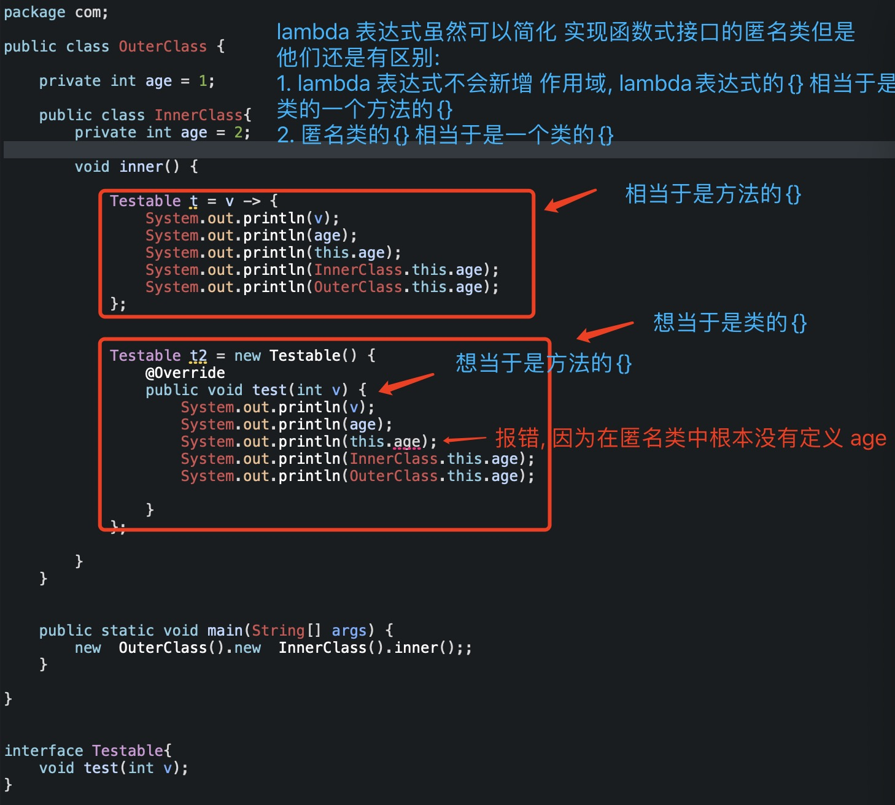 			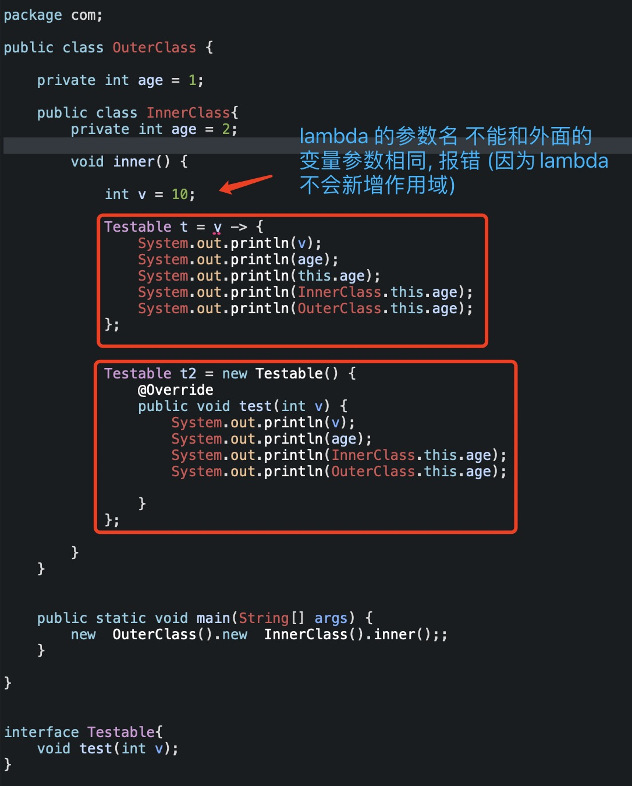 


# 十五、方法引用(method reference)  & lambda


- **如果 Lambda 中的内容仅仅是调用某个方法, 可以使用方法引用(method reference)来简化** 

  > 即, 以前我们我们使用lambda 表达式来简化匿名类实现的函数式接口
  >
  > 现在我们可以使用方法引用(method reference) 来简化lambda表达的书写


| 种类                             | 用法                               |
| -------------------------------- | ---------------------------------- |
| 引用特定对象的实例方法           | ObjectName::instanceMethodName     |
| 引用静态方法                     | **ClassName::staticMethodName   ** |
| 引用特定类型的任意对象的实例方法 | **ClassName::methodName**          |
| 引用构造方法                     | ClassName::new                     |
| 引用当前类中定义的实例方法       | this::instanceMethdoName           |
| 引用父类中定义的实例方法         | super::instanceMethodName          |

**注意:**

只有当lambda表达式中的内容, 仅仅是调用某个方法时, 我们才可以使用方法引用来简化lambda表达式的写法.

换句话说, 当我们的lambda 表达式内的内容仅仅是调用某个方法时, 我们就是用方法引用来简化lambda表达式, 编译器会自动的将我们的方法引用再包装回lambda表达式.


## 1、引用 类方法()

所谓**引用类方法**, 就是当 `lambda表示` 的内容仅仅是调用某个**类方法** (静态方法)时, 我们可使用: **类名::类方法名(静态方法名)** 来简化lambda表示式 , 示例如下:

```
// 1. 定义一个函数式接口
@FunctionalInterface
public interface Testable{
	int test(int v1, int v2);
}

// 使用lambda 表达式简化匿名类实现函数式接口
Testable t1 = (v1 , v2) -> { 	return Math.max(v1, v2);};
// Testable t1 = (v1 , v2) -> Math.max(v1, v2); 
System.out.println(t1.test(10, 20)); // 20


// 上面的 lambda 表达式, 可以使用 引用类方法计数简化为下面这种 
Testable t1 = Math::max;		// 方法引用, 类方法引用(类名::静态方法名)
System.out.println(t2.test(10, 20)); // 20
```

> 即: `(v1 , v2) -> { 	return Math.max(v1, v2);};`  或 ` (v1 , v2) -> Math.max(v1, v2); ` 可以简化为 : `Math::max;` 


## 2、引用特定对象的实例方法

所谓引用特定对象的实例方法, 就是当我们的lambda表达式中的内容, 仅仅是调用某个实例对象的某个方法时, 我们可以使用: **实例对象::实例方法名** 来简化lamba表达式的书写, 示例如下: 

```
// 定义接口(函数式接口)
interface Testable{
	void test(int v);
}

package com;
public class Person {
	private int age;
	public void setAge(int age) {
		this.age = age;
		System.out.println("set age: " + age);
	}
	
	public static void main(String[] args) {
		Person person  = new Person();
		// lambda表达式, 仅仅是调用某个实例的具体方法
		Testable t1 = (v) -> person.setAge(v);
		t1.test(10); 
		
		// 引用具体实例的实例方法, 简化lambda表达式的书写
		Testable t2 = person::setAge;
		t2.test(20);
	}
}
```


## 3、引用特定类型 的 任意对象的实例方法

所谓, `引用特定类型 的 任意对象 的实例方法` 

> 1. 对象的类型是确定的
> 2. 对象是不确定的
> 3. 对象的实例方法是确定的

具体示例如下:

```
import java.util.Arrays;

// 忽略大小写, 比较字符串
String[] names = {"jack", "james", "Apple", "obort"};
Arrays.sort(names, (name1, name2) -> name1.compareToIgnnoreCase(name2));
System.out.println(Arrays.toString(names));

// Arrays.sort(names, (name1, name2) -> name1.compareToIgnnoreCase(name2));
// name1 表示的都是字符串, 因此类型是特定的
// name1 表示的是不同的字符串实例对象,  因此是任意对象
// compareToIgnnoreCase 实例方法名是固定的

// 因此, 我们可以使用: 引用特定类型的任意对象的实例方法 简化lambda表达式, 如下:
String[] names2 = {"jack", "james", "Apple", "obort"};
Arrays.sort(names2, String::compareToIgnnoreCase);
System.out.println(Arrays.toString(names2));
```

**注意:**

引用特定类型的任意对象的实例方法, 在书写上与引用类方法 看上去是一样的, 但是实际上是不一样的

如何区分呢? 

-  `类名::静态方法` ,  `::` 右边的方法是静态方法 就是表示的是引用类方法
-  `类名::实例方法` , `::` 右边的方法是实例方法表示的就是 引用特定类型的任意对象的实例方法


## 4、引用构造方法

```
@FunctionalInterface
public interface Testable{
	Object test(int v);
}

public class Person{
	public Person(int age){
		System.out.println("person age: " + age);
	}
}


// lambda 表达式
Testable t1 = v -> new Person(v);
System.out.println(t1.test(18));

// 引用构造方法
Testable t2 = Person::new;
System.out.println(t2.test(19));

```


## 5、引用数组的构造构造方法

引用数组的构造方法与引用一般的构造方法的写法差不多. 

- 引用 普通的构造方法时, 我们是这样写的: `类名::new`
- 而应用数组的构造方法时, 我们只需要把`类名` 替换为具体的数组类型即可, eg: `int[]::new`  或 `String[]::new` 或 `Object[]::new` 等, 具体示例如下:

```
// 使用 lambda 表达式的写法
Testable t1 = v -> new int[v];
int[] arr = t1.test(3);
System.out.prinntln(arr.length);

// 使用 引用数组的构造方法
Testable t2 = int[]::new;
int[] arr2 = t2.test(5);
System.out.println(arr2.length);
```


## 6、引用当前类中定义的实例方法

简单的说, 引用具体(特定) 对象的实例方法与引用当前类中定义的实例方法类似, 其实就是 `实例对象::实例方法名`,

如下: 

```
@FunctionalInterface
public interface Testable{
	void test(int v);
}

public class Person{
	piblic void setAge(int age){
		System.out.println("person set age: " + age);
	}
	
	public void show(){
		// 使用 lambda 表达式的写法
		Testable t1 = v -> setAge(v);
		t1.test(10);
		
		// 使用 引用方法的写法
		Testable t2 = this::setAge;
		t2.test(18);
	}
}
```


## 7、引用当前对象, 父类中的实例方法

```
@FunctionalInterface
public interface Testable{
	void test(int v);
}

public class Person{
	piblic void setAge(int age){
		System.out.println("person set age: " + age);
	}
}

class Student extends Person{
	@Override 
	piblic void setAge(int age){
		System.out.println("student set age: " + age);
	}
	
	public void show(){
		// 使用 lambda 表达式的写法
		Testable t1 = v -> super.setAge(v);
		t1.test(10);
		
		// 使用 引用方法的写法
		Testable t2 = super::setAge;
		t2.test(18);
	}
}
```


# 十六、枚举

我们在平时的开发中, 如果一个变量的值只是在几个固定的值之间切换, 可以考虑使用枚举类型

其实使用枚举类型有很多好处, 比如:

- 变量的值的变化范围是可控的, 编译器会做容错校验, 避免手误
- 使用枚举变量, 可以达到见名知意,  代码可读性更高

其实, 枚举是由一组预定以的常量构成的, 除了使用JDK提供的方式定义枚举类型, 我们也可以使用java 类自定义实现枚举

## 1、自定义类实现java中的枚举

- 自定义类实现枚举

  > 自定义类实现枚举功能, 有个缺陷就是不能使用switch

  ```
  // 自定义类实现 春夏秋冬 枚举
  public class Season{
  	private Season(); // 私有化 构造方法, 禁止外部访问
  	
  	public static final Season SPRING = NEW Season();
  	public static final Season SUMMER = NEW Season();
  	public static final Season FALL = NEW Season();
  	public static final Season WINTER = NEW Season();
  }
  
  // 外部使用自定义枚举
  public class Main{
  	
  	public static void main(String[] args){
  		test(Season.SPRING);
  	}
  	
  	public static void test(Season season){
  		if(season == Season.SPRING){
  			System.out.println("春天");
  		}
  		else if(season == Season.SUMMER){
  			System.out.println("夏天");
  		}
  		else if(season == Season.FALL){
  			System.out.println("秋天");
  		}
  		else if(season == Season.WINTER){
  			System.out.println("冬天");
  		}
  	}
  }
  ```

  

## 2、java中枚举的定义

- 使用java中的 **enum** 关键字定义枚举,如下:

  ```
  // 使用java提供的 enum 关键字, 定义季节的枚举
  public enum Season{
  	SPRING, SUMMER, FALL, WINTER
  }
  ```

- 枚举的使用

  ```
  // 获取指定的枚举变量
  Season s = Season.Winter;
  
  // 其实, 枚举变量有2个常用的方法, 一个是用来获取枚举的名字(字符串), 另有一个是用于获取枚举的序号, 如下: 
  System.out.println("s.name"); // Winter
  System.out.println("s.ordinal");
  ```

- java中枚举的switch

  ```
  // 定义枚举
  public enum Season{
  	SPRING, SUMMER, FALL, WINTER
  }
  
  // 枚举switch 的使用
  public void test(){
  	Season s = Season.SUMMER;
  		switch (s) {
  		case SPRING:
  			System.out.println("春天");
  			break;
  		case SUMMER:
  			System.out.println("夏天");	
  			break;
  		case FALL:
  			System.out.println("秋天");
  			break;
  		case WINTER:
  			System.out.println("冬天");
  			break; 
  		default:
  			break;
  		}
  }
  ```

## 3、枚举的本质(java类) 

- java 中枚举的本质

  其实, 在java中, 枚举的本质就是类, 所有的枚举类型最终都隐士继承自 **java.lang.Enum**

  > 换句话说, 你表面上看是枚举类型, 其实编译器底层就是一个java类

  ```
  我们使用enum 定义的枚举类型
  public enum Season{
  	SPRING, SUMMER, FALL, WINTER
  }
  
  其实编译器底层就差不多是下面这种样式, 但是有点差异哈
  public class Season extends java.lang.Enum{
  	private Season(); // 私有化 构造方法, 禁止外部访问
  	
  	public static final Season SPRING = NEW Season();
  	public static final Season SUMMER = NEW Season();
  	public static final Season FALL = NEW Season();
  	public static final Season WINTER = NEW Season();
  }
  ```

## 4、枚举中还可以定义成员变量和方法

- 枚举定义完常量后, 可以再定义成员变量、方法等内容(这时最后一个常量要以分号结束).

  >  从这一点也说明了java中的枚举的本质就是类, 示例如下:

  ```
  public enum Season{
  	SPRING, SUMMER, FALL, WINTER; // 枚举中的常量必须写在 成员变量、方法的前面, 且后面写分号 ;
  	private int age; 
  	public void setAge(int age){
  		this.age = age;
  	}
  	
  	public int getAge(){
  	 return age;
  	}
  }
  
  public static void main(String[] args) {
  		Season s = Season.SUMMER;
  		s.setAge(10);
  		System.out.println(s.getAge()); // 10
  	}
  ```

- 枚举的构造方法权限必须是**无修饰符 或 private**

  一般来说,我们很少给枚举添加构造方法, 注意一下就可以了

- java会主动调用构造方法初始化每个常量, 你不能主动调用枚举的构造方法.


## 5、自定义了构造方法的枚举(高级用法)

- 我们前面已经讲过了, java中的枚举的本质其实就是java类, 继承自`java.lang.Enum`
- 且, java中的枚举除了可以定义枚举常量外, 我们还可以在枚举常量的后面定义成员变量, 成员方法, 自定义构造方法

下面我们将以定义一个季节的枚举来举例说明, 枚举中定义成员变量, 成员方法, 以及自定义构造方法的应用场景

```
// 因为在定义枚举时, 可以在常量后面定义成员变量, 这个功能很好用, 比如:
// 我们可以定义季节枚举, 自定义枚举的构造方法 ,并给每个季节有的温度描述一个范围
enum Season{
	SPRING(5, 15), 
	SUMMER(25, 35),
	FALL(15, 25),
	WINTER(-5, 5);
	
	private int min;
	private int max;
	
	public int getMin() {
		System.out.println(this.name() + "最低温度: "+ min);
		return min;
	}

	public int getMax() {
		System.out.println(this.name() + "最高温度: "+ max);
		return max;
	}
	
	// 注意, 枚举定义的构造方法是不能被主动调用的, 是留给编译器, 构造枚举常量时自动调用的
	Season(int min, int max){
		this.min = min;
		this.max = max;
	} 
}


// 使用自定义枚举, 高级用法
public static void main(String[] args) {
		Season s = Season.SPRING;  // 编译器底层会自动调用构造方法 Season(5, 15);
		s.getMax();	// SPRING最高温度: 15
		s.getMin(); // SPRING最低温度: 5
}
```


# 十七、数字(Number)


## 1、基本类型的缺陷(3个)

当我们说到数字时, 大家首先可能会想到的是基本数据类型(byte、short、int、long, double、float、char),基本类型用在使用中是有缺陷的, 下面我们来详细介绍一下:


**对比引用类型, 基本类型存在一些缺陷你** 

- 不能利用面向对象的方式去操作基本类型`(比如: 直接用基本类型调用方法)`

- 基本类型不能用来描述不存在的值, 比如: `null` 值.

  > 比如: 我们在描述一家店铺某天的营业情况时, 用基本数据类型就不好表达了, 如下:
  >
  > ```
  > double[] shouRu = {100, -100, 0}; 
  > 100表示当前挣了100元,   -100表示当前亏损了100元, 0表示当前不亏不赚
  > 但是, 我们如果想要描述当天没有开门营业怎么描述呢? 用 `0` 不准确的有歧义, 用基本数据类型很难表示, 用引用类型就很准确简单了
  > 比如: 用 String[] 就能很好的解决
  > String[] shouRu = {"100", "-100", null, "0"}; // null 表示当前没有开门
  > ```

- 当方法的参数是引用类型时, 基本类型是无法传递的

  ```
  public void testObj(Object obj){
  	System.out.println(obj);
  }
  
  int age = 10;
  String name = "张三";
  // 本质上基本类型是不能传递给引用类型的, 但是这是java的语法糖, 是可以的
  testObj(age);		// 这里不报错
  testObj(name);
  ```

  

那么, 我们在开发中如何解决上述基本类型的三大缺陷呢?

解决办法是将基本类型包装成引用类型


 ## 2、将基本数据类型包装成引用

- 基本类型包装成引用类型, 示例:

  ```
  public class IntObject{
  	private int value;
  	public IntObject(int value){
  		this.value = value;
  	}
  	
  	public int getValue{
  		return value;
  	}
  	
  	public void setValue(int value){
  		this.value = value;
  	}
  }
  ```

  

- 基本类型包装成引用类型的应用

  ```
  IntObject[] shouRu = {
  	new IntObject(100), 
  	new IntObject(-100), 
  	null, 
  	new IntObject(0)
  };
  
  shouRu[0].getValue;
  ```


## 3、包装类(wrapper class)

- 其实java中已经内置类基本类型的包装类`(都在java.lang包中)`

  其中数字类型(除了char 和 boolean)都是继承自**java.lang.Number** 

  | 基本类型  | 包装类型     |
  | --------- | ------------ |
  | `byte`    | `Byte`       |
  | `char`    | `Charactter` |
  | `short`   | `Short`      |
  | `int`     | `Integer`    |
  | `long`    | `Long`       |
  | `float`   | `Float`      |
  | `double`  | `Double`     |
  | `boolean` | `Boolean`    |

  > 换句话说, 以后我们要想将基本类型包装成引用类型, 就不用自己再实现了, 直接使用JDK提供的即可


## 4、自动装箱、拆箱(Autoboxing & unboxing)

- **自动装箱**:

  所谓的自动装箱, 就是指的java编译器会自动调用 **xxx.valueOf** 方法, 将基本类型装换为包装类型.

  ```
  Integer i1= 10; // 等价于 Integer i1= Integer.valueOf(10);
  
  void add(Integer num){}
  add(20); // 等价于 add(Integer.valueOf(20));
  ```

  

- **自动拆箱**:

  所谓自动拆箱,就是指的java编译器会自动调用 **xxx.value** 方法, 将包装类型转换为基本类型

  ```
  Integer i1 = 10;
  int i2 = i1; // 等价于 int i2 = i1.intValue();
  
  System.out.println(i1 == 10);
  // 等价于 System.out.prinntln(i1.intValue() == 10);
  
  Integer[] array = {11, 22, 33};
  int result = 0;
  for (Integer i : array){
  	// i.intValue() % 2 == 0;
  	if(i % 2 == 0){
  		result += i; // result += i.intValue();
  	}
  }
  ```

  

  > 说白了, 在以后java的开发中, 可以把基本类型当做 引用类型来用
  >
  > 也可以将引用类型当做基本类型来用
  >
  > 因为java有自动装箱和拆箱的机制

  

## 5、包装类型的判断等

- 包装类的判断, 不要使用 `==` 、`!=` 运算符, 应当使用`equals` 方法.

  > equals() 方法, 是用来判断包装类型里面存储的基本类型是不是一样的
  >
  > ```
  > // equals 方法的定义如下: 
  > public boolean equals(Object obj) {
  > if (obj instanceof Integer) {
  > 	return value == ((Integer)obj).intValue();  // 注意. 右边对obj 进行了强转!
  > }
  > return false;
  > }
  > ```

  ```
  Integer i1 = 100;
  Integer i2 = 100;
  Integer i3 = 200;
  Integer i4 = 200;
  
  // 不推荐
  System.out.println(i1 == i2); 	// true
  System.out.println(i3 == i4);	// false
  
  // 推荐
  System.out.println(i1.equals(i2)); 	// true
  System.out.println(i3.equals(i4));  // true
  ```

  从上面的例子中我们就发现一个现象, 同样的操作为什么 `i1 == i2)` 的结果为`true`  , 而 `(i3==i4))` 为`false` 呢? 

  其实, 是这样的, 在`Integer` 这个类中其实是有个静态嵌套类`IntegerCache` (Integer缓存类) , 我们从**Integer 类中定义的 valueOf(int i) 这个方法可以发现** 如下: 

  ```
  // Integer 中valueOf(int i)方法 定义的如下: 
  public static Integer valueOf(int i) {
      if (i >= IntegerCache.low && i <= IntegerCache.high)
          return IntegerCache.cache[i + (-IntegerCache.low)];
      return new Integer(i);
  }
  
  // IntegerCache 静态嵌套类的定义如下:
  private static class IntegerCache {
    static final int low = -128;
    static final int high;
    static final Integer cache[];	// 从这里我们可以看出 会缓存一些列的 Integer对象
  	
  	static {
      // high value may be configured by property
      int h = 127;
      String integerCacheHighPropValue =
      sun.misc.VM.getSavedProperty("java.lang.Integer.IntegerCache.high");
      if (integerCacheHighPropValue != null) {
      	try {
      		int i = parseInt(integerCacheHighPropValue);
     			i = Math.max(i, 127);
      		// Maximum array size is Integer.MAX_VALUE
      		h = Math.min(i, Integer.MAX_VALUE - (-low) -1);
      	} 
      	catch( NumberFormatException nfe) {
      		// If the property cannot be parsed into an int, ignore it.
      	}
      }
      high = h;
  
    	cache = new Integer[(high - low) + 1];
    	int j = low;
    	for(int k = 0; k < cache.length; k++)
    	cache[k] = new Integer(j++);
  
    	// range [-128, 127] must be interned (JLS7 5.1.7)
    	assert IntegerCache.high >= 127;
    }
  
  	private IntegerCache() {}
  }
  ```

  > 从Integer的源码, 我们可以发现, 当一个数字是 [-128 ~ 127] 的话, 我们使用 Integer.valueOf() 方法时, 取出的就是缓存对象

**结论:**

1. 当我们使用 **Integer.valueOf(10)**这种方法创建出来的包装对象时, JDK编译器会对 -128 ~ 127 之间的Integer 对象进行缓存

   > 换句话说, 当我们使用 Integer i1 = 10; 这种语法糖时`(内部调用的是 Integer.valueOf(10))` , 如果数字 是-128~127 之间的数字那么返回的就是缓存的Integer对象

2. 当我们使用 **new Integer(10)** 这种方法创建出来的包装对象时, JDK编译器不会对新建的 Integer对象进行缓存

3. **当我们在判断 包装类型时, 不要使用`==` 或者 `!=` , 因为容易出现误操作, 所以还是要用 equals 方法** 


## 6、使用注意

- **基本类型数组**  与 **包装类型数组** 之间是不能自动装箱、拆箱的.

  ```
  public static void test1(Integer[] nums){}
  public static void test2(int[] nums){}
  
  int[] nums1 = {11, 22};
  test1(nums1); 					// error
  Integer nums2 = nums1; 	// error
  
  Integer[] nums3 = {11, 22};
  test2(nums3); 					// error
  int[] nums4 = nums3; 		// error
  ```

## 7、Math 类

- **Math** 这个类提供了常见的数学计算功能, 定义在 `java.lang.Math` 包中.

  - 常用的常量 (static final)

    ```
    // 自然常数, 自然对数的底数
    public static final double E = 2.7182818284590452354;
    
    // 圆周率
    public static final double PI = 3.14159265358979323846;
    ```

  - 常用的数学方法

    ```
    Math.abs(-100); 				// 求绝对值: 100
    Math.max(100, 200);			// 求最大值: 200
    Math.min(100, 200);			// 求最小值: 100
    Math.floor(3.9);				// 向下取整: 3.0
    Math.ceil(3.1);					// 向上取整: 4.0
    Math.round(3.5);				// 四舍五入: 4
    Math.pow(4, 2);					// 4的2次方: 16
    Math.sqrt(16);					// 16的平方根: 4
    
    
    Math.exp(2);	// E的2次方
    Math.log(8);	// 求ln8的值, 以E为底数, 8为真数的对数 (即, 计算E的多少次方为8)
    
    //角度弧度
    double degree = 90;
    double radian = Math.toRadians(degree);
    
    // 三角函数
    Math.sin(radian);
    Math.cos(radian);
    Math.tan(radian);
    
    // 随机数
    Math.random(); // 生成[0.0, 1.0) 范围的随机数(包括0.0, 不包括1.0)
    ```

    

## 8、Random 类

Random 类定义在`java.lang.Random` 中, 可以更方便地生成各种随机数

- 生成各种随机数

  ```
  // 生成没有范围的随机数
  Random r = new Random();
  r.nextBoolean();
  r.nextInt();
  r.nextLong();
  r.nextFloat();
  r.nextDouble();
  
  // 有范围的生成随机数
  random.nextInt(100); // 生成[0, 100) 随机数 包含0 不包含100
  ```

  

## 9、UUID (重要!!)

- UUID (Universally Unique Identifier) , 通用唯一标识符

  UUID的目的是让分布式系统中的所有元素都有唯一的标识符, 而不需要通过中央控制端来做标识符的指定

- 在java中, 可以利用**java.util.UUID** 类的 `randomUUID` 方法生成一个`128bit` (32位16进制数) 的随机UUID

  ```
  // 6a9bb186-fc68-4352-9896-49b5dfca7c49
  System.out.println(UUID.randomUUID());
  ```

> 我们在做服务器开发时, 有时需要给每条记录都生成一个随机的唯一标识, 不可能每次生成唯一标识时都由同一台服务器生成这样必然会降低访问速度, 且真实的情况是用户访问的是分布式服务器中的一台服务器, 这时我们就可以使用访问的任意一台服务器生成一个随机的UUID, 即便是不同的服务器主机, 生成的唯一标识也是不会重复相同的
>
> 所以, 即便是分布式开发, 也可以放心大胆的使用这个方法为每条记录生成一个唯一的UUID
>
> (这个常识需要记住)

## 10、数字格式化

- 可以使用 `System.out.printf` 或者`System.out.format` 输出格式化的字符串

  > System.out.printf 内部是调用 System.out.format 的, 所以他们是完全等价的

  ```
  // System.out.printf 的定义
  public PrintStream printf(String format, Object ... args) {
  	return format(format, args);
  }
  
  
  int age = 18;
  double height = 1.88;
  System.out.printf("年龄: %s, 身高: %.2f",age, height);
  ```

- 可以使用 `String.format` 创建格式化字符串

- 其它示例:

  ```
  long num = 232545;
  System.out.printf("%d %n", num);
  System.out.printf("%08d %n", num);
  System.out.printf("%+8d %n", num);
  System.out.printf("%+08d %n", num);
  System.out.printf("%+,8d %n", num);
  System.out.printf("%+,8d %n", num);
  System.out.printf("%+,8d %n", num);
  // 打印:
  232545 
  00232545 
   +232545 
  +0232545 
  +232,545 
  +232,545 
  +232,545 
  
  double pi = Math.PI;
  System.out.printf("%f %n", pi);
  System.out.printf("%.3f %n", pi);
  System.out.printf("%8.3f %n", pi);
  System.out.printf("%08.3f %n", pi);
  System.out.printf("%-8.3f %n", pi);
  // 打印:
  3.141593 
  3.142 
     3.142 
  0003.142 
  3.142 
  ```

  | 转换符 | 作用                   |
  | ------ | ---------------------- |
  | `d`    | `十进制整数`           |
  | `f`    | `浮点数`               |
  | `n`    | `换行, 跟 \n 效果一样` |

  | 标记   | 作用                          |
  | ------ | ----------------------------- |
  | `08`   | `8个字符的宽度, 前面用0补齐`  |
  | `+`    | `显示符号 (正数+, 负数-)`     |
  | `,`    | `显示分组字符(本地化)`        |
  | `-`    | `左对齐`                      |
  | `.3`   | `保留3位小数`                 |
  | `10.3` | `10个字符的宽度, 保留3位小数` |

  

## 11、DecimalFormat

- 使用**java.text.DecimalFormat** 可以更好地控制 `前0`、`后0`、`前缀` 、`后缀` 、`分组分隔符` 、十进制分隔符等

  ```
  // 自定一个Decimal format 格式输出
  static void customPrint(String pattern, double value) {
    // 1. 根据样式 pattern 创建一个 format
    DecimalFormat fmtDecimalFormat = new DecimalFormat(pattern);
    // 2. 格式化输出
    System.out.println(fmtDecimalFormat.format(value));
  }
  
  customPrint("###,###.###", 1230456.789);
  customPrint("###.##", 1230456.789);
  customPrint("000000.00", 456.789); 
  customPrint("$###,###.###", 1230456.789);
  // 打印结果
  1,230,456.789
  1230456.79
  000456.79
  $1,230,456.789
  ```

  

## 12、字符串转数字 valueOf、parseXX

- 使用包装类的 **valueOf、parseXX** 方法

  > 一般使用 `valueOf` 将基本类型或者字符串转化为 包装类型
  >
  > 使用 `parseXX`将字符串转化为基本数据类型

  ```
  Integer i1 = Integer.valueOf("ff", 16) ; // 将字符串按照16进制格式解析
  Integer i1 = Integer.valueOf("12");
  int i2 = Integer.parseInt("12");
  
  // 如果想要解析 16进制的字符串, 需要额外传一个参数告诉编译器, 这个字符串是那个格式的
  // 因为默认情况下 parseInt 会将字符串按10进制格式进行解析, 这一点知道一下
  int i3 = Integer.parseInt("ff", 16);		// 将字符串按16进制解析
  
  Float f1 = Float.valueOf("12.34");
  float f2 = Float.parseFloat("12.34");
  ```

**注意:**

因为在java中有对于基本类型有 `自动装箱` 和 `自动拆箱` 的特点, 所有有些人认为`Integer.valueOf("12");`  和 `Integer.parseInt("12");` 是没有差异的, 因为当他们按照下面写代码时编译器不会报错:

```
Integer i1 = Integer.valueOf("12");		
int i2 = Integer.parseInt("12");


int i3 = Integer.valueOf("12");				// 因为语法糖不报错
Integer i4 = Integer.parseInt("12");	// 因为语法糖不报错
```

因此他们会误认为`valueOf` 和 `parseInt` 一样, 或者等价, 但是他们是有本质的区别的, 这个我们在java开发中是需要注意的


所以, 如果想要将字符串转换为包装类型就用 valueOf, 想要获取基本类型就使用 parseXX, 这才是正确的姿势. 


## 13、数字转字符串 valueOf、toString

- 使用字符串的 `valueOf` 方法, 包装类的 `toString` 方法

  ```
  String str1 = String.valueOf(12.34);			// 12.34
  String str2 = Integer.toString(255);			// 255
  
  // 将整数转换成 16进制的字符串
  String str3 = Integer.toString(255, 16); 	// ff
  String str4 = Float.toString(12.34f);			// 12.34
  ```

  

## 14、高精度计算

- `float` 、`double` 存储的只是小数的近似值, 并非精确值, 因此不适合用来进行精度计算

  - 如下:

    ```
    double d1 = 0.7;
    double d2 = 0.7;
    // 0.48999999999999994  != 0.49
    System.out.println(d1 * d2);
    ```

    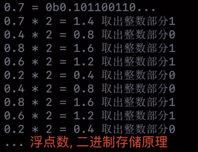 

    因为浮点数在内存中的存储方式就决定了, 浮点数不可能将数据记录的很准去, 数字越小误差越大

- 建议使用**java.math.BigDecimal** 来进行高精度计算

  - 建议使用字符串初始化`BigDecimal` 因为`float, double` 存储的都是近似值, 不是精确值

    ```
    new BigDecimal(0.7);  // 这样搞出来的bigDecimal 就是不精确的, 有误差
    // 你使用一个不准确的浮点数 `0.7` 得到的一个BigDecimal 肯定是不准确的
    ```

  - BigDecimal 的正确使用姿势

    ```
    import java.math.BigDecimal;
    
    // BigDecimal d1 = new BigDecimal(0.7);	// 不能这样做, 不准确
    // BigDecimal d2 = new BigDecimal(0.7); // 不能这样做, 不准确
    
    BigDecimal d1 = new BigDecimal("0.7");
    BigDecimal d2 = new BigDecimal("0.7");
    
    System.out.println(d1.add(d2));			// 加, 1.4
    System.out.println(d1.subtract(d2));	// 减, 0.0
    System.out.println(d1.multiply(d2));	// 乘, 0.49
    System.out.println(d1.divide(d2));		// 除, 1
    System.out.println(d1.setScale(3));		// 保留3位小数, 0.700
    
    其实, 多个BigDecimal实例对象进行运算后,得到的依然是一个BigDecimal实例对象
    ```

    

# 十八、字符串 String

## 1、String 易错点

- java中 `java.lang.String` 类代表字符串

  底层使用`char[]` 存储字符数据, 从java9开始 底层使用`byte[]`存储字符数据

  ```
  char[] cs = {'a', 'b', 'c'};
  String str = "abc"; 
  
  在java中, 你不能认为 char[] 与 String 等价, 
  ```

- 所有字符串字面量(比如: "abc") 都是String的实例对象

- String 对象一旦创建完毕, 它的字符内容是不可以修改的(即, 你可以认为字符串是不可变的)

  ```
  String str1 = "111";
  str1 += "222";
  str1 = "333";
  test(str1);
  System.out.println(str1);		// 结果依然是 "333"
  
  void test(String s){
  	s += "444";
  }
  ```

  > 换句话说,  String 引用指向的内容是不能像其他java对象一样通过一个方法来修改, 这是一个易错点
  >
  > 即, 我们只能修改String引用的指向, 不能修改指向的内容

## 2、字符串常量池(String Constant pool)

```
String s1 = "123";
String s2 = "123";
System.out.println(s1 == s2); // true
```

- 在java中字符串有个常量池(String Constant Pool, 简称 SCP) 

  - 从java7开始, 常量池属于堆空间一部分(以前放在方法区) 

- 当遇到字符串字面量是, JDK 就会去查看SCP. 

  - 如果SCP中存在与字面量内容一样的字符串对象A时, 就直接返回对象A (换句话说就不会新建一个字符串实例)
  - 否则, 创建一个新的字符串对象D, 并将D加入到SCP中, 返回D

  

  

## 3、字符串的初始化

```
String s1 = "123";
String s2 = new String("123");
String s3 = new String(s1);
String s4 = new String(s2);

char[] cs = {'1', '2', '3'};
String s5 = new String(cs);
String s6 = new String(s5);
```


## 4、intern 方法

- A.intern 方法的作用

  - 如果常量池(SCP) 中存在与A内容一样的字符串对象C时, 就返回C
  - 否则, 将A加入到常量池(SCP) 中, 返回A;

  ```
  int a = 1, b = 2, c = 3;
  String s1 = String.format("%d%d%d", a,b,c);
  String s2 = String.format("%d%d%d", a,b,c);
  
  String s3 = s1.intern();
  String s4 = s2.intern();
  String s5 = "123";
  
  System.out.println(s1 == s2);	// false
  System.out.println(s1 == s3); // true
  System.out.println(s1 == s4); // true
  System.out.println(s1 == s5); // true
  ```

## 5、字符串常量方法

```
" 123 456  ".trim();	// 取出首位的空格
"abc".toUpperCase();	// 转为大写字母 ABC
"ABC".toLowerCase();	// 转为小写字母 abc
"12345".contains("1"); // 是否包含某个字符串
"123456".startWith("123"); // 是否以某个字符串开头
"123456".endWith("456");	// 是否以某个字符串结尾
"1_2_3_4_5_6".split("_"); // 将字符串分隔为 ["1","2","3","4","5","6"]

"abc".compareTo("adc"); // 比较字符串大小 < 0
"abc".compareToIgnoreCase("ADC"); // 忽略大小写比较字符串大小 < 0
"abc".equals("abd"); 	// 看字符串内容是否相同
"abc".equalsIgnoreCase("abd"); 	// 忽略大小写看字符串内容是否相同
```


## 6、字符串截取

```
"123456789".substring(2); 	 // 从第二位开始截取
"123456789".substring(2, 5); // 从第二位开始到第五截取
"123456789".indexOf("3");	 // 获取索引
"123456789".lastIndexOf("3"); // 获取倒序索引
```


## 7、StringBuilder

### 1、StringBuilder 的简单介绍

- 在进行大量的字符串的改动操作时(比如:拼接、替换)

  - 使用String会非常的消耗内存、降低程序的性能 (因为String对象是不可变的, 每次操作会产生新对象)
  - 使用StringBuilder可以节省内存、提高访问速度

  ```
  String s1 = "";
  s1 += "111";
  s1 += "222";
  
  StringBuilder s2 = new StringBuilder();
  s2.append("111").append("222");
  // 因为我们在使用StringBuilder 的方法进行操作后, 方法返回的是this(StringBuilder)对象本身
  // 因此我们在使用StringBuilder时很多时候可以使用 链式编程简化代码的书写
  ```

  - StringBuilder 的常用方法有: **append、insert、delete、replace、reverse** 等

**注意:**

- StringBuilder 并不是String 的子类 或者 父类
- String 和 StringBuilder 都实现了 CharSequence 接口

> 如果以后在操作字符串时, 要求传一个`CharSequence` 类型的对象, 那么String 和StringBuilder 都可以


### 2、StringBuilder 的 append 原理

- StringBuilder 的原理就是它内部有个动态的char[] 数组, 和动态的数组原理一样

- StringBuilder默认的容量是16, 扩容后的新容量是原来的2倍+2

  - 16 扩容为 34
  - 34 扩容为 70
  - 70扩容为 142
  - ... ...

  ```
  // StringBuilder 的构造方法定义如下:
  public StringBuilder() {
  		// super的定义 AbstractStringBuilder(int capacity) { value = new char[capacity];  }
      super(16); 
  }
  
  
  ```

  

# 十九、日期 Date

## 1、Date的介绍与简单使用

- **java.util.Date** 是开发中经常用到的日期处理类.

  注意: 不是`java.sql.Date` 类

  - 一个Date对象, 包含了年月日时分秒等信息

  ```
  // d1 和 d2 都代表当前时间
  Date d1 = new Date();
  Date d2 = new Date(System.currentTimeMillis()); // 传入时间的毫秒数
  
  System.out.println(d1);
  System.out.println(d2);
  
  // 打印:
  Thu Oct 22 08:02:58 CST 2020  // 周四 10月 22日 08:02:58 中国标准时间 2020 年
  Thu Oct 22 08:02:58 CST 2020
  ```

  > CST 是 China standard Time 的缩写

  - 我们在创建Date时可以传入一个 long 类型的毫秒时间, 具体定义说明如下:

    > public Date(long date) {
    >
    > ​    fastTime = date;
    >
    > }
    >
    > 比如: new Date(123); 相当于是 获取一个 1970年1月1日 00:00:00 GMT + 123 毫秒的日期

- **System.currentTimeMillis()** 返回的是 从`1970年1月1日 00:00:00 GMT ` 开始计时的毫秒数


## 2、Date常用方法

- Date 的毫秒操作

  ```
  Date d1 = new Date();
  // 获取从1970年1月1日00:00:00 GMT开始到现在的毫秒数
  System.out.println(d1.getTime());	// 获取毫秒 1603329270962
  
  d1.setTime(2000);	// 设置毫秒
  System.out.println(d1.getTime());	// 2000
  ```

- Date 的比较操作

  ```
  Date d1 = new Date();
  Date d2 = new Date();
  
  d1.setTime(2000);
  
  // 比较时间
  d1.after(d2); 		// false
  d1.before(d2); 		// true
  d1.compareTo(d2); // -1   (-1 0 1)
  
  ```


## 3、日期格式化 SimpleDateFormat 

- **java.text.SimpleDateFormat** 常用来进行日期的格式化处理

  ```
  SimpleDateFormat fmt = new SimpleDateFormat("yyyy年MM月dd日 HH:mm:ss");		// HH24小时制
  // 1. 通过日期格式fmt对象, 将Date对象转换成对应格式的字符串
  String dateStr = fmt.format(new Date());
  System.out.println(dateStr);
  
  // 2. 通过日期格式fmt对象, 将指定格式的日期字符串, 转换成Date对象
  Date date = fmt.parse(dateStr);
  System.out.println(date);
  
  SimpleDateFormat fmt2 = new SimpleDateFormat("yyyy年MM月dd日 hh:mm:ss");		// hh12小时制
  System.out.println(fmt2.format(new Date()));
  
  // 打印:
  2020年10月22日 15:06:44
  Thu Oct 22 15:06:44 CST 2020
  2020年10月22日 03:06:44
  ```

  > SimpleDateFormat 的转换原理就是:使用真实的数字替换: `yyyy`、`MM`、`dd`、`HH 或 hh`、`mm`、`ss`
  >
  > 年份替换yyyy, 月份替换MM, 日期替换dd 
  >
  > 24小时制时数替换HH, 12小时制时数替换hh, 分钟数替换mm, 秒数替换ss
  >
  > 其它的字符原样拼接输出

- SimpleDateFormat 的模式字母

| 字母 | 元素                     | 示例             |
| ---- | ------------------------ | ---------------- |
| `G`  | `Era标志`                | `AD`             |
| `y`  | `年`                     | `1996;96`        |
| `M`  | `年中的月份`             | `july; jul; 07`  |
| `w`  | `年中的周数`             | `27`             |
| `W`  | `月份中的周数`           | `2`              |
| `D`  | `年中的天数`             | `189`            |
| `d`  | `月份中的天数`           | `10`             |
| `F`  | `月份中的星期`           | `2`              |
| `E`  | `星期中的天数`           | `Tuesday; tue`   |
| `a`  | `Am/pm 标记`             | `PM`             |
| `H`  | `一天中的小时数(0~23)`   | `0`              |
| `k`  | `一天中的小时数(1~24)`   | `24`             |
| `K`  | `am/pm 中的小时数(0~11)` | `0`              |
| `h`  | `am/pm 中的小时数(1~12)` | `12`             |
| `m`  | `小时中的分钟数`         | `30`             |
| `s`  | `分钟中的秒`             | `55`             |
| `S`  | `毫秒数`                 | `978`            |
| `z`  | `时区`                   | `GMT-08:00; PST` |
| `Z ` | `时区`                   | `-08:00`         |

​	

# 二十、日历Calendar 


- **java.util.Calendar** 也是开发中经常用到的日期处理类

  它的功能比Date 更加丰富, Date 中很多过期的方法都迁移到了Calendar中

  ```
  // Calendar 是一个抽象类, 不能像一般的类一样new
  Calendar calendar = Calendar.getInstance();
  		
  // 年份
  calendar.get(Calendar.YEAR);
  // 月份 (取值[0~11], 0是1月, 11是12月)
  calendar.get(Calendar.MONTH);
  // 一月中的第几天 ( 取值[1~31])
  calendar.get(Calendar.DAY_OF_MONTH);
  // 一周中的第几天 (取值 [1~7], 1是星期天, 2是星期一... ... 7是星期六)
  calendar.get(Calendar.DAY_OF_WEEK);
  // 一年中的第几天 (取值[1~366])
  calendar.get(Calendar.DAY_OF_YEAR);
  // 时
  calendar.get(Calendar.HOUR);
  // 分
  calendar.get(Calendar.MINUTE);
  // 秒
  calendar.get(Calendar.SECOND);
  // 毫秒
  calendar.get(Calendar.MILLISECOND);
  ```

- Calendar 的常用方法

  ```
  Calendar calendar = Calendar.getInstance();
  // 2019年7月6日
  calendar.set(2019, 07, 06);
  // 2019年7月11日
  calendar.add(Calendar.DAY_OF_MONTH, 5);
  // 2019年9月11日
  calendar.add(Calendar.MONTH, 2);
  
  // 设置Date对象
  calendar.setTime(new Date());
  // 获取Date对象
  calendar.getTime();
  
  // 设置毫秒数
  calendar.setTimeInMillis(System.currentTimeMills());
  // 获取毫秒数
  calendar.getTimeInMillis();
  ```

  

# 二一、异常(Exception)

在java开中, 我们对异常的处理主要包含两个方面:

- 一方面是我们在调用方法时, 如果方法内部可能会抛出异常, 我们需要对异常进行处理
- 另一种是, 我们在封装一个方法时, 如果某处出错, 我们要想方法调用者抛出一个异常供外部处理


## 1、开发中的错误

- 在开发java程序的过程中, 会遇到各种各样的错误

  - 语法错误

    会导致编译失败, 程序无法正常运行

  - 逻辑错误

    比如执行加法操作时, 不小心写成了减法操作

  - 运行时错误 **(也叫 异常)** 

    在程序运行过程中产生的意外, 会导致程序终止运行

- java中所有的异常最终都继承自**java.lang.Throable** 

  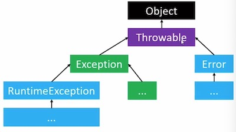   

- 检查型异常(Checked Exception)

  **检查性异常必须使用 try catch 或 throws 处理, 否则编译器报错** 

  > 其实所谓的检查性异常, 一般都是提示我们需要多做几步的检查, 保证程序健壮性, 比如: 文件不存在, 判断权限不支持, 判断环境是否满足等... ... 

  - 这类异常一般难以避免, 编译器会进行检查

  - 如果开发者没有处理这类异常, 编译器将会报错

  - 除**Error、RuntimeException** 以外的异常, 都是检查型异常

  - 常见的**检查型异常** 

    ```
    // java.io.FileNotFoundException 文件不存在
    FileOutputStream fos = new FileOutputStream("F:/yr/com/abc.jpg");
    
    SimpleDateFormat fmt = new SimpleDateFormat("yyyy-MM-ddd");
    // java.text.ParseException 字符串的格式不对
    Date date = fmt.parse("2006/10/8");
    
    // java.lang.InterruptedException
    Thread.sleep(1000);
    
    // java.lang.ClassNotFoundException 不存在这个类
    Class cls = Class.forName("Dog");
    
    Class cls = null; 
    // java.lang.InstantiationException 没有无参构造方法
    // java.lang.IllegalAccessException 没有权限访问构造方法
    cls.newInstance();
    ```

    

- 非检查型异常(Unchecked Exception)

  > 一般非检查性异常是可以通过代码来避免的, 比如: 判空null 

  - 这类异常一般可以避免(你写代码稍微注意一下就避免了), 编译器不会进行检查

  - 如果开发者没有处理这类异常, 编译器将不会报错

  - **Error、RuntimeException** 这类就是非检查型异常

  - 常见的非检查性异常

    ```
    // 下面两个都是Error
    for(int i = 0; i < 200; i++) {
      // java.lang.OutOfMemoryError 内存不够用错误
      long[] arr = new  long[10_0000_0000];
    }
    
    // java.lang.StackOverflowError
    public static void test(){
    	test();
    }
    
    // 下面是runtime exception
    StringBuilder s = null;
    // java.lang.NullPointerException (RuntimeException 运行时异常)
    s.append("abc");
    
    // java.lang.NumberFormatException 参数非法
    new Integer("abc");
    
    int[] arr = {1,3,3};
    // java.lang.ArrayIndexOutOfBoundsException 数组越界
    int rst = arr[3];
    
    Object obj = "123.4";
    // java.lang.ClassCastException	// 类型不匹配
    Double d = (Double)obj;
    ```

    


- 异常的处理
  - 序产生了异常, 一般我们会称之为: **抛出了异常** 
  - 不管抛出的是检查型异常, 还是非检查型异常
    - 只要程序员没有主动去处理它, 都会导致java程序 **终止运行** 
  - 异常处理通常有2种方式:
    - **try - catch** : 捕获异常
    - **throws** : 将异常往上抛出


**总结:** 

所谓 **检查性异常** 就是编译器提示我们这个API 可能会出现某种错误, 需要我们使用代码对可能出现的异常做排查, 以便保证代码的健壮性, 比如: 读取文件不存在的检查

**非检查性异常** 一般是语法上面的错误, 这种编译器一般难通过语法检查, 比如: 参数类型错误, 数组越界这类, 需要我们在写代码时多做判断检查来规避


## 2、try - catch


```
try{
	// 代码1
	// 代码2 (可能会抛出异常)
	// 代码3
}
catch(异常A e){
	// 当抛出[异常A]类型时, 会进入这个代码块
}
catch(异常B e){
	// 当没有抛出[异常A]类型
	// 但抛出[异常B]类型异常时, 会来到这个代码块
}
catch(异常C e){
	// 当没有抛出[异常A] [异常B]类型
	// 但抛出[异常C]类型的异常时, 会进入这个代码块
}
// 代码4 ... ... 

// 注意:
[异常A] 不可以是[异常B, C] 的父类型
[异常B] 不可以是[异常C] 的父类型
```

- 代码的执行流程说明

  - 如果[代码2]没有抛出异常

    1. [代码1, 3]都会被执行

    2. 所有的 catch 都不会被执行

    3. [代码4]会被执行

  - 如果[代码2]抛出异常

    1. [代码1]会被执行, [代码3]不会被执行

    2. 会选择匹配的 catch 来执行
    3. [代码4] 会被执行

**写在 try{} 中的某条代码一旦抛出异常, 那么try{}里面的这条语句后面的代码就没有机会再执行了** 

**父类型的异常必须写在子类型的后面**


## 3、Throwable 常用方法

 

- 如上图所示, 所有的异常都是继承自**Throwable** 的

- **Throwable 的常用方法**

  ```
  try{
  	Integer i = new Integer("abc");
  }
  catch(NumberFormatException e){
  	// 1. 异常描述
  	System.out.println(e.getMessage());
  	System.out.println("----------------------");
    // 2. 异常名称 + 异常描述
    System.out.println(e);
    System.out.println("----------------------");
    // 3. 打印堆栈信息
    e.printStackTrace();
  }
  
  // 打印:
  For input string: "abc"
  ----------------------
  java.lang.NumberFormatException: For input string: "abc"
  ----------------------
  java.lang.NumberFormatException: For input string: "abc"
  	at java.lang.NumberFormatException.forInputString(NumberFormatException.java:65)
  	at java.lang.Integer.parseInt(Integer.java:580)
  	at java.lang.Integer.<init>(Integer.java:867)
  	at com.meiju.Main.main(Main.java:8)		// 一般双击这一行堆栈描述会自动跳转到代码定位
  ```


## 4、catch 的细节

- 我们在使用 `try{} catch()` 捕获异常时. 其实一个 `catch` 是可以捕获多种类型的异常的

  ```
  try{
  
  }
  catch(异常A | 异常B | 异常C){
  	// 当抛出 [异常A] 或 [异常B] 或 [异常C] 类型的异常时, 会进入这个代码块
  }
  ```

  > 从java7开始, 单个catch 可以捕获多种类型的异常

- 如果并列的几个异常类型之间存在父子关系, 保留父类型即可

- 这里的变量 e 是隐式 `final` 类型的 (e 的类型不确定时, e 是隐式final 的) 

  > 不论e是不是final 的, 一般我们避免修改e的指向

  ```
  try{ 
  }
  catch(NumberFormatException e ){
  	e = null; // 当catch 的异常类型是明确的类型时, e 是可以修改的
  }
  
  // 但是, 当 e 的类型是不确定时, e 是final 的, 如下:
  try{
  
  }
  catch(NumberFormatException | ClassCastException e ){ // 此时e的类型不确定
  	e = null; // 报错, 此时 e 是隐式final 的, 不允许修改
  }
  ```


**思考下面的代码打印是什么?**

```
public static void main(String[] args){
	System.out.println(1);
	Integer i = new Integer("abc");
	System.out.println(2); 
}
```


```
public static void main(String[] args){
	System.out.println(1);
	try{
		System.out.println(2);
		Integer i = new Integer("abc");
		System.out.println(3);	// 这句代码没机会执行了
	}catch (NumberFormatException e){
		e.printStackTrace();
		System.out.println(4);
	}
	System.out.println(5);
}
```


**经典错误**

```
Integer[] nums = {11, null, 22};
for (Integer num : nums) {
  System.out.println(num);
}
// 打印, ok, 如下:
11
null
22
	
// 打印报错:   
Integer[] nums = {11, null, 22};
for (int num : nums) {
	System.out.println(num);
}
```


## 5 、打印的细节

- 1. 首先大家都知道, 我们在调用java的 `System.out.println(obj)` 方法时, 其实打印的是 `obj.toString()` 返回的字符串你内容, 即 `obj.toString()` 返回什么字符串, 打印的就是什么
- 2. 我们知道, 在java里如果一个引用执行的是null 的话, 我们是不能调用它的实例方法的, 会抛异常, 如: `null.xxx()` 是不被允许的

- 3. 下面我们来看一个现象: 

```
class Dog{
	@Override
	public String toString() {
		return "Dog 666";
	}
}

public static void main(String[] args){
	
  Dog dog1 = new Dog();
  System.out.println(dog1);

  Dog dog2 = null;
  System.out.println(dog2);
}
// 打印结果如下:
Dog 666
null
```

> 我们在分析上面的代码的语法是会发现一个很奇怪的结论: 
>
> 按道理来说 `System.out.println(dog2);` 会报错, 但是它没有, 这是为什么呢? 

我们经过对源码进行分析发现: 在`System.out.println()` 方法它内部是这样执行了, 有对对象的 null 进行判断, 如下:

```
// println 方法的定义
public void println(Object x) {
  String s = String.valueOf(x);
  synchronized (this) {
    print(s);
    newLine();
  }
}

// valueOf方法的定义
public static String valueOf(Object obj) {
	return (obj == null) ? "null" : obj.toString();
}
```


## 6、finally 

- **finally 的常见用法如下:** 

  ```
  // 1. 写法1: try-catch-finally
  try{ // 可能抛出异常的代码写在这里main
  
  }catch(异常 e){ // 需要捕获的异常写在这里面
  	
  }finally{// 无论抛不抛异常, 都必须执行的代码写在这里面
  
  }
  
  // 2. 写法2: try-finally
  try{ // 可能抛出异常的代码写在这里main
  
  }finally{// 无论抛不抛异常, 都必须执行的代码写在这里面
  
  }
  ```

- **finally 的作用**

  - `try` 或 `catch` 正常执行完毕后, 一定会执行`finally` 中的代码
  - `finaly`  可以和 `try-catch` 配合使用, 也可以只和`try` 搭配使用
  - 经常会在`finaly` 中编写一些关闭, 释放资源的代码(比如: 关闭文件)

  > - 说白了, finaly 一般和try catch 一起使用, 或单独和 try 一起使用(不能单独使用)
  >
  > - 如果 finally 和 try catch 一起使用的话, 一般写在最后一个catch的后面(不能瞎写), 比如:
  >
  >   ```
  >   try{
  >   }catch(异常 e){
  >   }catch(异常 e){
  >   }finally{
  >   }
  >   ```

- finally 示例:

  ```
  PrintWriter out = null;
  try{
  	out = new PrintWriter("F:/abc.txt");
  	out.print("my name is zhangsan);
  }catch(FileNotFoundException e){
  	e.printStackTrace();
  }finally{
  	if(out != null){
  		out.close();	// 关闭文件
  	}
  }
  ```

- finally 细节

  - 如果在执行`try` 或者 `catch` 时, JVM 退出或者当前线程被中断、杀死,  `finally` 可能不会被执行

  - 如果`try` 或者`catch` 中使用了 `return`、 `break` 、`continue` 等提前结束语句, `finally` 会在`return`、`break`、`continue` 之前执行

  - 看下代码的执行情况:

    ```
    // 示例1: 
    try {
    	System.out.println(1);
    	return ;	// 虽然这里有return 但是后面的finally 依然会执行
    }finally {
    	System.out.println(2);
    }
    // 打印结果:
    1
    2
    
    
    // 示例2:
    for(int i=0; i < 4; i++) {
      try {
        System.out.println("try1: " + i);
        if(i == 2) continue;		// 虽然i==2这轮循环continue了 但finaly 依然会执行
        System.out.println("try2: " + i);
      }finally {
        System.out.println("finally: " + i);
      }
    }
    // 打印结果:
    try1: 0
    try2: 0
    finally: 0
    try1: 1
    try2: 1
    finally: 1
    try1: 2
    finally: 2					// 当为2时, finally 依然执行了
    try1: 3
    try2: 3
    finally: 3
    
    
    // 示例3:
    for(int i=0; i < 4; i++) {
      try {
        System.out.println("try1: " + i);
        if(i == 2) break;		// 虽然这轮循环 break了, 但是finally 依然会执行
        System.out.println("try2: " + i);
      }finally {
        System.out.println("finally: " + i);
      }
    }
    // 打印结果:
    try1: 0
    try2: 0
    finally: 0
    try1: 1
    try2: 1
    finally: 1
    try1: 2
    finally: 2		// finally 依然执行了
    
    // 示例4:
    public static void main(String[] args){
      System.out.println(get());
    
    }
    
    static int get() {
      try {
        new Integer("abc");
        System.out.println(1);
        return 2;		
      }catch (Exception e) {
        System.out.println(3);
        return 4;
      }finally {
        System.out.println(5);
      }
    }
    // 打印结果:
    3
    5
    4
    ```

    **结论: ** 

    > finally 会在 `break`、`continue` 、`return` 执行之前执行


## 7、throws

### 1、throws 的使用体验

**throws  的作用: 将异常抛给上层方法, 当前方法不对异常做处理** 

我们在java开发中, 通常会有两种方式处理异常: **try-catch-finally 和 throus** , 使用**try-catch-finally** 是直接捕获在当前方法中抛出的异常, 而使用**throws** 是将当前方法中出现的异常抛给外层方法, 当前方法不处理, 下面我们就来看下**throws** 的用户

```
// 使用try catch 的写法, 在当前方法内处理异常
static void test() {
  System.out.println(1);
  try {
    Class cls = Class.forName("Dog");
  } catch (ClassNotFoundException e) {	// 处理捕获到的异常
    e.printStackTrace();
  } 
  System.out.println(2);
}

// 使用throws 将当前方法内抛出的异常, 抛出去
static void test() throws ClassNotFoundException {
  System.out.println(1);
  Class cls = Class.forName("Dog");
  System.out.println(2);
}
```


### 2、throws 的流程

- 示例代码 

  ```
  public static void main(String[] args)   throws ClassNotFoundException {
  		System.out.println(1);
  		method1();
  		System.out.println(2);
  	}
  	
  	static void method1()  throws ClassNotFoundException{
  		method2();
  	}
  	static void method2()  throws ClassNotFoundException{
  		method3();
  	}
  	static void method3() throws ClassNotFoundException {
  		Class cls = Class.forName("abc");
  	}
  ```

  - 示例流程分析

  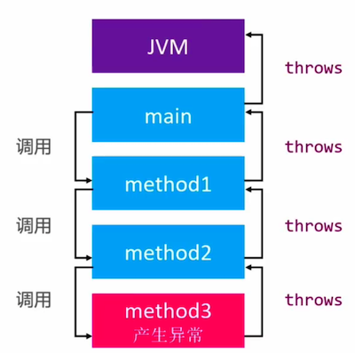 

  - 实例流程说明:

    从上面的代码和流程图我们可以发现, 当内层方法中执行的代码出现异常后, 我们是可以使用**throws** 关键字将对应的异常一层层的往外层方法抛的 (我们可以把throws 异常理解成 甩锅, 当你不想背锅时就使用throws 甩出去), 如果外层方法都不处理, 最后异常就会来到**JVM** 最终程序终止. 


### 3、throws 抛异常细节1

- 当我们的方法内可能会出现多个异常时, 我们可以使用 **throws** 抛出多个异常, 也可以抛出部分异常, 亦可以抛出异常的父类, 如下: 

  ```
  // 1. 抛出多个异常, 不同异常使用 , 分隔
  static void method3() throws ClassNotFoundException, FileNotFoundException {
    Class cls = Class.forName("abc");
    PrintWriter out = new PrintWriter("C:/abc.mp3");
  }
  
  // 2. 因为 ClassNotFoundException 和 FileNotFoundException 的公共父类是 Exception
  // 因此我们也可以抛出公共父类异常
  static void method3() throws Exception {
    Class cls = Class.forName("abc");
    PrintWriter out = new PrintWriter("C:/abc.mp3");
  }
  
  // 3. 也可以处理部分异常, 抛出部分异常
  static void method3() throws ClassNotFoundException{
    Class cls = Class.forName("abc");
    try {
      PrintWriter out = new PrintWriter("C:/abc.mp3");
    } catch (FileNotFoundException e) {
  
      e.printStackTrace();
    }
  }
  ```

  > 在实际开发中, 我们一般是希望对异常描述的越清楚越好, 这样便于我们程序出问题后检查,  因此我们不推荐使用抛出公共异常父类的做法


### 4、throws 抛异常细节2

- 当父类的方法没有**throws** 抛异常时, 子类继承父类且重写父类的方法时, 之类的方法也不能使用**throws** 抛出异常. 

  ```
  class Person{
  	public void test() {
  		System.out.println("person test");
  	}
  } 
  
  class Student extends Person{
  	@Override
  	// public void test() throws  Exception { // 错误, 父类没有throws , 子类重写也不能有throws
    public void test()  { 
  		super.test();
  		System.out.println("student test");
  	}
  }
  ```

  

- 如果父类的方法有**throws** 异常, 子类重写的方法可以**不throws** 异常(子类自己消化掉了) , 也可以子类和父类**throws** 相同的异常, 也可以子类**throws** 出父类异常的子类型

  - 子类重写父类的`throws` 方法, 子类不`throws` 异常, 自己消化掉

    ```
    class Person{
    	public void test() throws Exception {}
    } 
    
    class Student extends Person{
    	@Override
    	public void test()  { 
    		 // 内部, 消化掉 父类的异常
    	}
    }
    ```

  - 子类重写父类的有`throws` 的方法时, 抛出和父类想同的异常

    ```
    class Person{
    	public void test() throws Exception { }
    } 
    
    class Student extends Person{
    	@Override
    	public void test() throws Exception { }
    }
    ```

  - 子类重写父类的`throws` 方法, 抛出父类异常的子类, 也是可以的

    ```
    class Person{
    	public void test() throws Exception {}
    } 
    
    class Student extends Person{
    	@Override
    	public void test() throws XXXException {} // Exception 的子类
    }
    ```


### 5、throws 抛异常细节3

当我们抛出的是检查性异常时, 如果我们没有对异常进行处理( try-catch 或 throws) , 编译器将报错, 提示我们必须处理, 但是当抛出的是非检查性异常(比如: RuntimeException) 时, 如果我们不处理, 编译器不会报错, 示例如下:

- 检查性异常, 必须处理

  ```
  void test1(){
  	test2();		// error , 必须处理异常
  }
  
  void test2() throws Exception{
  }
  ```

- 非检查性异常, 可以不处理

  ```
  public static void main(String[] args)    {
  	test2();	// 可以不处理, 不抛错
  } 
  	static void test2() throws RuntimeException{
  }
  ```

  

## 8、throw 不是 throws

>  注意: 我们此处说的**throw** 不是前面说的 **throws** 

### 1、throw 的简单使用

我们前面介绍的异常处理都是我们们在调用API时(方法)时方法内部抛给我们的,要我们处理的.  但是有时我们在封装API(方法)时想告诉别人某个参数不满足条件, 想抛出一个异常给调用者时我们需要怎么做呢?  这时, 我们就需要用到 **throw** , 创建一个自定你以异常(错误) , 外部就可以使用 **try-catch 或者 throws** 来处理了

- 使用**throw** 可以抛出一个新建的异常(我们自定义的异常) 

  ```
  //定义一个方法, 内部可以抛出自定义的 异常
  void setAge(int age) throws Exception{ // 将自定义的异常抛出
  	if(age <= 0){
  		// 抛出自定义异常
  		throw new Exception("age 必须是>0 的int");
  	}
  	this.age = age;
  }
  
  // 外部调用
  void test(){
  	try{
  		setAge(10);
  	}
  	catch(IllegalArgumentException e){
  		e.printStackTrace();
  	}
  }
  ```

  > 注意: 当我们在方法内使用了 throw 抛出了自定义的异常后, 一定要使用 throws 将异常抛出去, 否则throw 将毫无意义(如果你使用了 throw 而 没有使用 throws 就像是你发现了异常但是没有上报, 你不上报外面怎么会知道有错呢?)


**简单的说:**  

当我们在调用方法时, 如果方法内部可能抛出异常, 此时我们可以使用`try-catch` 或者 `throws` 的方式来处理接收到的异常.

当我们在封装一个方法供外部使用时, 如果在某种条件下需要将一个错误抛给外部让外部调用者来对这种错误异常进行处理时, 这时我们就可以使用 `throw` 来抛出一个异常 (注意: throw 和 throws 通常是一起使用的) 


### 2、throw 的细节

- 通过 **throw**  抛出的检查性异常, 必须通过 **try-catch 或 这 throws** 处理,如下示例:

  ```
  public class Person{
  	public Person(String name) throws Exception{	
  		if(name == null || name.length() == 0){
  			throw new Exception("name 不能为空");
  		}
  	}
  }
  // 因为Exception 是检查性异常, 必须处理
  ```

  

- 通过 **throw** 抛出的非检查性异常, 可以不处理(即 可以不用try-catch 或 throws 处理)

  **IllegalArgumentException 非法参数异常, 这平时用的多** 

  ```
  public class Person{
  	public Person(String name){	
  		if(name == null || name.length() == 0){
  			throw new IllegalArgumentException("name 不能为空");
  		}
  	}
  }
  // 因为IllegalArgumentException 是 非检查性异常, 可以不处理
  ```


从上面的示例我们发现一个问题, 我们使用 **throw 抛出一个检查性异常外部必须额外写代码处理, 使用throw 抛出的是一个非检查性异常(比如: 运行时异常)外部不需要额外写代码处理** , 既然抛出检查性异常和非检查性异常都可以, 那么我们在真实的开发中怎么来选择呢? 我们一般面对选择都是有选择困难症的

是这样的哈!

- 当我们抛出的是检查性异常的话, 外部在调用我们的方法时, 必须额外写代码对异常做处理, 代码书写的肯定要复杂一些, 可读性肯定会降低. 
- 如果我们抛出的是非检查性异常, 外部使用时没有增加代码的复杂性
- 因此我们的结论和处理方式, 通常是这样的:
  - 如果你觉得这个异常是很重要的, 必须引起外部的注意, 那么就抛出检查性异常, 明确告诉外面需要额外的处理可能发出的异常, 外部必须引起重视
  - 如果你觉得这个异常仅仅是一个警告, 只是在某种条件下给出错误提示, 那么就使用非检查性异常, 这样对外部来说不增加额外的代码成本. 


## 9、自定义异常

前面我们通过 **throw** 出去的异常都是系统提供的异常类型, 但是在实际的开发中, 系统提供的异常可能是不能满足我们的需求的, 这时就需要我们自定义异常了.

在java开发中, 自定义的异常类型, 基本都是以下2种做法:

- 要么继承自 **Exception**
  - 使用起来代码稍微复杂点
  - 希望开发者重视这个异常, 认真处理这个异常
  - 就是我们前面一直在提的 检查性异常
- 要么继承自 **RuntimeException**
  - 使用起来代码更加简洁
  - 不严格要求开发者去处理这个异常
  - 这个就是我们一直在说的 运行时异


**自定义异常的优点:**

1. 因为有时, 我们使用系统提供的异常类型不能很全面的满足我们要想表达的思想, 使用自定义异常更灵活, 更接地气
2. 因为自定义异常是我们自己实现的异常类型, 因此在很多地方能更方便更灵活, 更见名知意


```
// 自定义 检查性异常
public EmptyStringException extends Exception{
	public EmptyStringException(String name){
		super(name + "的长度不能为空");
	}
}

// 运行时异常
public NumberException extends RuntimeException{
	public NumberException(String name){
		super(name + "取值必须>=0");
	}
}
```


## 10、总结

- 不论事 **检查性异常, 非检查性异常, 只要是继承自Throwable** 我们都可以使用 **try-catch 或者 throws** 来处理
- 只是, 如果你是非检查性异常,  **try-catch 或者 throws** 不是强制的
- 不论是什么异异常, 只要最终传递到了 JVM 中, 都会导致程序终止


- 其实我们在开发中, 也有个误区: 是不是程序中有抛出异常就是程序员代码写的不好呢? 
  - 其实不是的, 比如检查性异常是难以避免的(比如: 要读取一个文件, 文件真实就是不存在), 因此编译器强制要求你去检查. ( 比如: 通过一个名字去获取一个类, 外部传参是难以避免的)


## 11、使用异常的好处

- 将错误代码与普通代码区分开
- 能将错误信息传递到调用栈中
- 能对错误信息进行分组


## 12 、编写一个断言类

```
public class Assert{
	public static void test(boolean v){
		if(v) return;
		throw new IllegalArgumentException("条件不成立");
	}
}

// 使用断言类测试代码
public static void main(String[] args)    {
		int age = 10;
		Assert.test(age > 10);

		String name = "";
		Assert.test(name != null && name.length() != 0);
	}

// 打印:
Exception in thread "main" java.lang.IllegalArgumentException: 条件不成立
	at com.meiju.Assert.test(Main.java:28)
	at com.meiju.Main.main(Main.java:14)
```


# 二二、正则表达式


## 1、字符串的合法验证

- 在开发中, 我们经常会对一些字符串进行合法验证, 如下:

   

- 自己实现一个代码的验证

  ```
  // 自己实现一个email 的判断规则
  // 6~18个字符, 可使用字母, 数字, 下划线, 需以字母开头
  public static boolean validate(String email) {
  
  
    // 在java中获取指定位置的字符 email.charAt(1);
    // 获取字符数组 char[] chars = email.toCharArray();
    if (email == null) {
      return false;
    }
  
    char[] chars  = email.toCharArray();
    if (chars.length < 6 || chars.length > 18) {
      return false;
    }
    if (! isLetter(chars[0])) {
      return false;
    }
  
    for(int i = 1; i < chars.length; i++) {
      char c = chars[i];
      if (isLetter(c) || isDigit(c) || c == '-') {
        return true;
      }
    } 
    return false;
  }
  
  private static  boolean isLetter(char c) {
    return (c >= 'A' && c <= 'Z') || (c >= 'a' && c <='z');
  }
  
  private static boolean isDigit(char c) {
    return (c >= '0' && c <= '9') ;
  }
  ```

> 使用:
>
> ```
> public static void main(String[] args) {
>   System.out.println(validate("qqq333wewe"));
> }
> ```


- 我们刚才用自定义的方式写了一个规则来判断, 发现是如此的复杂,下面我们使用正则表达式来实现相同的功能, 如下:

  ```
  // 使用正则来判断 
  String regex  = "[a-zA-Z][a-zA-z0-9]{5,17}";
  System.out.println("qqq333wewe".matches(regex));
  
  // 也可以这样写
  String regex  = "[a-zA-Z]\\w{5,17}";  // \w 字母数字下划线
  System.out.println("qqq333wewe".matches(regex));
  ```

  > 正则表达式, 可以使用一段非常精简的表达式取代复杂的逻辑验证
  >
  > 极大的提高了我们的开发效率

正则表达式是一门通用的技术, 适用于绝大多数流行的编程语言

比如, 刚才的正则表达式完全可以使用在javaScript中, 如下: 

```
// 在javaScript 中使用正则
const regex = /[a-zA-Z]\w{5,17}/;
console.log(regex.test("qqq333wewe"));
```


## 2、单字符匹配

> 单字符匹配, 一个 `[]` 中只匹配一个字符

| 语法            | 含义                                                 |
| --------------- | ---------------------------------------------------- |
| `[abc]`         | a、b、c                                              |
| `[^abc]`        | 除了a、b、c以外的任何字符                            |
| `[a-zA-Z]`      | 从a到z、从A到Z                                       |
| `[a-d[m-p]]`    | [a-dm-p]  并集,即`[a-d[m-p]]` 与 `[a-dm-p]` 完全等价 |
| `[a-z&&[def]]`  | d、e、f  交集                                        |
| `[a-z&&[^bc]]`  | [ad-z] 差集, 从[a-z]中减去[bc]                       |
| `[a-z&&[^m-p]]` | [a-lq-z] 差集, 从a-z中减去[m-p]                      |

> 示例:
>
> `[bcr]at` 第一个字符是 b 或 c 或r, 第二个是a, 第三个时 t
>
> 也可以这样写: `[b|c|r]at` 
>
> 还可以这样写: `(b|c|r)at` , 注意: 使用这种小括号`()` 中间就必须有`|` , 如果使用`[]` 那么中竖线`|` 可以省略


## 3、预定义字符

### 1、预定义字符的介绍与使用

| 语法 | 含义                                                        |
| ---- | ----------------------------------------------------------- |
| `.`  | 任意字符                                                    |
| `\d` | [0-9] 数字                                                  |
| `\D` | `[^0-9]`  非数字                                            |
| `\s` | `[ \t\n\f\r]` 空白(注意 \t 前面有个空格哈), tab键 回车 换行 |
| `\S` | `[^\s]` 非空白                                              |
| `\w` | [a-zA-Z0-9_] 单词 (字母 数字 下划线)                        |
| `\W` | `[^\w]`  非单词                                             |

> 以 1个反斜杠`\` 开头的字符会被当做转义字符处理
>
> 因此:
>
> 为了能在正则表达式中完整的表示预定义字符, 在java中需要用2个反斜杠`\\`开头, 比如:
>
> `\\t`  或 `\\d`   

```
比如: 我们想要匹配任意字符, 可以这样能写
String regex = ".";
String str = "a";
System.out.println(str.matches(regex)); // true

// 如果指向匹配一个 `.` 那么需要使用 `\\.` 来表示
String regex2 = "\\.";		// 判断一个点
String str2 = "a";
String str3 = ".";
System.out.println(str2.matches(regex2)); // true
System.out.println(str3.matches(regex2)); // true
```


### 2、预定义字符的细节

- `.` 在正则表达式中是属于预定义字符, 如果想要判断单独的 `.` ,而不是全部的字符, 我们需要使用`\\.` , 这个细节在开发中容易犯, 要注意!!! 

  - 比如我们要判断 `.java` 要怎么写呢? 

    ```
    String regex = ".java"; // 表示第一个字母是任意的, 后面是java
    System.out.println(".java".matches(regex)); // true
    System.out.println("ajava".matches(regex)); // true
    System.out.println("bjava".matches(regex)); // true
    System.out.println("xjava".matches(regex)); // true
    
    如果我们要判断的就是 点java , 我们要怎么写呢? 按照下面的写
    string regex2 = "\\.java";
    System.out.println(".java".matches(regex)); // true
    System.out.println("ajava".matches(regex)); // false
    ```

  - 比如: 我们需要判断 `[`  `]`  又要怎么写呢? 

    一样的, 因为在java中单个`[` 或这 `]` 是有特殊含义的, 我们要这样写 `\\[`  或者 `\\]` 

  - 同样的, 判断 `{` `}`  , 需要写成: `\\{`  或 `\\}` 

  - 判断`^` , 需要写成 `\\^` 

  

## 4、量词 (贪婪、勉强、独占)


| 贪婪(Greedy) | 勉强(reluctant) | 独占(Possessive) | 含义                 |
| ------------ | --------------- | ---------------- | -------------------- |
| X{n}         | X{n}?           | X{n}+            | X 出现n次            |
| X{n,m}       | X{n,m}?         | x{n,m}+          | X 出现n到m次         |
| X{n,}        | X{n,}?          | X{n,}+           | X 出现至少n次        |
| X?           | X??             | X?+              | X{0,1} X出现0次或1次 |
| X*           | X*?             | X*+              | X{0,} X出现任意次    |
| X+           | X+?             | X++              | X{1,} X至少出现1次   |

> 可以将贪婪理解为, 先整口吞,不满足再从右往左一个个丢, 再一起吞再判断, 依次往复

- 示例:

  ```
  String regex = "6{3}"; // 6出现3次
  "66".matches(regex); // false
  "666".matches(regex); // true
  "6666".matches(regex); // false
  
  String regex2 = "6{2,4}"; // 6出现2到4次
  "6".matches(regex2); // false
  "66".matches(regex2); // true
  "666".matches(regex2); // true
  "6666".matches(regex2); // true
  "66666".matches(regex2); // false
  
  String regex3 = "6{2,}";	// 6 至少出现2次
  "6".matches(regex3); // false
  "66".matches(regex3); // true
  "666".matches(regex3); // true
  "6666".matches(regex3); // true
  "66666".matches(regex3); // false
  
  
  String regex4 = "6?";	// 6 出现1次 或0次
  "".matches(regex4); // true
  "6".matches(regex4); // true
  "66".matches(regex4); // false
  
  
  String regex5 = "6*";	// 6 出现任意次
  "".matches(regex5); // true
  "6".matches(regex5); // true
  "66".matches(regex5); // false
  
  String regex5 = "6+";	// 6 至少出现1次
  "".matches(regex5); // false
  "6".matches(regex5); // true
  "66".matches(regex5); // true
  ```

  

## 5、Pattern 、 Matcher

### 1、String的matches 方法底层实现

- String 的matches方法底层用到了 Pattern、 Matcher 两个类, 如下:

  ```
  // java.lang.String 中的matches 定义如下:
  public boolean matches(String regex){
  	return Pattern.matches(regex, this);
  }
  
  // java.lang.regex.Pattern 中的matches 方法定义如下:
  public static boolean matches(String regex, CharSequence input){
  	Pattern p = Pattern.compile(regex);
  	Matcher m = p.matcher(input);
  	return m.matches();
  }
  ```

  > 换句话说, 当我们调用String的matches 方法时, 其实内部是调用了Pattern的matches 方法

### 2、Matcher 常用方法

- 常用方法介绍

  ```
  // 如果整个input 与 regex 匹配, 就返回 true
  public boolean matches();
  
  // 如果从 input 中找到了与 regex 匹配的子序列, 就返回true
  // 如果匹配成功, 可以通过 start、end、group 方法获取更多信息
  // 每次的查找范围会先剔除此前已经查找过的范围
  public boolean find()
  
  // 返回上一次匹配成功的开始索引
  public int start();
  
  // 返回上一次匹配成功的结束索引
  public int end();
  
  // 返回上一次匹配成功的 input 子序列
  public String group();
  ```

- 示例1, 找出所有满足条件的子串

  ```
  String input = "123_444_555_666_789";
  String regex = "\\d{3}"; 		// 找3个数字
  
  Pattern p = Pattern.compile(regex);
  Matcher m = p.matcher(input); 
    while (m.find()) { // 检查满足条件的子串
      
    System.out.println(m.group()); 	// 获取匹配的子串
    // 获取匹配子串的开始位置
    System.out.println(m.start());  // [0, 3) 左闭右开
    // 获取匹配子串的结束位置
    System.out.println(m.end()); 	// [0, 3) 左闭右开
  }
  // 打印:
  123
  0
  3
  444
  4
  7
  555
  8
  11
  666
  12
  15
  789
  16
  19
  ```

  > 1. System.out.println(input.matches(regex)); // false, matches 要求完全匹配
  > 2. m.matches() 也是要求完全匹配
  > 3. m.find() 调用一次, 就只匹配一个只串

  

### 3、正则工具封装1(matcher 工具封装)

```
public static void findAll(String regex, String input){
	if(regex == null || input == null) return;
	
	Pattern p = Pattern.compile(regex);
	Matcher m = p.matcher(input);
	boolean found = false;
	while(m.find()){
		found = true;
		System.out.format("\"%s\", [%d, %d] %n", m.group(), m.start(), m.end());
	}
	if(!found){
		System.out.println("not found");
	}
}
```

- 示例1:

  ```
  String regex = "123";	
  String input = "123";
  findAll(regex, input);
  // 打印:
  "123", [0, 3] 
  
  String regex2 = "123";	
  String input2 = "6_123_123_7";
  findAll(regex2, input2);
  // 打印:
  "123", [2, 5] 
  "123", [6, 9] 
  
  String regex3 = "[abc]{3}";	
  String input3 = "abcaaabbbcccbac";
  findAll(regex3, input3);
  // 打印:
  "abc", [0, 3] 
  "aaa", [3, 6] 
  "bbb", [6, 9] 
  "ccc", [9, 12] 
  "bac", [12, 15]
  
  String regex4 = "\\d{2}";	
  String input4 = "0_21_345_67_8";
  findAll(regex4, input4);
  // 打印:
  "21", [2, 4] 
  "34", [5, 7] 
  "67", [9, 11] 
  ```

- 示例2:

  ```
  String input = "";
  findAll("a?", input);
  // 打印:
  "", [0, 0] 
  
  String input2 = "";
  findAll("a*", input2);
  // 打印:
  "", [0, 0]
  
  String input3 = "";
  findAll("a+", input3);
  // 打印:
  not found
  ```

- 示例3:

  ```
  String input = "a";
  findAll("a?", input);
  // 打印:
  "a", [0, 1] 
  "", [1, 1] 
  
  String input2 = "a";
  findAll("a*", input2);
  // 打印:
  "a", [0, 1] 
  "", [1, 1] 
  
  String input3 = "a";
  findAll("a+", input3);
  // 打印:
  "a", [0, 1] 
  ```

- 示例4:

  ```
  String input = "abbaaa";
  findAll("a?", input);
  // 打印:
  "a", [0, 1] 
  "", [1, 1] 
  "", [2, 2] 
  "a", [3, 4] 
  "a", [4, 5] 
  "a", [5, 6] 
  "", [6, 6] 
  
  String input2 = "abbaaa";
  findAll("a*", input2);
  // 打印:
  "a", [0, 1] 
  "", [1, 1] 
  "", [2, 2] 
  "aaa", [3, 6] 
  "", [6, 6] 
  
  String input3 = "abbaaa";
  findAll("a+", input3);
  // 打印:
  "a", [0, 1] 
  "aaa", [3, 6] 
  ```


### 4、正则工具封装2(matcher 工具封装)

```
// flag 表示的是正则的模式, 后面会讲
public static void findAllf(String regex, String input, int flag){
		if(regex == null || input == null) return;
		
		Pattern p = Pattern.compile(regex, flag);
		Matcher m = p.matcher(input);
		boolean found = false;
		while(m.find()){
			found = true;
			System.out.format("\"%s\", [%d, %d] %n", m.group(), m.start(), m.end());
		}
		if(!found){
			System.out.println("not found");
		}
	}
```


 ## 6、Matcher 贪婪、勉强、独占的区别 !!!

| 贪婪(Greedy) | 勉强(reluctant) | 独占(Possessive) | 含义                 |
| ------------ | --------------- | ---------------- | -------------------- |
| X{n}         | X{n}?           | X{n}+            | X 出现n次            |
| X{n,m}       | X{n,m}?         | x{n,m}+          | X 出现n到m次         |
| X{n,}        | X{n,}?          | X{n,}+           | X 出现至少n次        |
| X?           | X??             | X?+              | X{0,1} X出现0次或1次 |
| X*           | X*?             | X*+              | X{0,} X出现任意次    |
| X+           | X+?             | X++              | X{1,} X至少出现1次   |

- **贪婪** (很贪, 越长越好)

  - 先吞掉整个 **input** 进行匹配
    - 若匹配失败, 则吐出最后一个字符
  - 然后再尝试匹配, 重复此过程, 直到匹配成功

  > 贪婪是从右往左缩, 只要满足条件就不缩了
  >
  > 贪婪模式也可能会匹配多次

  ```
  String input = "afooaaaaaafooa";
  findAll(".*foo", input); // 贪婪
  // 打印:
  "afooaaaaaafoo", [0, 13] 
  
  //贪婪模式也可能会匹配多次 (这也是贪婪模式)
  findAll("d+","ddd_dddd_ddddd");
  // 打印
  "ddd", [0, 3] 		
  "dddd", [4, 8] 
  "ddddd", [9, 14] 
  ```

- **勉强**

  - 先吞掉**input** 的第一个字符进行匹配
    - 若匹配失败, 再吞掉下一个字符
  - 然后再尝试匹配, 重复此过程, 直到匹配成功

  > 从左往右扩展, 满足条件就不扩了

  ```
  String input = "afooaaaaaafooa";
  findAll(".*?foo", input);
  // 打印:
  "afoo", [0, 4] 
  "aaaaaafoo", [4, 13] 
  ```

- **独占**

  - 先吞掉整个 **input** 进行唯一的一次匹配

  ```
  String input = "afooaaaaaafooa";
  findAll(".*+foo", input);
  // 打印:
  not found
  ```


> 因为Matcher 会匹配每一个分组, 因此你可以理解为已经被匹配的部分会被切除掉, 不会在进行到下一轮匹配中.

## 7、捕获组

所谓捕获组, 就是下面带小括号`()` 这种

```
String regex = "dog{3}";
"doggg".matches(regex); // true

// 使用 [] 括起来, 表示一个字符, 取其中一个
String regex2 = "[dog]{3}";
"ddd".matches(regex2); // true
"ooo".matches(regex2); // true
"ggg".matches(regex2); // true
"dog".matches(regex2); // true
"gog".matches(regex2); // true
"gdo".matches(regex2); // true
... 

// 使用 () 括起来表示是一个组, 是一个整体, 必须一起出现
String regex3 = "(dog){3}";
"dogdogdog".matches(regex3); // true
```

> 注意:
>
> 如果在捕获中中出现了竖线`|` 含义又不一样了, 表示是或
>
> `(a|b|c)` 等价于[abc]


## 8、捕获组-反向引用(backreference) 待看

### 1、反向引用的简单使用

- 反向引用(backreference)

  - 可以使用**反写干(`\`) + 组编号(从1开始)** 来引用组的内容
  - 注意: 反向引用, 引用的是内容作为规则

  ```
  String regex = "(\\d\\d)\\1";
  "1212".matches(regex); // true
  "1234".matches(regex); // false
  ```

  > **说明**:
  >
  > - 一对小括号`()` 表示一个组, 如果我们这么写: `(a)(b)(c)` 代表3个组, 分别是第一组`(a)` , 第二组`(b)` , 第三组`(c)`
  > - `(\\d\\d)` 表示必须出现2个数字, 表示的是一组
  > - `(\\d\\d)\\1` 中的`\\1` 表示获取1号组的内容,相当于1号组的内容再重复一次(即, 相当于`(\\d\\d)(\\d\\d)` , 注意此处是相当于, 不是等于.

  ```
  String regex = "([a-z]{2})([A-Z{2})\\2\\1";
  "mjPKPKmj".matches(regex); // true
  "mjpkmjpk".matches(regex); // false
  // 从这个示例, 就可以看到引用
  ```

  > - `([a-z]{2})([A-Z]{2})\\2\\1` 中的第一组是`([a-z]{2})` , 第二组是`([A-Z]{2})`
  > - `([a-z]{2})([A-Z]{2})\\2\\1` 有点像等价于 `([a-z]{2})([A-Z]{2})([a-z]{2})([A-Z]{2})` 但是又不相等


### 2、捕获组-反向引用, 详细说明

前面已经介绍了捕获组反向组引用, 下面我们来详细说明一下, 我们在实际开发中怎么来确认引用的是那一部分呢?

- 一般来说, 我们是通过检查正则表达式中有几个成对的小括号`()` 来判断有几个捕获组的.(或者我们可以数一下有几个左括号`(` 就有几个捕获组)

  如下: 表达式中一共有4个捕获组

  ```
  ((A)(B(C)))
  ```

- 一般, 我们是从正则表达式的左边的第一个左括号`(`开始往右边数, 一个左括号`(` 就是一个捕获组

  ```
  ((A)(B(C)))
  // 一共4个组
  // 第1组: ((A)(B(C)))
  // 第2组: (A)
  // 第3组: (B(C))
  // 第4组: (C)
  ```

  > 一般来说正则表达式中的小括号`(` 是成对出现的

  ```
  String regex = "((I)( Love( You)))\\3{2}";
  "I Love You Love You Love You".matches(regex);	// true
  ```

### 3、捕获组- 实用功能

- 实用捕获组, 获取捕获到的指定内容

  > 先通过正则表达式匹配出所有的满足条件的子串, 在使用捕获组再获取到其中的某个组功能

  ```
  利用捕获组, 获取捕获组中的内容
  // 我们要获取 小写-数字-大写 中间的数字 
  String regex = "[a-z]+-([0-9]+)-[A-Z]+";
  Pattern p = Pattern.compile(regex);
  String input = "12-12a-10-ZZ-bb-20-cc-ee-19-ZZ-cc";
  Matcher m = p.matcher(input);
  boolean find = false;
  while(m.find()) {
    System.out.format("%s ==> %s\n", m.group(), m.group(1));
    find = true;
  }
  if (!find) {
    System.out.println("没找到");
  }
  
  // 打印:
  a-10-ZZ ==> 10
  ee-19-ZZ ==> 19
  ```

- 应用场景2, 找出所有的文件名

  ```
  比如我们有这样的文件名, 如下: 要获取中间的xxxx 文件名
  {
  01xxxxx.mp3
  02xxxxx.Mp3
  03xxxxx.mP3
  ... ... 
  999xxxxx.MP3
  }
  
  String regex = "[0-9]*(\\w+).[mM][pP]3"; 
  Pattern p = Pattern.compile(regex);
  String input = "1024xxMP3xxx.MP3"; // 其中一个
  Matcher m = p.matcher(input);
  while(m.find()){
    System.out.println(m.group());
    System.out.println(m.group(1)); // 文件名
  }
  
  // 打印:
  1024xxMP3xxx.MP3
  xxMP3xxx
  ```

  


## 9、边界匹配符(boundary Matcher)

### 1、边界匹配

- 我们仔细分析一个字符串发现有下面这些特点:
  - 一个字符串有若干个字符组成, 而字符又可以分成: 小写, 大写, 数字, 下划线, 空格, 换行等等
  - 一个字符串有若干个单词组成
  - 一个字符串可能又有多行
  - 一个单词有单词的开头, 以及单词的结尾
  - 一行文字有一行文字的开头以及结尾
  - 一个字符串有自己的口头和结尾

我们前面介绍的是从字符角度来匹配的, 这节边界我们要说的是从位置来匹配的问题

> 顺便提一嘴:
>
> 边界匹配, 通常与正则表达式的模式有关, 比如: 单行模式, 多行模式等

| 语法 | 含义                                                         |
| ---- | ------------------------------------------------------------ |
| `\b` | 单词边界                                                     |
| `\B` | 非单词边界                                                   |
| `^`  | 一行的开头 **(一个字符串可能显示多行)**                      |
| `$`  | 一行的结尾**(一个字符串可能显示多行)**                       |
| `\A` | 输入的开头**(相当于整个字符串的开头)**                       |
| `\z` | 输入的结尾**(相当于整个字符串的结尾, 但是结尾不可以是终止符(即`\n` `\r`)** |
| `\Z` | 输入的结尾 **(结尾可以有终止符(即终止符可以是`\n` `\r`)**    |
| `\G` | 上一次匹配的结尾                                             |

> 一定要搞清楚什么是输入(整个字符串), 什么是一行
>
> 我们平时使用`" "` 描述的字符串在实际显示时, 可能是多行显示的, 整个字符串就是输入, 看到的一行, 就是一行

**一些概念**

- **终止符** (final Terminator、Line Terminator)
  
  - `\r`(回车) 、`\n`(换行符)、`\r\n` (回车换行符)
  
- **输入** : 整个字符串

  > 你以后看到输入, 就是代表整一个字符串

- **一行**: 以终止符(或整个输入的结尾) 结束的字符串片段
  
  - 如果输入是: `"dog\ndog\rdog"` 
  - 那么3个`dog` 都是一行, 也就是说 `"dog\ndog\rdog"` 表示的是3行, 每行都是一个`dog`

> 总结:
>
> 所谓输入, 就是整个字符串, 一行就是一行一行的, 只有明白了输入和一行, 在正则中有些问题才好处理


**注意:**

1. 边界匹配符合我们之前讲的预定义字符是有本质区别的, 预定义字符是用来匹配某个字符的, 边界匹配符匹配的是位置不是字符

2. 下图标注的地方, 就是我们一个字符串中的所有**单词边界** :

   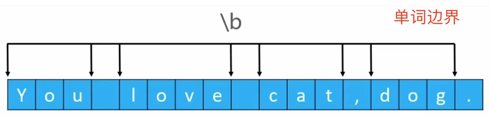 


### 2、边界匹配符-单词边界

- 示例: (匹配单词边界)

  > 我们可以用单词的边界来匹配一个字符串中的单词
  
  ```
  String regex = "\\bdog\\b";				// 左边是单词边界, 右边也是单词边界
  findAll(regex,"This is a dog." );
  // "dog", [10, 13] 

  findAll(regex,"This is a doggie." );
// not found
  
  findAll(regex,"dog is cute" );
  // "dog", [0, 3] 
  
  findAll(regex,"I Love cat, dog, pig." );
  // "dog", [12, 15] 
  ```
  
- 示例: (匹配非单词边界)

  ```
  String regex = "\\bdog\\B";		// 左边是单词边界, 右边不能是单词边界
  findAll(regex,"This is a dog.");
  // not found
  
  findAll(regex,"This is a doggie.");
  "dog", [10, 13] 
  
  findAll(regex,"dog is cute");
  // not found
  
  findAll(regex,"I Love cat, dog, pig.");
  // not found
  ```


### 3、边界匹配符- 一行的开始

```
String regex = "^dog$";		// 左边是一行的开始, 右边是一行的结束
findAll(regex, "dog");
// "dog", [0, 3] 

findAll(regex, "     dog");
// not found

findAll("\\s*dog$","     dog");
// "     dog", [0, 8]

findAll("^dog\\w*","dogbblahblah");
// "dogbblahblah", [0, 12] 

findAll("\\Gdog","dog");
// "dog", [0, 3] 

findAll("\\Gdog","dog dog");
// "dog", [0, 3] 

findAll("\\Gdog","dogdog");
// "dog", [0, 3] 
// "dog", [3, 6] 
```


### 4、边界的细节

- 什么是单词边界

  ```
  String regex = "\\bdog\\b";		// 左边是一行的开始, 右边是一行的结束
  findAll(regex, "dog_dog6dog+dog-dog哈 dog ,dog."); 
  // 打印:
  "dog", [12, 15] 
  "dog", [21, 24] 
  "dog", [26, 29] 
  // 分析: 从上面的打印结果我们猜测, _ 数字 汉字 字母 应该都是算是单词的一部分, 运算符标点符空格算是单词边界
  ```

- 下面我们来讲一下, 一行的开头`^` 与 输入的开头`\A`的区别,  一行的结尾`$`  与 输入的结尾`\z` 的区别, 以及注意点

  - 首先要说明一下, 我们前面封装的工具 `findAll(String regex, String input)` 默认使用的是单行模式, 我们要在正则表达式中使用 `^` `$` 表达一行的开头语一行的结尾, 需要在多行模式下才有效果


## 10、常用模式

### 1、正则表达式常用模式介绍

**单行模式, 多行模式, 不区分大小写模式** 

| 模式             | 含义                                          | 等价的正则写法 |
| ---------------- | --------------------------------------------- | -------------- |
| DOTALL           | 单行模式(`.` 可以匹配任意字符, 包括终止符)    | `(?s)`         |
| MULTILINE        | 多行模式 (`^,$` 才能真正匹配一行的开头和结尾) | `(?m)`         |
| CASE_INSENSITIVE | 不区分大小写                                  | `(?i)`         |

> 说明:
>
> - 以前默认情况下虽然 `.`  是匹配任意字符, 但是是不能匹配终止符(即`\r` `\n` ) 的, 只有在 `DOTALL` 模式下才能匹配终止符(即 `\r` `\n`) 
>
>   ```
>   findAll(".","\r\n"); 
>   System.out.println("--------");
>   findAllf(".","\r\n", Pattern.DOTALL);
>   // 打印:
>   not found
>   --------
>   "
>   ", [0, 1] 
>   "
>   ", [1, 2] 
>   ```
>
> - 在以前, 虽然正则表达式中年`^` 是用来匹配一行的开始, `$` 是用来匹配一行的结尾的, 但是在默认情况下是匹配不出一行的开始和结尾的, 只有在`MULTILINE` 模式下才能匹配出一行的开始和结尾
>
>   ```
>   findAll("^dog$","dog\ndog\rdog");	
>   System.out.println("------------");
>   findAllf("^dog$","dog\ndog\rdog", Pattern.DOTALL);	
>   System.out.println("------------");
>   findAllf("^dog$","dog\ndog\rdog", Pattern.MULTILINE);
>   // 打印:
>   not found
>   ------------
>   not found
>   ------------
>   "dog", [0, 3] 
>   "dog", [4, 7] 
>   "dog", [8, 11] 
>   ```
>
>   

### 2、常用模式示例:

- 不区分大小写模式 (CASE_INSENSITIVE)

  ```
  findAll("dog","Dog_dog_DOG");
  // "dog", [4, 7] 
  
  findAllf("dog", "Dog_dog_DOG", Pattern.CASE_INSENSITIVE);
  // "Dog", [0, 3] 
  // "dog", [4, 7] 
  // "DOG", [8, 11] 
  
  findAll("(?i)dog","Dog_dog_DOG");
  // "Dog", [0, 3] 
  // "dog", [4, 7] 
  // "DOG", [8, 11] 
  
  findAll("(?i)Dog","Dog_dog_DOG");
  // "Dog", [0, 3] 
  // "dog", [4, 7] 
  // "DOG", [8, 11] 
  ```

- 单行模式(DOTALL) & 多行模式 (MULTILINE)

  > 多行模式才能完全发挥 `^`  和 `$` 的特点
  
  ```
  findAll(".","\r\n");
  // not found
  
  findAllf(".","\r\n", Pattern.DOTALL);		// 单行模式
  // "\r", [0, 1] 
  // "\n", [1, 2] 
  
  findAllf(".","\r\n", Pattern.MULTILINE);	// 多行模式
  // not found
  
  findAllf(".","\r\n", Pattern.DOTALL | Pattern.MULTILINE);	// 单行和多行
  // "\r", [0, 1] 
  // "\n", [1, 2] 
  
  findAll("(?sm).","\r\n"); // 单行和多行
  // "\r", [0, 1] 
  // "\n", [1, 2] 
  
  findAll("^dog$","dog\ndog\rdog");		// 这个模式是单行模式, 匹配不出来
  // not found
  
  findAllf("^dog$","dog\ndog\rdog", Pattern.DOTALL); // 单行模式匹配不出来
  // not found
  
  // 多行模式匹配出来了, 每一行有行的开头与行的结尾
  findAllf("^dog$","dog\ndog\rdog", Pattern.MULTILINE);	
  // "dog", [0, 3] 
  // "dog", [4, 7] 
  // "dog", [8, 11]
  
  // 多行模式和单行模式匹配出来了, 每一行有行的开头与行的结尾
  findAllf("^dog$","dog\ndog\rdog", Pattern.DOTALL | Pattern.MULTILINE);
  // "dog", [0, 3] 
  // "dog", [4, 7] 
  // "dog", [8, 11]
  ```


### 3、边界匹配符 \A \z \Z

```
findAll("\\Adog\\Z","dog");		// 匹配输入的口头 与输入的结尾
// "dog", [0, 3] 

findAll("\\Adog\\z","dog\n"); // 匹配输入的口头 与输入的结尾(`\z` 结尾不能是终止符 `\n` 或 `\r`
// not found
findAll("\\Adog\\Z","dog\n"); // 匹配输入的口头 与输入的结尾(`\z` 结尾可以是终止符 `\n` 或 `\r`
// "dog", [0, 3] 

findAll("\\Adog\\z","dog\ndog\rdog");			
// not found

findAllf("\\Adog\\z","dog\ndog\rdog", Pattern.MULTILINE);
// not found
```

> 注意:
>
> - `\A` `\z` `\Z` 因为表示的是输入的开头和结尾, 因此结果与单行模式多行模式无关
> - `^` `$` 因为表示的是单行的口头和结尾, 因此结果与单行模式多行模式相关

## 11、常用正则表达式

正则表达式在线测试:

https://c.runoob.com/front-end/854


| 需求         | 正则表达式        |
| ------------ | ----------------- |
| 18位身份证号 | `\d{17}[\dXx]`    |
| 中文字符     | `[\u4e00-\u9fa5]` |


## 12、String 类与正则表达式

- String 类中接收正则表达式作为参数的常用方法有

  ```
  public String replaceAll(String regex, String replacement);
  public String replaceFirst(String regex, String replacement);
  public String[] split(String regex);
  ```


### 1、练习

- 将单词 row 换成单词line

  ```
  String s1 = "The row we are looking for is row 8.";
  String s2 = s1.replace("row", "line"); 
  String s3 = s1.replaceAll("\\brow\\b", "line");
  
  System.out.println(s2);
  System.out.println(s3);
  
  // The line we are looking for is line 8.
  // The line we are looking for is line 8.
  
  String s1 = "Tomorrow I will wear in brown standing in row 10.";
  String s2 = s1.replace("row", "line"); 
  String s3 = s1.replaceAll("\\brow\\b", "line");
  String s4 = s1.replace(" row ", "line"); 
  
  System.out.println(s2);
  System.out.println(s3);
  System.out.println(s4);
  // Tomorline I will wear in blinen standing in line 10.
  // Tomorrow I will wear in brown standing in line 10.
  // Tomorrow I will wear in brown standing inline10.
  ```

- 将所有连续的数字替换为 ** 

  ```
  String s1 = "ab12c3d345efg7h89i1011jk12mnn"; 
  String s2 = s1.replaceAll("\\d+", "**"); 
  System.out.println(s2); 
  // ab**c**d**efg**h**i**jk**mnn
  ```

- 利用数字分隔字符

  ```
  String s1 = "ab12c3d345efg7h89i1011jk12mnn"; 
  String[] arr = s1.split("\\d+");
  
  for (int i = 0; i < arr.length; i++) {
    System.out.format("%d: %s \n", i, arr[i]);
  }
  // 打印:
  0: ab 
  1: c 
  2: d 
  3: efg 
  4: h 
  5: i 
  6: jk 
  7: mnn 
  ```

- 提取 重叠的字母, 数字

  ```
  String input = "aa11+bb23-mj33*dd44/5566%ff77"; 
  String  regex = "([a-z])\\1(\\d)\\2";
  Pattern p = Pattern.compile(regex);
  Matcher m = p.matcher(input);
  while (m.find()) {
    System.out.println(m.group());
    System.out.println(m.group(1));
    System.out.println(m.group(2));
  } 
  
  // 打印:
  aa11
  a
  1
  dd44
  d
  4
  ff77
  f
  7
  
  
  
  String input = "aa12+bb34-mj56*dd78/9900"; 
  String  regex = "[a-z]{2}\\d(\\d)";
  Pattern p = Pattern.compile(regex);
  Matcher m = p.matcher(input);
  while (m.find()) {
    System.out.println(m.group());
    System.out.println(m.group(1));
  } 
  //打印:
  aa12
  2
  bb34
  4
  mj56
  6
  dd78
  8
  ```

  

# 二三、泛型 (Generics)

## 1、泛型介绍

- 从java5开始, 增加了泛型技术
- 什么是泛型?
  - **将类型变为参数, 提高代码复用率** , 原来可能写几个类, 现在一个泛型类搞定

- 建议的类型参数名称
  - T: type
  - E: Element
  - K: Key
  - N: Number
  - V: Value
  - S、U、V: 2nd、3rd、4th types


## 2、泛型类型(Generic type)

### 1、泛型类型介绍

- **什么是泛型 类型?** 

  - 使用了**泛型的类 或者 接口** , 这个类的类型或者这个接口的类型, 我们就称为泛型类型

    > 同理, 如果一个类接、口没有使用泛型技术, 我们就不能说这个类、接口是泛型类型

  - 比如: 

    - java.util.Comparator
    - Java.util.Comparator

  ```
  // 定义泛型类 
  public  class Student<T>{  // <T> 是类型的占位符 
  	private T score;
  	public T getScore(){
  		return score;
  	}
  	public void setScore(T score){
  		this.score = score;
  	}
  }
  
  // 使用泛型类
  // java7以前的写法
  Student<String> stu = new Student<String>();
  
  // java7以后, 可以省略右边<>中的类型
  Student<String> stu = new Student<>();
  stu.setScore("A");
  System.out.println(stu.getScore());
  
  Student<Double> stu2 = new Student<>();
  stu2.setScore(12.0);
  System.out.println(stu2.getScore());
  // 注意: 右边的<>是不可省略的, <>内的类型是可以省略的
  ```


### 2、泛型类型的 类型参数

所谓泛型类的类型参数, 就是定义在泛型类右边的`<>` 中写的参数 (type parameter)

```
// 此处的 T 就是类型参数
public class Student<T>{
	public T score;
}

// 此处的N 和 S 都是类型参数
public class Teacher<N, S>{
	public N age;
	public S name;
}

// 类型参数的名称一般是没有要求的, 随便写, 但是一般我们都只写一个字母 
```


**注意:** 

泛型类型的 类型参数只能是引用类型, 不能是基本类型, 如下:

```
// Student<double> stu2 = new Student<>();  错误写法, double 是基本类型

Student<Double> stu2 = new Student<>();  // 正确写法
```


### 3、泛型类型的 多个类型参数

一个泛型类型, 可以有一个或者多个类型参数, 如下:

```
// 1. 1个类型参数
public class Person<N>{
	private N age; 
	public Person(N age){
		this.age = age;
	}
}

// 2. 多个类型参数
public class Student<N, S>{
	private N no;
	private S score;
	public Student(N no, S score){
		this.no = no;
		this.score = score;
	}
}
```


### 4、定义 泛型类型的 类型占位符

```
public class Person<N>{
}

public class Student<N, S>{
}

public interface Runnable<T1,T2>{
}
```

- 我们 称`Person<N>` 、 `Student<N, S>`  、`Runnable<T1,T2>`为泛型类型
- 称 `Person<N>` 中的 `N` , `Student<N, S>` 中的`N` `S` , `Runnable<T1, T2>` 中的`T1` `T2` 为泛型类型中的类型占位符
- 在定义类 或 接口时在类名或接口名 右边写上`<N>` 或`<T1, T2>`  称为给泛型类型定义 类型占位符


### 5、泛型类型的继承


#### 1、泛型类型的继承-关系1

**同一个类, 不同的参数类型, 结果泛型类型之间没有继承关系**

即: 类相同, 参数类型不同, 泛型类之间不存在继承关系

```
// 系统的Integer 定义如下:
public final class Integer extends Number implements Comparable<Integer> {
... ...
}

// Box 类定义如下
public class Box<E>{
	public E element;
}
```

- `Integer`  继承自 `Number` , 有父子关系
- `Box<String>` 与 `Box<Object>` 之间不存在继承关系
- `Box<String>`  继承自 `Object` , 有父子关系
- `Box<Object>` 继承自 `Object` , 有父子关系

**结论1:**

```
Box<String> strBox = new Box<>();
Box<Object> objBox = new Box<>();
objBox = strBox;  // 错误
// Box<String>  与 Box<Object> 之间是没有继承关系的, 不能直接赋值
```


#### 2、泛型类型的继承-关系2

**类是继承关系, 参数类型相同, 泛型类之间是继承关系** 

- 示例如下:

  ```
  public interface Collection<E> extends Iterable<E>;
  public interface List<E> extends Collection<E>;
  public interface ArrayList<E> extends List<E>;
  ```

  - 继承关系如下:

    `ArrayList<String>`  继承自`List<String>` 继承自 `Collection<String>` 继承自`Iterable<String>

**结论:**

```
Iterable<String> it = null;
Collection<String> co = null;
List<String> li = null;
ArrayList<String> arr = null;

// 因为上面的类型有继承关系, 因此可以下面的赋值
it = co;
co = li;
li = arr; 
```


#### 3、泛型类型的继承-关系3

**类是继承关系, 参数类型也是继承关系, 泛型类之间不存在继承关系** 

**结论:**

```
// 但是, 下面的就不行了
List<Object> lo = null;
ArrayList<String>  arrs = null;
lo = arrs; // 错误
```

> 虽然 List 和 ArrayList 是继承关系, Object 和 String 是继承关系, 但是 List<Object> 和 ArrayList<String> 之间不是继承关系


#### 4、泛型类型的继承-关系4

**泛型类型的子类, 可以在父类的基础上扩充泛型的参数类型**

下面的操作是可以的

```
public interface MyList<E, T> extends List<E>{
	void setNo(T no);
}
```

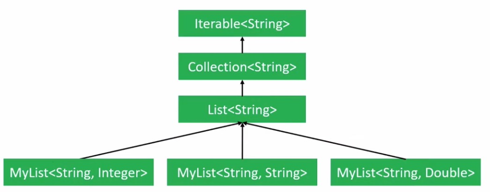 

```
List<string> li = null;
MyList<String, Integer> mli1 = null;
MyList<String, Double> mli2 = null;
MyList<string, String> mli3 = null;

li = mli1; // ok
li = mli2; // ok 
li = mli3; // ok

mli1 = mli2; // error
mli1 = mli3; // error 
```


## 3、原始类型 (Raw Type)

- **什么是原始类型?** 

  - 没有传递具体的类型给 泛型的类型参数的 类型, 称为原始类型, 如下:

  ```
  // Box 称为Box<E> 的原始类型 (Raw type)
  Box rawBox = new Box();				// 如果你在开发中这样写一般会报 warning: rawtypes 警告
  Box<String> strBox = new Box<>();
  Box<Object> objBox = new Box<>();
  // 即 `Box` 原始类型, `Box<String>` 非原始类型
  ```

  > 官方, 不建议我们使用泛型类的原始类型, 这也是警告的原因

- 原始类型与 泛型类型的赋值, 注意点:

  ```
  Box rawBox = new Box();					// 原始类型
  Box<String> strBox = new Box<>();		// 泛型类型
  Box<Object> objBox = new Box<>(); 		// 泛型类型
  
  // 我们可以直接将泛型类型 赋值给原始类型, 不会报错和警告
  rawBox = strBox;	// ok
  rawBox = objBox;	// ok 
  
  // 也可以将 原始类型赋值给泛型类型, 报警告
  strBox = rawBox;	// unchecked warning
  objBox = rawBox;    // unchecked warning
  ```

  > - 当使用了 **原始类型** 时, 编译器会给出 **rawtypes** 警告, 可以使用 **@SuppressWarnings("rawtypes");** 消除
  >
  > - 将 **非原始类型** 赋值给 **原始类型** 时, 编译器不会报任何警告和错误
  > - 将**原始类型** 赋值给**非原始类型** 时, 编译器会报警告**unchecked** , 可以使用**@SuppressWarnings("unchecked")** 消除

- 当我们使用 泛型类的原始类型时, 其实编译器是这样处理的

  ```
  class Box<E>{
  	public E element;
  }
  
  void test(){
  	// 原始类型
  	Box rawBox = new Box();
  	Box<Object> objBox = new Box<>();
  }
  ```

  > 测试验证发现:
  >
  > - rawBox 与 objBox 是同一种类型, 即原始类型会被编译器默认处理为 Box<Object> 类型
  > - 虽然rawBox 与 objBox类型一样, 但是原始类型与泛型类型还是有区别


## 4、泛型方法

### 1、泛型方法概念

> 初学者, 泛型方法容易入坑

- **什么是泛型方法?**

  - 前面我们已经介绍过了, 使用了泛型的 类 或 接口, 我们称这种类或者接口为泛型类型
  - 同理, 在方法中使用了泛型的方法, 我们称之为泛型方法. (这样说并不准确) 

  ```
  // 注意, 下面的方法不是泛型方法, 只是算泛型类型的一部分
  public class Person<T>{
  	private T age;
  	public void setAge(T age){	// 这个方法只能算是, 泛型类 `Person<T>` 的一部分
  		this.age = age;
  	}
  }
  ```

  - 泛型方法的准确描述应该是这样的:
    - 类不是泛型类, 但是类里面的方法使用了泛型
    - 这样的方法, 我们就称之为泛型方法, 如下:

  ```
  // Arrays 中定义的 sort方法就是一个 泛型方法, 如下: 
  // Array 不是泛型类, 但是 sort 方法是泛型方法
  public class Arrays {
  
  	 public static <T> void sort(T[] a, Comparator<? super T> c) {
          if (c == null) {
              sort(a);
          } else {
              if (LegacyMergeSort.userRequested)
                  legacyMergeSort(a, c);
              else
                  TimSort.sort(a, 0, a.length, c, null, 0, 0);
          }
      }
  }
  ```


### 2、泛型方法应用的使用情景

- 比如我们定义了一个泛型类, 如下:

  ```
  class Student<T1, T2>{
  	public T1 age;
  	public T2 height;
  	
  	public void setAge(T1 age){
  		this.age = age;
  	}
  
  	public void setHeight(T2 height) {
  		this.height = height;
  	} 
  }
  ```

- 外部使用泛型类, 作为方法参数:

  ```
  public class Test {
  
  	public static void main(String[] args) {
  		// 定义一个  Student<Integer, Double> 实例
  		Student<Integer, Double> stu1 = new Student<>();
  		stu1.setAge(18);
  		stu1.setHeight(20.0);
  		set(stu1, 10, 1.88);	// ok 不报错
  		display(stu1);				// ok 不报错
  		
  		
  		Student<String, String> stu2 = new Student<>();
  		// set(stu2, 11, 1.44);   // error , set方法 参数类型错误(即 stu2 类型不对)
  		// display(stu2);					// error , set方法 参数类型错误(即 stu2 类型不对)
  	}
  	
  	static void set(Student<Integer, Double> stu, Integer age, Double height) {
  		stu.setAge(age);
  		stu.setHeight(height);
  	}
  	static  void display(Student<Integer, Double> stu) {
  		System.out.println(stu.getAge());
  		System.out.println(stu.getHeight());
  	}
  }
  ```

  > 在上面封装 `set` 方法时, 其实我们原本想的是你 任意传递一个 `Student<T1, T2>` 对象, 我们都可以为它设置 `age` 和`height` , 但是从上面的定义方法 `set(Student<Integer, Double> stu, Integer age, Double height)` 我们发现, 我们只能为 一种泛型类 `Student<Integer, Double>` 这一种类型的对象调用 set 方法, 其它类型的Student 就出问题了, 比如: `Student<String, String>` 类型就不能使用这个 set 方法, 显然有通用型问题.  那我们要怎样才能解决这个对泛型类的操作的问题呢? 


**说白了, 上面的问题就是泛型类作为方法的参数问题,要解决泛型类作为方法的参数或者返回值通用的问题, 我们必须使用泛型方法** , 下一节我们就来介绍泛型方法的定义


### 3、泛型方法的定义

- 普通方法定义

  ```
  // 这个普通方法, 只能处理泛型类的一种类型, 即 `Student<Integer, Double>` , 通用性地
  static void set(Student<Integer, Double> stu, Integer age, Double height) {
    stu.setAge(age);
    stu.setHeight(height);
  }
  
  static  void display(Student<Integer, Double> stu) {
    System.out.println(stu.getAge());
    System.out.println(stu.getHeight());
  }
  ```

- **泛型方法定义 ** 

  ```
  static <T1, T2> void set(Student<T1, T2> stu, T1 age, T2 height) {
    stu.setAge(age);
    stu.setHeight(height);
  }
  
  static <T1, T2> void display(Student<T1, T2> stu) {
    System.out.println(stu.getAge());
    System.out.println(stu.getHeight());
  }
  ```

- **泛型类型的定义**

  ```
  // 泛型类型 类定义
  public class Student<T1, T2>{
  	public T1 age;
  	public T2 height;
  }
  
  // 泛型类型 接口定义
  public interface Runnable<T1>{
  	void run(T1);
  }
  ```

  从上面的定义泛型方法, 以及我们前面讲过的定义泛型类型, 我们发型不论是定义泛型类型还是定义泛型方法都有这样的特点:

  1. 先使用 `<T1>` 或者 `<T1, T2>` 或者 `<T1, T2, T3>` 这种方式在 类中或者方法中, 声明类型占位符, 说明在后面的泛型类型或者泛型方法中将要用到对应的占位类型
  2. 泛型类型或者泛型方法中的类型占位符定义好后, 可以在泛型类型 或者 泛型方法中使用 占位类型来定义变量了

  不同的是, 泛型类型和 泛型方法声明 类型占位符的位置不一样, 泛型类型是在 类名的右边使用 `<T1, T2>` 这样的方式声明的, 泛型方法实在 方法的返回值类型的 左边使用`<T1, T2>` 这种样式定义的

  

  ### 4、泛型类型 & 泛型方法的综合使用

  ```
  // 定义 泛型类型 的类
  class Student<T1, T2>{
  	private T1 age;
  	private T2 height;
  	
  	public T1 getAge() {
  		return age;
  	}
  	public T2 getHeight() {
  		return height;
  	}
  	
  	public void setAge(T1 age){
  		this.age = age;
  	}
  	
  	public void setHeight(T2 height) {
  		this.height = height;
  	} 
  }
  ```

- 调用泛型类, 简单的写法

  ```
  // 测试
  public class Main {
  
  	public static void main(String[] args) {
  		Student<Integer, Double> stu1 = new Student<>(); 
  		set(stu1, 10, 1.88);			// 简化版调用泛型方法
  		display(stu1);						// 简化版调用泛型方法
  		
  		Student<String, String> stu2 = new Student<>(); 
  		set(stu2, "age: 18", "height: 1.88");  // 简化版调用泛型方法  
  		display(stu2);												 // 简化版调用泛型方法
  	}
  	
  	// 定义泛型方法
  	static <T1, T2> void set(Student<T1, T2> stu, T1 age,T2 height) {
  		stu.setAge(age);
  		stu.setHeight(height);
  	}
  	
  	// 定义泛型方法
  	static <T1, T2> void display(Student<T1, T2> stu) {
  		System.out.println(stu.getAge());
  		System.out.println(stu.getHeight());
  	}
  }
  
  // 打印结果, 一切ok:
  10
  1.88
  age: 18
  height: 1.88
  ```

  

- 调用泛型类, 完整的写法

  > 需要在调用的方法前, 点号`.` 后, 写清楚泛型的类型

  ```
  // 测试
  public class Main {
  
  	public static void main(String[] args) {
  		Student<Integer, Double> stu1 = new Student<>(); 
  		Main.<Integer, Double>set(stu1, 10, 1.88);			// 完整版调用泛型方法
  		Main.<Integer, Double>display(stu1);						// 完整版调用泛型方法
  		
  		Student<String, String> stu2 = new Student<>(); 
  		Main.<String, String>set(stu2, "age: 18", "height: 1.88");  // 完整版调用泛型方法
  		Main.<String, String>display(stu2);												 // 完整版调用泛型方法
  	}
  	
  	// 定义泛型方法
  	static <T1, T2> void set(Student<T1, T2> stu, T1 age,T2 height) {
  		stu.setAge(age);
  		stu.setHeight(height);
  	}
  	
  	// 定义泛型方法
  	static <T1, T2> void display(Student<T1, T2> stu) {
  		System.out.println(stu.getAge());
  		System.out.println(stu.getHeight());
  	}
  }
  
  // 打印结果, 一切ok:
  10
  1.88
  age: 18
  height: 1.88
  ```

  

### 4、泛型方法 应用

```
// 泛型类
public class Box<E>{
	private E element;
	public Box(){}
	public Box(E element){
		this.element = element
	}
}

// 泛型方法
<T> void addBox(T element, List<Box<T>> boxes){
	Box<T> box = new Box<>(element);
	boxes.add(box);
}

List<Box<Integer>> boxes = new ArrayList<>();
addBox(11, boxes);
addBox(12, boxes);
addBox(13, boxes);
```


### 5、泛型方法 - 类型推断

```
public class Collections{
	public static final <T> List<T> emptyList(){
		return (List<T>) EMPTY_LIST;	// 根据返回值类型推到
	}
}

// 测试
List<String> list1 = Collections.emptyList();
List<Integer> list2 = Collections.emptyList();
```


### 6、泛型方法 -- 构造方法

```
public class Person<T>{
	private T age;
	public <E> Person(E name, T age){ // 这种用法比较少, E 是来自构造方法本身, T 是来自于泛型类型参数
	
	}
}

// 测试
Person<Integer> p1 = new Perosn("jack", 19);
Person<Double> p2 = new Person(666, 1.90);
Person<String> p3 = new Person(2.0, "80后");
```


### 7 、泛型方法的细节

- 正确的写法

  ```
  public class Box<E>{
  	private E element;
  	public E getElement(){
  		return this.element;
  	}
  }
  ```

- 错误的写法

  ```
  public class Box<E>{
  	private E element;
  	public E getElement(){
  		return this.element;
  	}
  	
  	public static void print(E elment){  // 错误, 因为是静态方法, E 这个类型占位符需要 单独定义
  		// 实现省略 ... 
  	}
  }
  ```

>  **结论:**
>
> - 泛型类型的 类型参数, 只能用在实例方法上, 不能用在静态方法上.
> - 换句话说, 如果定义的静态方法想用泛型技术的话, 只能把静态方法定义成 泛型方法

- 正确的写法

  ```
  public class Box<E>{
  	private E element;
  	public E getElement(){
  		return this.element;
  	}
  	
  	public <E> static void print(E elment){  
  		// 实现省略 ... 
  	}
  }
  ```

  

## 5、限制类型参数

### 1、泛型类型参数 限制 (基本款)

基本款, 限制类型参数满足一个条件即可, eg:  **`<T extends A>`** 


- 可以通过 **extend** 对类型参数增加一些限制条件, 比如: **`<T extends A>`** 

  > - **extends** 后面可以跟 **类名、接口名** 
  > - 代表**T** 必须是**A** 类型, 或者继承自**A** , 或者实现**A** 

  ```
  public class Person<T extends Number>{  // 即 T必须是Number 或子类
  	private T age;
  	public int getAge(){
  		if(age == null){
  			return 0;
  		}
  		return age.intValue();
  	}
  	public Person(T age){
  		this.age = age;
  	}
  }
  ```

  > 因为, 我们只想用一个数字来描述 age, 如果 T 这个类型参数不做限制, 什么类型都可以, 这样代码就会出现意料之外的错误, 所以此处我们必须是用 `<T extends Number>` 对类型占位符做类型的限制


### 2、泛型类型参数 限制 (高级款)  

通知满足多个条件, eg: `<T extends A & B & C>` 

- 我们在给泛型的类型参数做类型限制时, 除了可以要求泛型的类型参数满足一个类型要求, 我们还可以要求这个类型参数满足多个类型的限制要求, 具体说明如下

  > `<T extends A & B & C>` 
  >
  > 表示, T 必须同时满足 A、B、C

- 这种泛型类型参数的高级约束, 其实还有他的注意点:

  1. 如果在 extends 后面要写多个约束, eg: `<T extends A & B & C>`  那么

     `A、B、C` 可以都是接口类型, 这样的话 `A、B、C` 书写可以没有顺序区分

  2. 如果`A、B、C` 中有类的话, 只能有一个类, 且这个类就是`A` , `B、C` 是接口, 为什么是这样要求的呢?

     这其实也很好理解, 因为java是单继承的语言.


### 3、泛型类型参数, 限制类型 示例

```
public static <T extends Comparable<T>> T getMax(T[] array){
	if(array == null || array.length == 0){
		return null;
	}
	
	T max = array[0];
	for(int i = 1; i < array.length; i++){
		if(array[i] == null) continue;
		if(array[i].compareTo(max) <= 0) continue;
		max = array[i];
	}
	return max;
}

// 其实, Comparable<T> 这个约束很好理解, 就是一个带泛型的接口定义而已
// 从这个示例, 我们发现, 泛型的类型参数中也是可以有泛型类型参数的, 在实际开发中不要搞懵了, 这一点初学者容易犯错误 
// 泛型的参数类型占位符是 <T extends Comparable<T>>
// 泛型的参数类型的约束类型 是  Comparable<T>
```

> 在JDK 中已经定义了一个Comparable<T> 接口, 如下: 
>
> ```
> public interface Comparable<T> {
> 	public int compareTo(T o);
> }
> ```
>
> Integer 已经实现了Comparable<T> 接口
>
> ```
> public final class Integer extends Number implements Comparable<Integer> {
> 
> public int compareTo(Integer anotherInteger) {
>     return compare(this.value, anotherInteger.value);
> }
> public static int compare(int x, int y) {
>     return (x < y) ? -1 : ((x == y) ? 0 : 1);
> }
> // 其它省略 ... 
> }
> ```

**下面我们来自定义 一个实现 `Comparable<T>` 接口的类, 来调用前面定义的 `<T extends Comparable<T>> T getMax(T[] array)` 方法**, 如下:


```
public class Person implements Comparable<Person>{
	private int age;
	public int getAge(){
		return this.age;
	}
	public Person(int  age){
		this.age = age;
	}
	
	@Override 
	public String toString(){
		return "person: " + this.age;
	}
	
	//------------实现 Comparable<Person>---代表, Person 实例对象可以比较 Person
	@Override 
	public int compareTo(Person p){
		// 注意: 因为 p 是引用类型, 需要对非null 做判空处理
		if(p == null) return 1;
	
		if(this.getAge() > p.getAge()){
			return 1;
		}
		else if(this.getAge() < p.getAge()){
			return -1;
		}
		return 0;
	}
}


public static void main(String[] args){
	Person[] array = new Person[3];
	array[0] = new Person(11);
	array[1] = new Person(22);
	array[2] = new Person(33);
	System.out.println(getMax(array)); // 33
	// 打印结果:
	person: 33
	
	// 因为Person实现了Comparable<T>, 所以此处我们可以调用Arrays.sort排序
  Arrays.sort(array);	// 默认排序从小到大
  System.out.println(Arrays.toString(array));
	// 打印结果:
	[person: 11, person: 22, person: 33]
}
```


### 4、Comparable 对比 Comparator

- 如果数组元素本身具备可比较性(即, 实现了 java.util.Comparable 接口)

  - 那么可以直接使用 **Arrays.sort** 方法对元素进行排序

- 如果数组元素本身不具备可比较性(即, 没有实现 java.util.Comparable 接口)

  - 我们可以使用**Arrays.sort(T[] a, Comparator<? super T> c)** 方法来对数组进行自定义排序

    > Comparator  是一个函数式接口, 因此我们可以使用匿名类或者 lambda 表达式

  - 那么, **Compatator** 存在的意义是什么? 
    1. 可以在不修改源代码的基础上, 对数据进行排序
    2. 当数组元素不具备可比较性时, 我们可以自定排序

- Arrays 默认排序

  ```
  // 使用 Arrays.sort 方法对Integer[] 进行默认排序
  Integer[] arr = {5,4,3,2,1};
  Arrays.sort(arr);  // 注意, 默认排序数组中不能有null
  System.out.println(Arrays.toString(arr));
  // 打印
  [1, 2, 3, 4, 5]
  ```

- Arrays 自定义排序

  ```
  // 使用Arrays.sort(T[] a, Comparator<? super T> c)) 进行自定义排序
  Arrays.sort(arr, new Comparator<Integer>() {
    @Override
    public int compare(Integer o1, Integer o2) {
      if (o1 == null) return -1;
      if (o2 == null) return 1;
      return	o1.intValue() - o2.intValue();
    }
  });
  System.out.println(Arrays.toString(arr));
  // 打印;
  [null, 1, 2, 3, 4, 5]
  
  
  //--------使用lambda 优化匿名类-------
  Arrays.sort(arr, (Integer o1, Integer o2) -> {
    if (o1 == null) return -1;
    if (o2 == null) return 1;
    return	o1.intValue() - o2.intValue();
    
  });
  System.out.println(Arrays.toString(arr));
  // 打印;
  [null, 1, 2, 3, 4, 5]
  ```


### 5、泛型类型参数 限制类型 Comparable 高级用法

```
class Student<T extends Comparable<T>> implements Comparable<Student<T>>{ 
	
	private T score;
	public T getScore() {
		return this.score;
	}
	public void setScore(T score) {
		this.score = score;
	}
	
	public Student(T score) {
		super();
		this.setScore(score);
	}
	
	@Override
	public int compareTo(Student<T> o) { 
		return score.compareTo(o.score);
	}
}
```

> 代码分析:
>
> 1.简单的说, `class Student<T extends Comparable<T>> implements Comparable<Student<T>>` 中的 `<T extends Comparable<T>>`  的作用是对Student中要用到的泛型类型参数的占位定义, 表示**Student类**用的参数类型需要具备可比较性
>
> 2.  `class Student<T extends Comparable<T>> implements Comparable<Student<T>>` 中的 `<T extends Comparable<T>>`  中的`implements Comparable<Student<T>>`  表示的是**Student类** 实现了**Comparable接口** 具备可比较性, 且 `Comparable<Student<T>>` 中的`<Student<T>` 表示的是**Student类** 中的比较接口方法的参数类型是`<Student<T>>` 类型的
> 3. 从这个示例我们发现 类名后面的泛型参数类型占位符, 约束的泛型参数类型的范围是类, 表示的是类具备这样的约束
> 4. 而implements 后面的泛型参数类型约束描述的是接口中用到的参数类型的约束
>
> 其实, 也很好理解, 各段管理各段, 各司其职嘛


# 二四、集合 (Collections)

## 1、java中的常用集合介绍

- 在**java.util** 包中有个集合框架 `(Collections Framework)` , 提供了一大堆常用的数据结构
  - `ArrayList` 、`LinkedList` 、`Queue`、`Stack`、`HashSet`、`HashMap` 等
- 数据结构是计算机存储、组织数据的方式
  - 常用的数据结构:`线性结构` 、`树形结构`、`图形结构` 

> 在实际应用过程中, 根据使用场景来选择最适合的数据结构, 即可

- java中各种常用的数据继承关

  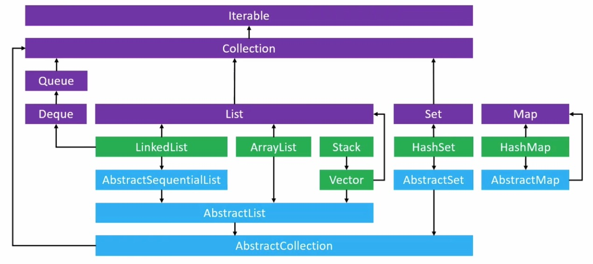 

  > - 紫色代表接口
  > - 绿色代表实现类
  > - 蓝色代表抽象类

**思考:**

为何 Map 如此独立? 跟 Collection、Iterable 毫无关系? 


## 2、List  VS  Set  VS  Map

- List 的特点
  - 可以存储重复的元素
    - 元素之间`equals` 可能返回 true
  - 可以通过索引访问元素
  - 有记录元素的添加顺内
- Set 的特点
  - 不可以存储重复的元素
    - 元素之间`equals` 不可能返回 true
  - 不可以通过索引访问元素
  - 不记录元素的添加顺序(LinkedHashSet 例外)
- Map 的特点
  - 不可以存储重复的key
    - key之间`equals` 可能返回 true
  - 不可以通过索引返回 `key-value`
  - 不记录`key-value` 的添加顺序 (linkedHashMap 除外)


## 3、数组的局限性

```
int[] array = new int[4];
array[0] = 11;
array[1] = 22;
array[2] = 33;
```

 

- 无法动态扩容
- 操作元素的过程不够面向对象


**java.util.ArrayList 是java中的动态数组** 

- 一个可以动态扩容的数组
- 封装了各种实用的数组操作


## 4、ArrayList 的基本使用

### 1、ArrayList 基本能使用介绍

- ArrayList 的基本用法

  **ArrayList 实现了List接口, 而List接口继承自Collection接口**

  ```
  ArrayList listArr = new ArrayList();
  listArr.add(null);
  listArr.add(false);
  listArr.add(11);
  listArr.add('8');
  listArr.add(null);
  
  System.out.println(listArr.indexOf(null));		// 获取指定元素的 序号
  System.out.println(listArr.lastIndexOf(null));
  System.out.println(listArr.size() );			// 获取 array 的长度
  System.out.println(listArr);
  
  // 打印:
  0
  4
  5
  [null, false, 11, 8, null]
  ```

- ArrayList 常用方法汇总

  ```
  public int size();				// 获取元素的个数
  public boolean isEmpty();	// 判断集合是否为空
  public boolean contains(Object o);	// 判断是否包某个元素
  public int indexOf(Object o);				// 获取指定元素的索引
  public int lastIndexOf(Object o);		// 反向 获取指定元素的索引
  public E get(int index);	
  // 如果之前index没有对应的元素会报错 IndexOutOfBoundsException
  public E set(int index, E element);		// 返回的是 set 之前的元素
  public boolean add(E element);
  public E remote(int index);
  public boolean remove(Object o);
  public void clear();
  
  public boolean addAll(Collection<? extends E> c);
  public boolean addAll(int index, Collection<? extends E> c);
  public boolean removeAll(Collection<?> c);
  public boolean retainAll(Collection<?> c);
  public void forEach(Consumer<? super E> action);
  public void sort(Comparator<? super E> c);
  
  public Object[] toArray();
  public <T> T[] toArray(T[] a);
  public void trimToSize();
  public void ensureCapacity(int minCapacity);
  ```


### 2、ArrayList 使用注意点:

一般来说, 在java中我们不会直接定义一个 **ArrayList**  的引用对象, 而是直接定义一个**List** 的引用, 面向接口编程, 如下:

```
// 不推荐这种写法
ArrayList<String> arrayList = new ArrayList<String>();

// 推荐这种写法
List<String> list = new ArrayList<String>();	
使用List 以后可以随时换方案, 如下:
list = new LinkedList<String>();
这种就称为面向接口编程
```

> 因为, ArrayList实现了List接口, 所有我们直接定义List类型
>
> // public interface List<E> extends Collection<E> 
> // public class ArrayList<E> extends AbstractList<E> implements List<E>, RandomAccess, Cloneable, java.io.Serializable

- 示例 

  **public boolean removeAll(Collection<?> c);** 

  删除交集

  ```
  List<Integer> list1 = new ArrayList<>();
  list1.add(11);
  list1.add(22);
  list1.add(33);
  list1.add(44);
  
  List<Integer> list2 = new ArrayList<>();
  list2.add(22);
  list2.add(33);
  list2.add(55);
  
  System.out.println("list1: " + list1);
  System.out.println("list2: " +list2);
  
  // 从list1 中删除 list2 中的所有元素
  list1.removeAll(list2);
  System.out.println("list1: " +list1);
  
  // 打印:
  list1: [11, 22, 33, 44]
  list2: [22, 33, 55]
  list1: [11, 44]
  ```

- 示例:

  **public boolean retainAll(Collection<?> c);** 

  保留交集

  ```
  List<Integer> list1 = new ArrayList<>();
  list1.add(11);
  list1.add(22);
  list1.add(33);
  list1.add(44);
  
  List<Integer> list2 = new ArrayList<>();
  list2.add(22);
  list2.add(33);
  list2.add(55);
  
  System.out.println("list1: " + list1);
  System.out.println("list2: " +list2);
  
  // 从list1 中保留 list2 中的所有元素
  list1.retainAll(list2);
  System.out.println("list1: " +list1);
  
  // 打印:
  list1: [11, 22, 33, 44]
  list2: [22, 33, 55]
  list1: [22, 33]
  ```

  


### 3、ArrayList - toArray 转换成普通数组 

#### 1、toArray() 简单使用

ArrayList, LinkedList 等都是一种数据结构, 是一种动态的数组, 但是有时我们想将这种复杂的数据结构转换成最普通的数组, 我们需要怎么做呢? 

在**List** 接口中定义了一个方法**Object[] toArray();**  方法, 通过`toArray()` 方法可以将实现了List接口的数据结构转换成最普通的数组. 因为 ArrayList, LinkedList 等都实现了List 接口, 所有可以

- toArray() 的简单使用

  ```
  List<Integer> list1 = new ArrayList<>();
  list1.add(11);
  list1.add(22);
  list1.add(33);
  list1.add(44);   
  System.out.println(list1); 
  Object obj[] = list1.toArray(); 
  System.out.println(obj);
  System.out.println(Arrays.toString(obj));
  
  // 打印:
  [11, 22, 33, 44]
  [Ljava.lang.Object;@6d06d69c
  [11, 22, 33, 44]
  ```


#### 2、toArray() 细节

- 当我们使用 toArray() 将一个集合转换成普通数组时, 结果是一个 `Object[]`类型, 如下:

  ```
  List<Integer> list1 = new ArrayList<>();
  list1.add(11);
  list1.add(22);
  Object[] objs = list1.toArray(); 
  ```

  > 如果我们希望将 list1 转换成 Integer[] 类型我们需要使用List中实现另外一个方法`<T> T[] toArray(T[] a);`

- 将List 转换成指定类型的 数组

  **`<T> T[] toArray(T[] a);`**  , a 是一个具体数组实例

  ```
  List<Integer> list1 = new ArrayList<>();
  list1.add(11);
  list1.add(22); 
  // 将List 转换成 Object[] 类型数组
  Object[] objs =  list1.toArray(); 
  System.out.println(objs);
  
  // 将List 转换成指定类型的数组, 后面传一个数组即可
  Integer[] array = list1.toArray(new Integer[0]);
  System.out.println(array);
  
  // 打印:
  [Ljava.lang.Object;@6d06d69c
  [Ljava.lang.Integer;@7852e922
  ```


### 4、ArrayList 的遍历

- 经典遍历

  ```
  List<Integer> array = new ArrayList<>();
  array.add(11);
  array.add(22);
  array.add(33);
  int size = array.size();
  for(int i=0; i<size; i++){
  	System.out.println(array.get(i));
  }
  ```

  > 注意:
  >
  > 在获取List 的元素时, 只能通过 array.get(index), 来获取, 普通数组才能使用下标语法糖 array1[10]获取. 
  >
  > ```
  > 不推荐这样写: 
  > for(int i=0; i<array.size(); i++){
  > 	System.out.println(array.get(i));
  > }
  > 
  > 推荐这样写:
  > int size = array.size();
  > for(int i=0; i<size; i++){
  > 	System.out.println(array.get(i));
  > }
  > ```


- 迭代器遍历

  ```
  List<Integer> array = new ArrayList<>();
  array.add(11);
  array.add(22);
  array.add(33);
  
  // 获取迭代器
  Iterator<Integer> it = array.iterator();
  while (it.hasNext()) {	// hasNext 的原理是判断size有没越界
    Integer num = it.next();
    System.out.println(num);
  }
  ```

- for-each

  ```
  List<Integer> array = new ArrayList<>();
  array.add(11);
  array.add(22);
  array.add(33);
  
  for (Integer i : array) {
    System.out.println(i);
  }
  ```

- List.forEach + lambda 遍历

  函数式接口, 匿名类

  ```
  List<Integer> array = new ArrayList<>();
  array.add(11);
  array.add(22);
  array.add(33);
  // default void forEach(Consumer<? super T> action)
  // 从forEach 的定义可以发现, forEach 需要传递一个 实现 Consumer 接口的对象
  // Consumer 是一个函数式接口类型的接口
  // 其实我们使用 lambda 表达式即可
  array.forEach((item)->{
    System.out.println(item);
  });
  
  lambda简化
  array.forEach((item)->System.out.println(item));
  lambda 方法绑定
  array.forEach(System.out::println);
  
  
  // 匿名类实现遍历
  List<Integer> array = new ArrayList<>();
  array.add(11);
  array.add(22);
  array.add(33);
  
  // 匿名类 函数式接口
  array.forEach(new Consumer<Integer>() {
    @Override
    public void accept(Integer t) {
      System.out.println(t);
    }
  });
  ```


### 5、ArrayList 的扩容原理

像以前, 我们使用一个数组时, 会先创建, 比如: `int[] nums = new int[5]` , 但是我们在使用ArrayList 的时候是没有指定ArrayList的容量, 比如:

```
ArrayList<Integer> nums = new ArrayList<>();
nums.add(11);
nums.add(22);
nums.add(33);
```

其实是这样的,ArrayList内部是使用Array实现的, 它有个默认的容量, 支持动态扩容, 

- ArrayList 的最小容量(默认容量)是10
- 每次扩容时, 新容量是旧容量的1.5倍


## 5、遍历


### 1、for -each 格式, 的本质 Iterator

```
// for-each 格式
for(元素类型 变量名 : 数组\iterable){
	... ... 
}
```

> List、Collection、Iterable、Set 都可以用 for-each遍历, 除了Map不行


**说明:** for-each 的本质

- 实现了**Iterable** 接口的对象, 都可以使用哪个 **for-each** 格式遍历元素

  - 比如: List, Set. (Map 不行)

- **Iterable** 在使用**for-each** 格式遍历元素时, 本质是使用了**Iterator对象** 

  > 说白了, 下面两段代码是一样的
  >
  > ```
  > for (Integer i : array) {
  >   System.out.println(i);
  > }
  > 
  > Iterator<Integer> it = array.iterator();
  > while (it.hasNext()) {	
  >   Integer num = it.next();
  >   System.out.println(num);
  > }
  > 
  > 即: for-each 只是 Iterator 的语法糖而已
  > ```


### 2、自定义 Iterable 、Iterator

- for-each 的本质就是 Iterator

- 自定一个实现Iterable 和 Iterator

  ```
  // 定义一个可遍历的类
  class ClassRoom implements Iterable<String>{
  	private String[] studentNames;
  	
  	// 自定义一个可变参数的构造方法 (可变参数的特定是保证是一个非null 的数组, 不论有没有用可变参数)
  	public ClassRoom(String...studentNames) {
  		this.studentNames = studentNames;
  	}
  	
  
  	// 实现Iterable 的接口方法
  	@Override
  	public Iterator<String> iterator() {
  		return new ClassRoomIterator();
  	}
  	
  	// 定义一个内部类, 实现 ClassRoom自己的Iterator
  	private class ClassRoomIterator implements Iterator<String>{
  
  		private int cursor; // 游标
  		@Override
  		public boolean hasNext() {
  			return cursor < studentNames.length;
  		}
  
  		@Override
  		public String next() {
  			return studentNames[cursor++];
  		}	
  	}
  }
  
  
  void test1(){
    // 测试可遍历类
    ClassRoom room = new ClassRoom("zhagnsan", "lisi", "wangwu", "zhaoliu");
    Iterator<String> it = room.iterator();
    while(it.hasNext()) {
      String name = it.next();
      System.out.println(name);
    }
    
    // 等价于下面, for-each 的本质是 Iterator, 我们平时写的 for-each 其实就是Iterator的语法糖
    //for (String name : room) {
    //  System.out.println(name);
    //}
  }
  
  // 打印:
  zhagnsan
  lisi
  wangwu
  zhaoliu
  ```

- 我们也可以使用 Iterator 的匿名类, 实现Iterator遍历

  ```
  class ClassRoom implements Iterable<String>{
  	private String[] studentNames;
  	
  	public ClassRoom(String...studentNames) {
  		this.studentNames = studentNames;
  	}
  	
  	@Override
  	public Iterator<String> iterator() {
  		
  		// 匿名类
  		return new Iterator<String>() {
  
  			private int cursor; // 游标
  			@Override
  			public boolean hasNext() {
  				return cursor < studentNames.length;
  			}
  
  			@Override
  			public String next() {
  				return studentNames[cursor++];
  			}
  			
  		};
  	}
  	 
  }
  ```

### 3、可遍历的本质 Iterable Iterator

- 其实, 不论是List 还是 Collection, 只要是实现了 **Iterable** 接口的类, 都是可遍历的
- 为什么说, 实现了**iterable** 接口的类是可遍历的呢? 那是因为遍历的本质都是返回一个可迭代对象 **Iterator**

- Iterator 接口定义如下:

  ```
  public interface Iterator<E> {
    boolean hasNext();
    E next();
    // 其它 省略 ... 
  }
  ```

- Iterable 接口定义如下:

  ```
  public interface Iterable<T> {
    Iterator<T> iterator();
  	// 其它 省略 ... 
  }
  ```

  

### 4、遍历 的 同时删除元素 Iterator

要求:

通过遍历的方式, 挨个删除所有的元素

> 如果删除所有元素, 我们可以直接调用 `clear()` 方法删除, 在List接口中有`clear()`的定义

- 像我们使用下面几种方法来删除元素, 都是有问题的, 如下:

  ```
  ArrayList<Integer> nums = new ArrayList<Integer>();
  nums.add(11);
  nums.add(22);
  nums.add(333);
  nums.add(444);
  
  // 删除不完
  for (int i = 0; i < nums.size(); i++) {
    nums.remove(i);
  }
  System.out.println(nums);
  // 打印:
  [22, 444]
  
  
  // 报错 ConcurrentModificationException
  for (Integer num : nums) {
    nums.remove(num);
  }
  
  // 报错 ConcurrentModificationException
  nums.forEach((num)->{
    nums.remove(num);
  });
  ```

- **如果想要在遍历元素的时候, 依次删除元素的话, 我们只能使用Iterator 的remove 方法, 如下:**

  ```
  ArrayList<Integer> nums = new ArrayList<Integer>();
  nums.add(11);
  nums.add(22);
  nums.add(333);
  nums.add(444);
  
  Iterator<Integer> it =  nums.iterator();
  System.out.println("----------");
  while (it.hasNext()) {
    Integer num =  it.next();
    System.out.println(num);
    it.remove(); //注意, 在调用Iterator 的remove方法前必须先调用 next 方法
  }
  
  System.out.println("----------");
  System.out.println(nums);
  
  // 打印:
  ----------
  11
  22
  333
  444
  ----------
  []
  ```

**补充**

- 如果在遍历集合元素的时候, 使用了集合自带的方法修改集合的长度 (比如: add, remove 等方法)

  那么可能会抛出`java.util.ConcurrentModificationException`异常

**结论:**

- 所以, 如果以后想要在遍历数组的时候删除元素, 请使用迭代器


> 虽然我们刚才介绍了, 如果我们可以通过迭代器 Iterator 在遍历元素的同时删除元素不会报错, 但是我们通过查看SDK发现迭代器只提供了删除元素功能, 是没有提供添加元素的功能, 如果我们在使用迭代器在遍历的时候又想添加元素要怎么做呢? 这就要看我们后面介绍的**ListIterator** 了.


### 5、遍历的时候添加元素 ListIterator

- 前面我们介绍了**Iterator** 可以编译元素, 可以删除元素.
- **ListIterator**  继承自 **Iterator** 在**Iterator** 的基础上增加了一些功能. 


> Iterator 接口主要的功能定义:
>
> ```
> public interface Iterator<E> {
> 	boolean hasNext();
> 	E next();
> 	default void remove() {
>       throw new UnsupportedOperationException("remove");
>   }
>   default void forEachRemaining(Consumer<? super E> action) {
>       Objects.requireNonNull(action);
>       while (hasNext())   action.accept(next());
>   }
> }
> ```
>
> ListIterator 继承自 Iterator, 其定义如下:
>
> ```
> public interface ListIterator<E> extends Iterator<E> {
> 	boolean hasNext();
> 	E next();
> 	boolean hasPrevious();
> 	E previous();
> 	int nextIndex();
> 	int previousIndex();
> 	void remove();		// 删除当前 cursor指向的元素
> 	void set(E e);		// 修改当前 cursor指向的元素
> 	void add(E e);
> }
> ```


- ListIterator 示例:

  ```
  // 示例1:
  ArrayList<Integer> nums = new ArrayList<Integer>();
  nums.add(11);
  nums.add(22);
  nums.add(333);
  nums.add(444);
  
  ListIterator<Integer> it = nums.listIterator();
  while (it.hasNext()) {
     System.out.println(it.next());
  }
  
  while(it.hasPrevious()) {
    System.out.println(it.previous());
  }
  
  // 示例2
  ArrayList<Integer> nums = new ArrayList<Integer>();
  nums.add(11);
  nums.add(22);
  nums.add(333);
  nums.add(444);
  
  ListIterator<Integer> it = nums.listIterator();
  while (it.hasNext()) {
     System.out.println(it.next() + 30);
  }
  
  System.out.println(nums);
  // 打印:
  41
  52
  363
  474
  [11, 22, 333, 444]
  
  
  // 示例3:
  ArrayList<Integer> nums = new ArrayList<Integer>();
  nums.add(11);
  nums.add(22);
  nums.add(333);
  nums.add(444);
  
  System.out.println("--------");
  ListIterator<Integer> it = nums.listIterator();
  while (it.hasNext()) {
     it.add(99);
     System.out.println(it.next());
     it.add(88);
  }
  System.out.println("--------");
  System.out.println(nums);
  
  // 打印: 有点意思
  --------
  11
  22
  333
  444
  --------
  [99, 11, 88, 99, 22, 88, 99, 333, 88, 99, 444, 88]
  ```


## 6、ArrayList 中的其它常用方法

### 1、public void trimToSize() 方法

在将**trimToSize() 方法**  的用法前, 我们就要先提一下**ArrayList** 的底层原理了.

>  在优化程序性能时, 此方法很有用

- 首先我们知道 ArrayList 是java中的一种数据结构, 是一种动态数组, 具备动态扩容和缩容的功能, 其底层是使用普通数组实现(而不是链表). ArrayList的默认容量是10, 即当你初始化一个ArrayList对象时, ArrayList内部就会持有一个长度为10 的数组, 这时数组内存储的都是 `null` , 当我们往ArrayList 中添加对象`(add(E element)`时, 如果ArrayList发现其内部的数组已经装满了时, 他会将内部持有的数组扩容为原来长度的 1.5倍.

  当我们在调用ArrayList的`clear()` 方法时, `clear()` 方法会将ArrayList内持有的数组的所有元素设置为`null` 这样ArrayList内部就清空了, 但是, 但是此时ArrayList 内持有的数组还是原来的长度, 如果后续过程中我们只向Arraylist中存储少量的元素时, 那么将造成大量的存储空间浪费, 这时我们的**trimToSize()** 方法就上场了.

  **一句话, ArrayList 中的 trimToSize() 方法的功能就是对 ArrayList 中持有的数组进行缩容操作, 避免存储空间浪费** , trimToSize() 后ArrayList中的数组的长度就是ArrayList的size大小

  ```
  // trimToSize()定义如下
  public void trimToSize() {
      modCount++;
      if (size < elementData.length) {
          elementData = (size == 0)
            ? EMPTY_ELEMENTDATA
            : Arrays.copyOf(elementData, size);
      }
  }
  ```

  


### 2、public void ensureCapacity(int minCapacity)

简单的说**ensureCapacity(int minCapacity)** 方法的作用就是确保 ArrayList 中的数组有指定长度的容量

- 其实, ArrayList 中的 **ensureCapacity** 的原理是这样的, 我们知道ArrayList 的实现原理是内部持有一个数组 且这个数组默认的长度为10 , 当我们想ArrayList 中添加元素时, 如果ArrayList 中的数组的容量不足时是按照1.5倍的方式进行扩容的, 如果我们要想一个ArrayList 中存入大量的数据时默认情况下扩容操作就很频繁, 这样就会存在很多不必要的开销, 如果我们知道大概要存储多少条数据时, 我们就可以在存储数据时使用 **ensureCapacity**  方法对数组进行容量确保(扩容) 操作, 这样后续存储数据时, 就不必频繁的做扩容操作了, 提高性能.

  ```
  ArrayList<Integer> arr = new ArrayList<Integer>();  // 默认容量10
  arr.ensureCapacity(100); // 保证 ArrayList 的容量至少有100
  
  ArrayList<Integer> arr2 = new ArrayList<Integer>(1000); // 创建一个默认容量是 1000的
  ```

  > ```
  > // ensureCapacity 的定义如下:
  > public void ensureCapacity(int minCapacity) {
  >     int minExpand = (elementData != DEFAULTCAPACITY_EMPTY_ELEMENTDATA) 
  >     								? 0: DEFAULT_CAPACITY;
  >     if (minCapacity > minExpand) {
  >         ensureExplicitCapacity(minCapacity);
  >     }
  > }
  > ```

**简单的说, ensureCapacity 就是对ArrayList 进行扩容, 容量保证操作** 

